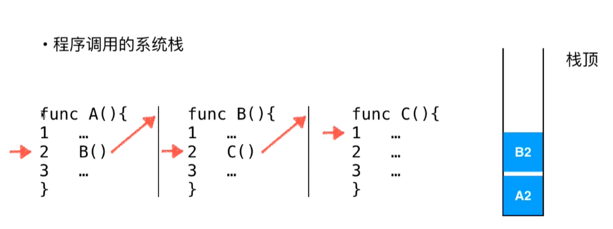

# 第05章 递归

## 5.3 递归基础和递归的宏观语意
> 本质上，将原来的问题，转化为更小的同一问题

### 举例


### 代码
```java
public class ArrSum {
    private int res = 0;

    public int sum(int[] arr) {
        return sum(arr, 0);
    }

    /**
     * 计算从arr[i]到arr[n-1]的和
     *
     * @param arr 数组
     * @param i   当前遍历到的索引
     * @return arr[i]到arr[n-1]的和
     */
    private int sum(int[] arr, int i) {
        if (i == arr.length) {
            // 遍历完数组，返回0
            return 0;
        }
        return arr[i] + sum(arr, i + 1);
    }

    public static void main(String[] args) {
        int[] arr = {1, 2, 3, 4, 5};
        System.out.println(new ArrSum().sum(arr));
    }
}
```

### 递归解析
> 递归是a->a->a即相同函数的互相调用，实际与a->b->c即不同函数之间的调用没啥区别~不断取内层调用函数的返回值给上一层即可~我们只要想清楚内层函数的逻辑即可~~
+ 1.求解最基本问题
+ 2.把原问题转换为更小的问题


递归就像老师说的那样，将原有问题变成一个更小的问题，然后在更小的问题基础上再变成更更小的问题，一直到不能再变小为止，当不能再变更小的时候，这个时候这个问题的答案就变得显而易见了，然后再通过这个答案反其道而行之，以这个答案为基础向上推导出原问题的答案。

## 5.4 链表的天然递归结构性质

### 链表递归的终止条件：访问到为NULL的节点
> 直到最后可以理解为空本身也是一个链表。null就是那个最基础的、最平凡的链表，即递归退出条件


### 递归解决LeetCode203号问题：删除链表中等于指定值的所有元素
> 链表删除（递归写法）：
+ 1.注意宏观语义
+ 2.删除掉一个节点后得到小问题的解
+ 3.考虑怎么用小问题的解构建原问题的解
+ 4.分情况讨论

```java
class Solution {
    public ListNode removeElements(ListNode head, int val) {
        if (head == null) {
            return null;
        }
        head.next = removeElements(head.next, val);
        // head节点要删除就直接跳过head节点，否则就返回原来的
        return head.val == val ? head.next : head;
    }

    public static void main(String[] args) {
        int[] nums = {1, 2, 6, 3, 4, 5, 6};
        ListNode head = new ListNode(nums);
        System.out.println(head);
        ListNode result = (new Solution()).removeElements(head, 6);
        System.out.println(result);
    }
}
```

## 5.5 递归的微观解读
### 递归的调用和普通的子函数链式调用没区别，只不过名字是自己而已。
> 递归调用与普通调用的对比

> 递归相当于隐式的系统调用栈


### 递归过程详细分析举例1：数组求和
```java
public class ArrSum {
    private int res = 0;

    public int sum(int[] arr) {
        return sum(arr, 0);
    }

    /**
     * 计算从arr[i]到arr[n-1]的和
     *
     * @param arr 数组
     * @param i   当前遍历到的索引
     * @return arr[i]到arr[n-1]的和
     */
    private int sum(int[] arr, int i) {
        if (i == arr.length) {
            // 遍历完数组，返回0
            return 0;
        }
        return arr[i] + sum(arr, i + 1);
    }

    public static void main(String[] args) {
        int[] arr = {1, 2, 3, 4, 5};
        System.out.println(new ArrSum().sum(arr));
    }
}
```

### 递归过程详细分析举例2：删除链表中等于指定值的所有元素
```java
class Solution {
    public ListNode removeElements(ListNode head, int val) {
        if (head == null) {
            return null;
        }
        head.next = removeElements(head.next, val);
        // head节点要删除就直接跳过head节点，否则就返回原来的
        return head.val == val ? head.next : head;
    }

    public static void main(String[] args) {
        int[] nums = {1, 2, 6, 3, 4, 5, 6};
        ListNode head = new ListNode(nums);
        System.out.println(head);
        ListNode result = (new Solution()).removeElements(head, 6);
        System.out.println(result);
    }
}
```