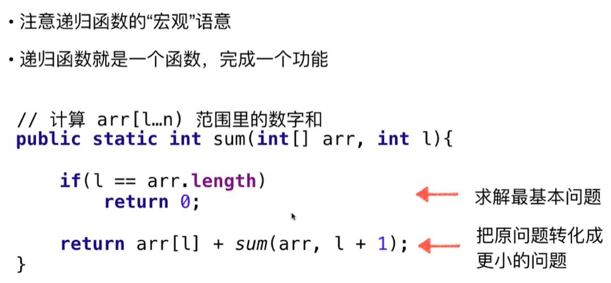
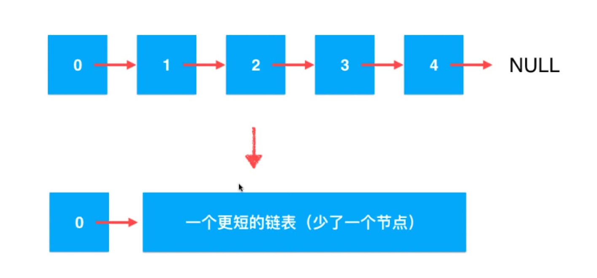
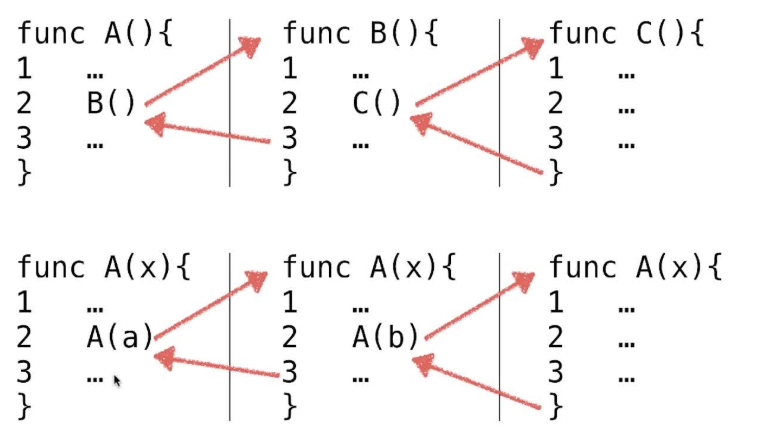
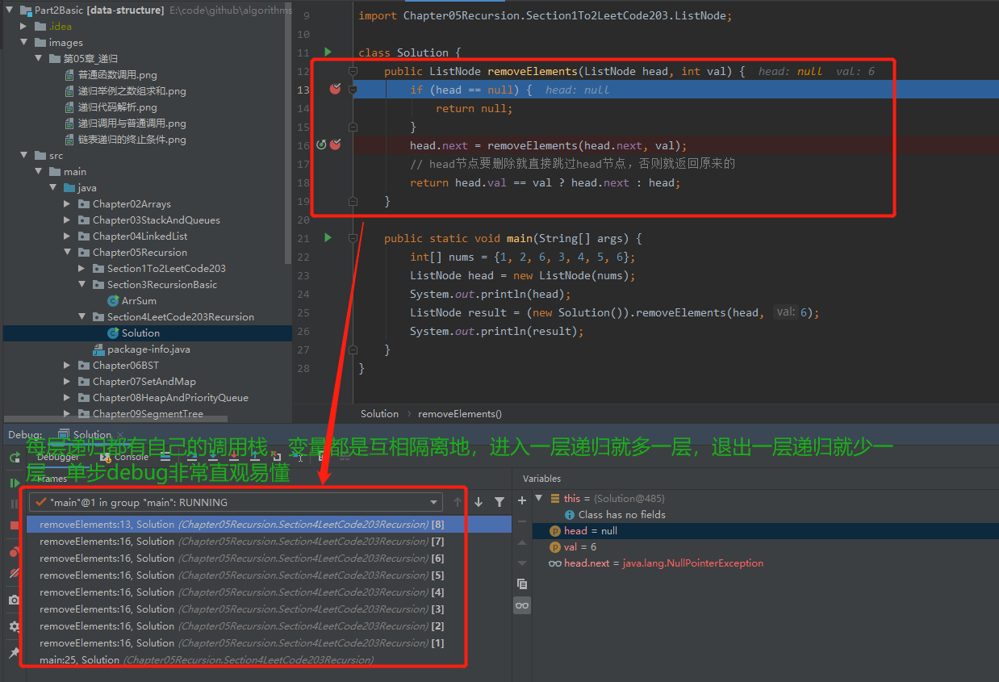

# 第05章 递归

## 5.3 递归基础和递归的宏观语意
> 本质上，将原来的问题，转化为更小的同一问题

### 举例


### 代码
```java
public class ArrSum {
    private int res = 0;

    public int sum(int[] arr) {
        return sum(arr, 0);
    }

    /**
     * 计算从arr[i]到arr[n-1]的和
     *
     * @param arr 数组
     * @param i   当前遍历到的索引
     * @return arr[i]到arr[n-1]的和
     */
    private int sum(int[] arr, int i) {
        if (i == arr.length) {
            // 遍历完数组，返回0
            return 0;
        }
        return arr[i] + sum(arr, i + 1);
    }

    public static void main(String[] args) {
        int[] arr = {1, 2, 3, 4, 5};
        System.out.println(new ArrSum().sum(arr));
    }
}
```

### 递归解析
> 递归是a->a->a即相同函数的互相调用，实际与a->b->c即不同函数之间的调用没啥区别~不断取内层调用函数的返回值给上一层即可~我们只要想清楚内层函数的逻辑即可~~
+ 1.求解最基本问题(也即`递归的退出条件`)
+ 2.把原问题转换为更小的问题(也即`递归的具体逻辑`)


递归就像老师说的那样，将原有问题变成一个更小的问题，然后在更小的问题基础上再变成更更小的问题，一直到不能再变小为止，当不能再变更小的时候，这个时候这个问题的答案就变得显而易见了，然后再通过这个答案反其道而行之，以这个答案为基础向上推导出原问题的答案。

## 5.4 链表的天然递归结构性质

### 链表递归的终止条件：访问到为NULL的节点
> 直到最后可以理解为空本身也是一个链表。null就是那个最基础的、最平凡的链表，即递归退出条件


### 递归解决LeetCode203号问题：删除链表中等于指定值的所有元素
> 链表删除（递归写法）：
+ 1.注意宏观语义
+ 2.删除掉一个节点后得到小问题的解
+ 3.考虑怎么用小问题的解构建原问题的解
+ 4.分情况讨论

```java
class Solution {
    public ListNode removeElements(ListNode head, int val) {
        if (head == null) {
            return null;
        }
        head.next = removeElements(head.next, val);
        // head节点要删除就直接跳过head节点，否则就返回原来的
        return head.val == val ? head.next : head;
    }

    public static void main(String[] args) {
        int[] nums = {1, 2, 6, 3, 4, 5, 6};
        ListNode head = new ListNode(nums);
        System.out.println(head);
        ListNode result = (new Solution()).removeElements(head, 6);
        System.out.println(result);
    }
}
```

## 5.5 递归的微观解读
### 递归的调用和普通的子函数链式调用没区别，只不过名字是自己而已。
> 递归调用与普通调用的对比

> 递归相当于隐式的系统调用栈


### 递归过程详细分析举例1：数组求和
```java
public class ArrSum {
    private int res = 0;

    public int sum(int[] arr) {
        return sum(arr, 0);
    }

    /**
     * 计算从arr[i]到arr[n-1]的和
     *
     * @param arr 数组
     * @param i   当前遍历到的索引
     * @return arr[i]到arr[n-1]的和
     */
    private int sum(int[] arr, int i) {
        if (i == arr.length) {
            // 遍历完数组，返回0
            return 0;
        }
        return arr[i] + sum(arr, i + 1);
    }

    public static void main(String[] args) {
        int[] arr = {1, 2, 3, 4, 5};
        System.out.println(new ArrSum().sum(arr));
    }
}
```
本题中递归函数为`int sum(int[] arr, int i)`，arr.length=5
+ 第1层递归：i=0<5，arr[i]=arr[0]=1，进入第2层递归i+1=1
+ 第2层递归：i=1<5，arr[i]=arr[1]=2，进入第3层递归i+1=2
+ 第3层递归：i=2<5，arr[i]=arr[2]=3，进入第4层递归i+1=3
+ 第4层递归：i=3<5，arr[i]=arr[3]=4，进入第5层递归i+1=4
+ 第5层递归：i=4<5，arr[i]=arr[4]=5，进入第6层递归i+1=5
+ 第6层递归：i=5=5，把0返回到上一层递归
+ 第5层递归：把arr[4]+0返回到上一层递归
+ 第4层递归：把arr[3]+arr[4]+0返回到上一层递归
+ 第3层递归：把arr[2]+arr[3]+arr[4]+0返回到上一层递归
+ 第2层递归：把arr[1]+arr[2]+arr[3]+arr[4]+0返回到上一层递归
+ 第1层递归：把arr[0]+arr[1]+arr[2]+arr[3]+arr[4]+0返回到上一层递归
+ 没有上一层递归了，函数执行完毕，把求和结果返回即为数组的值

### 递归过程详细分析举例2：删除链表中等于指定值的所有元素
```java
class Solution {
    public ListNode removeElements(ListNode head, int val) {
        if (head == null) {
            return null;
        }
        head.next = removeElements(head.next, val);
        // head节点要删除就直接跳过head节点，否则就返回原来的
        return head.val == val ? head.next : head;
    }

    public static void main(String[] args) {
        int[] nums = {1, 2, 6, 3, 4, 5, 6};
        ListNode head = new ListNode(nums);
        System.out.println(head);
        ListNode result = (new Solution()).removeElements(head, 6);
        System.out.println(result);
    }
}
```
本题中初始链表结构为`1->2->6->3->4->5->6->NULL`，递归函数为`ListNode removeElements(ListNode head, int val)`,我们可以认为每个链表的最后一个节点都是NULL，方便作为递归的终止条件
+ 第1层递归：head.val=1，head->next=`2->6->3->4->5->6->NULL`，head=`1-2->6->3->4->5->6->NULL`!=null，所以进入下一层递归
+ 第2层递归：head.val=2，head->next=`6->3->4->5->6->NULL`，head=`2->6->3->4->5->6->NULL`!=null，所以进入下一层递归
+ 第3层递归：head.val=6，head->next=`3->4->5->6->NULL`，head=`6->3->4->5->6->NULL`!=null，所以进入下一层递归
+ 第4层递归：head.val=3，head->next=`4->5->6->NULL`，head=`3->4->5->6->NULL`!=null，所以进入下一层递归
+ 第5层递归：head.val=4，head->next=`5->6->NULL`，head=`4->5->6->NULL`!=null，所以进入下一层递归
+ 第6层递归：head.val=5，head->next=`6->NULL`，head=`5->6->NULL`!=null，所以进入下一层递归
+ 第7层递归：head.val=6，head->next=`NULL`，head=`6->NULL`!=null，所以进入下一层递归
+ 第8层递归：head=null，满足递归回退条件条件，把NULL返回给上一层
+ 第7层递归：赋值head.next=null，head=`6->NULL`，head.val=6为真，所以递归返回head.next即`NULL`给上一层递归
+ 第6层递归：赋值head.next=null，head变了，head=`5->NULL`，head.val=5!=6，所以递归返回head即`5->NULL`给上一层递归
+ 第5层递归：赋值head.next=`5->NULL`，head变了，head=`4->5->NULL`，head.val=4!=6，所以递归返回head即`4->5->NULL`给上一层递归
+ 第4层递归：赋值head.next=`4->5->NULL`，head变了，head=`3->4->5->NULL`，head.val=4!=6，所以递归返回head即`3->4->5->NULL`给上一层递归
+ 第3层递归：赋值head.next=`3->4->5->NULL`，head变了，head=`6->3->4->5->NULL`，head.val=6=6，所以递归返回head.next即`3->4->5->NULL`给上一层递归
+ 第2层递归：赋值head.next=`3->4->5->NULL`，head变了，head=`2->3->4->5->NULL`，head.val=2!=6，所以递归返回head即`2->3->4->5->NULL`给上一层递归
+ 第1层递归：赋值head.next=`2->3->4->5->NULL`，head变了，head=`1->2->3->4->5->NULL`，head.val=1!=6，所以递归返回head即`1->2->3->4->5->NULL`给上一层递归
+ 已经没有上一层递归了，所以整个递归调用过程完毕，取出值为6的节点后的链表为`1->2->3->4->5->NULL`

## 5.6 递归调试

### 使用IDE来单步追踪
> 
### 通过depth参数打印--来显示递归深度，方便看递归过程。在`递归进入新层`和`递归退出当前层`的时候都打印下深度字符串
> 可以看到下面的分析过程和我们手动分析地完全一样，[代码地址](src/main/java/Chapter05Recursion/Section6RecursionDebug/SolutionDebug.java)
```java
/***********************************************************
 * @Description : 虚拟头结点可以大大简化代码
 * @author      : 梁山广(Laing Shan Guang)
 * @date        : 2019/12/29 14:18
 * @email       : liangshanguang2@gmail.com
 ***********************************************************/
package Chapter05Recursion.Section4LeetCode203Recursion;

import Chapter05Recursion.Section1To2LeetCode203.ListNode;

class SolutionDebug {
    /**
     * 删除链表中值为val的所有元素
     *
     * @param head  链表的头结点
     * @param val   要删除的节点的值
     * @param depth 递归的深度
     * @return
     */
    public ListNode removeElements(ListNode head, int val, int depth) {
        // 下面两行是递归进入新层
        System.out.print(generateRecursionDepthStr(depth));
        System.out.println("第" + depth + "层递归：head=" + head + "，要找的值为节点值为：" + val);
        if (head == null) {
            return null;
        }
        head.next = removeElements(head.next, val, depth + 1);
        // 下面两行是递归退出当前层
        System.out.print(generateRecursionDepthStr(depth));
        System.out.println("第" + depth + "层递归：head=" + head + "，要找的值为节点值为：" + val);
        // head节点要删除就直接跳过head节点，否则就返回原来的
        return head.val == val ? head.next : head;
    }

    /**
     * 生成递归深度的字符串
     *
     * @param depth 递归层数
     * @return depth*2个"--"
     */
    private String generateRecursionDepthStr(int depth) {
        StringBuilder sb = new StringBuilder();
        for (int i = 0; i < depth; i++) {
            sb.append("--");
        }
        return sb.toString();
    }

    public static void main(String[] args) {
        int[] nums = {1, 2, 6, 3, 4, 5, 6};
        ListNode head = new ListNode(nums);
        ListNode result = (new SolutionDebug()).removeElements(head, 6, 1);
        System.out.println();
        System.out.println("递归结束，结果为：：" + result);
    }
}
/**
 * --第1层递归：head=1->2->6->3->4->5->6->NULL，要找的值为节点值为：6
 * ----第2层递归：head=2->6->3->4->5->6->NULL，要找的值为节点值为：6
 * ------第3层递归：head=6->3->4->5->6->NULL，要找的值为节点值为：6
 * --------第4层递归：head=3->4->5->6->NULL，要找的值为节点值为：6
 * ----------第5层递归：head=4->5->6->NULL，要找的值为节点值为：6
 * ------------第6层递归：head=5->6->NULL，要找的值为节点值为：6
 * --------------第7层递归：head=6->NULL，要找的值为节点值为：6
 * ----------------第8层递归：head=null，要找的值为节点值为：6
 * --------------第7层递归：head=6->NULL，要找的值为节点值为：6
 * ------------第6层递归：head=5->NULL，要找的值为节点值为：6
 * ----------第5层递归：head=4->5->NULL，要找的值为节点值为：6
 * --------第4层递归：head=3->4->5->NULL，要找的值为节点值为：6
 * ------第3层递归：head=6->3->4->5->NULL，要找的值为节点值为：6
 * ----第2层递归：head=2->3->4->5->NULL，要找的值为节点值为：6
 * --第1层递归：head=1->2->3->4->5->NULL，要找的值为节点值为：6
 *
 * 递归结束，结果为：：1->2->3->4->5->NULL
 */
```

## 5.7 更多和链表相关的问题
+ 近乎所有和链表相关的操作，都可以使用递归的形式完成
+ 可以自己把链表的增删改查改为递归实现，[参考实现](src/main/java/Chapter05Recursion/Section7MoreAboutLinkedList/LinkedListRecursion.java)
+ [LeetCode中链表相关的问题](https://leetcode-cn.com/tag/linked-list/)
+ [玩转算法面试第5章 在链表中穿针引线](https://coding.imooc.com/learn/list/82.html)也看下，[相关代码](../Part3Practise/第05章_链表相关.md)
+ [斯坦福大学的关于链表的一个很好的文档](src/main/java/Chapter05Recursion/Section7MoreAboutLinkedList/LinkedListProblems.pdf)，[刘老师关于里面问题的解析](https://mp.weixin.qq.com/s?__biz=MzU4NTIxODYwMQ==&mid=2247483779&idx=1&sn=555eeab210e54dc420f2b0cb106a2779&chksm=fd8caec5cafb27d3e5ecf692911883ccfc1abfd125a1268b24ae57860dc9e3f44ac49576010b&token=842435376&lang=zh_CN#rd)
