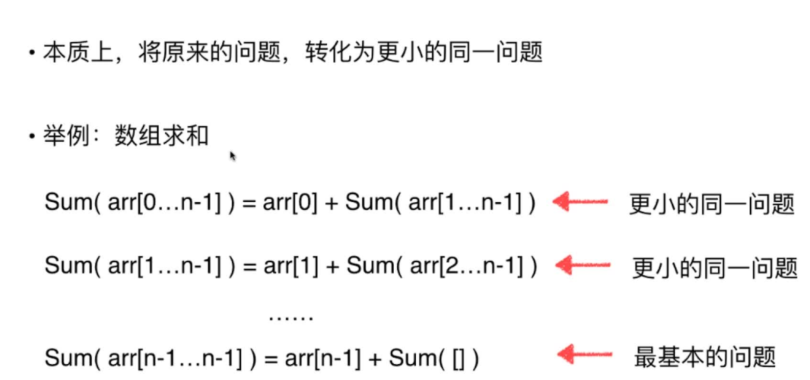

# 第05章 递归

## 5.3 递归基础和递归的宏观语意
> 本质上，将原来的问题，转化为更小的同一问题

### 举例


### 代码
```java
public class ArrSum {
    private int res = 0;

    public int sum(int[] arr) {
        return sum(arr, 0);
    }

    /**
     * 计算从arr[i]到arr[n-1]的和
     *
     * @param arr 数组
     * @param i   当前遍历到的索引
     * @return arr[i]到arr[n-1]的和
     */
    private int sum(int[] arr, int i) {
        if (i == arr.length) {
            // 遍历完数组，返回0
            return 0;
        }
        return arr[i] + sum(arr, i + 1);
    }

    public static void main(String[] args) {
        int[] arr = {1, 2, 3, 4, 5};
        System.out.println(new ArrSum().sum(arr));
    }
}
```

### 递归解析
> 递归是a->a->a即相同函数的互相调用，实际与a->b->c即不同函数之间的调用没啥区别~不断取内层调用函数的返回值给上一层即可~我们只要想清楚内层函数的逻辑即可~~
+ 1.求解最基本问题
+ 2.把原问题转换为更小的问题


