# 第06章_二分搜索树BST
## 6.1 为什么要研究树结构
### 树结构的应用
+ 文件目录树
+ 公司人员组织架构
### 将数据使用树结构存储后，出奇的高校
+ 二分搜索树BST(Binary Search Tree)
+ 平衡二叉树：AVL、红黑树
+ 堆、并查集
+ 线段树、Trie(字典树、前缀树)

## 6.2 二分搜索树基础
> 从二叉树到二分搜索树
### 二叉树的基本结构
+ 和链表一样，是动态数据结构，动态即不需要自己维护容量，能自动扩缩容
+ 二叉树具有唯一的根节点
+ 每个父节点
  + 左边的子节点叫左孩子
  + 右边的子节点叫右孩子
+ 二叉树每个节点最多有两个子节点，可以只有一个左孩子或右孩子，也可以一个孩子节点也没有
+ `一个子节点也没有(即左右子节点均为null)`的节点叫做`叶子节点`，就像现实世界中树的叶子上不会长枝杈一样。
+ 每个节点最多有一个父亲节点。实际除了根节点没有父亲节点，其他节点都有且只有一个父亲节点。
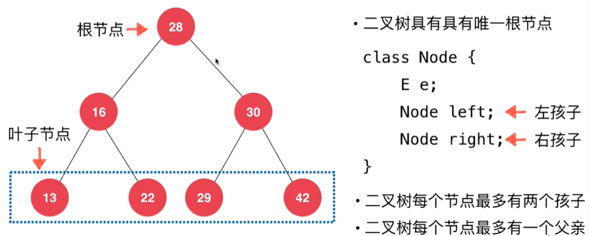
+ 和链表一样，二叉树有天然的递归结构
  + 每个节点的左子树也是二叉树
  + 每个节点的右子树也是二叉树
  + 满二叉树：除了叶子节点，每个节点都有左右两个孩子节点，如下图
    
+ 二叉树不一定都是满二叉树，下面都是例子
  > 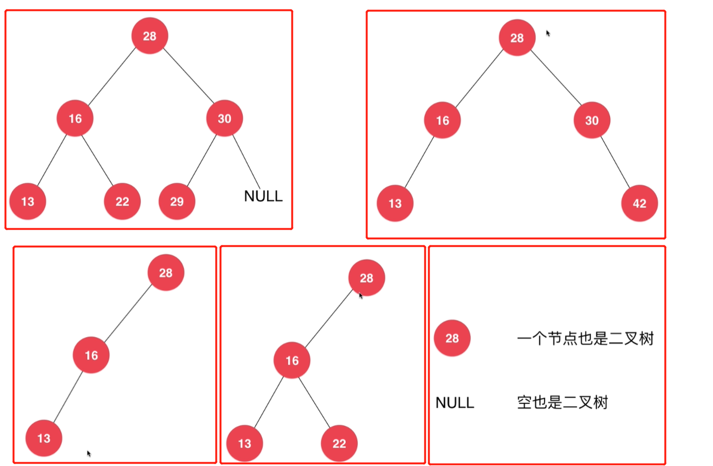

### 二叉树到二分搜索树
> 二分搜索树也被称为二分查找树，它是基于二叉树的一种树形结构，它有着很鲜明的特点：

+ 任意一个节点的左子树中的所有节点都小于这个节点
+ 任意一个节点的右子树中的所有节点都大于这个节点

即`二分搜索树是满足上述两个条件的一种特殊的二叉树`
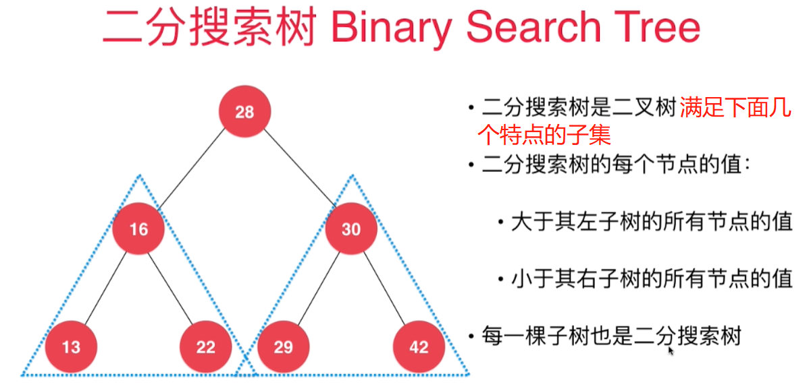

### 二分搜索树更多的性质

+ 每一颗子树也是二分搜索树
+ 存储的元素必须具有**可比性**(`实现Comparable接口`)


### 二分搜索树的基本代码结构

[二分搜索树的基本代码结构](src/main/java/Chapter06BST/Section02BSTBasic/BST.java)

## 6.3 向二分搜索树中添加节点

复习递归的组成部分
+ 1.递归终止条件
+ 2.递归组成逻辑

向二分搜索树添加新元素
+ 若二叉树为空，直接把要插入的节点作为根节点
+ 若该节点要想插入到一个完整的二分搜索树中，我们需要从根节点出发与其比较，
  + 若比当前节点大则往右走，然后与下一个节点进行比较，
  + 若比当前节点小则往左走，然后与下一个节点进行比较，
  + 找到一个节点的左子节点或右子节点为null，则把要插入的节点插入这个位置
  + 不允许插入重复元素(节点值E相等)，如果遍历过程中发现要插入的节点和已有节点相等，不做任何处理直接返回
    + 但是如果想让其包含重复元素的话也可以实现，只需要对其进行重定义：左子树小于等于节点；或者右子树大于等于节点
    + 我们前两章讲地数组和链表是可以有重复元素的

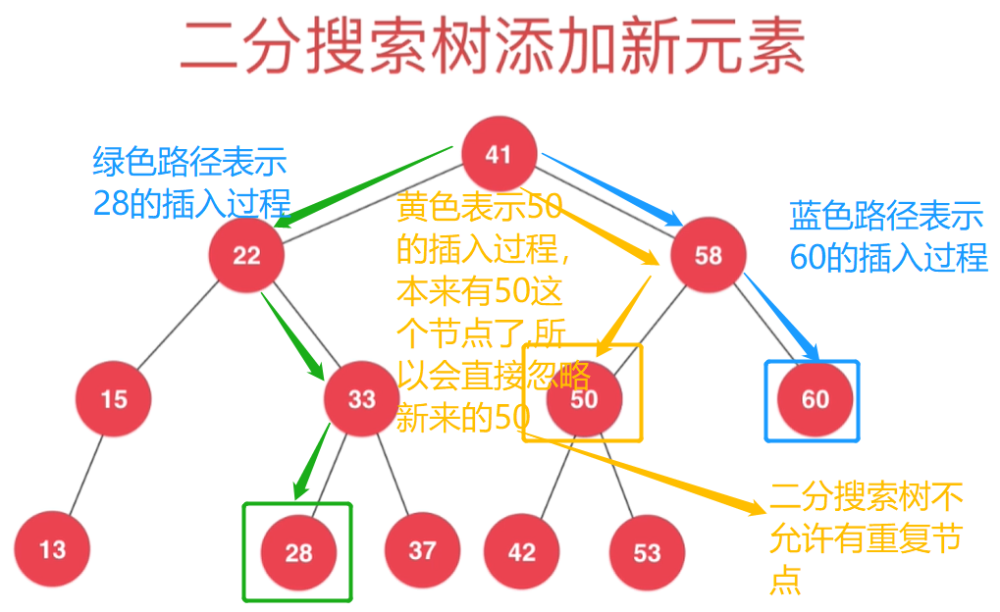


实现代码如下：
```java
/**
 * 向以节点Node为根节点的二分搜索树树中添加新的元素e，递归实现
 *
 * @param node 二分搜索树的根节点
 * @param e    要加入地元素e
 */
private void add(Node node, E e) {
    if (e.compareTo(node.e) < 0) {
        // e小于根节点，往node的左子树继续遍历
        if (node.left == null) {
            // 执行完节点插入操作递归就会回退到上一层递归
            node.left = new Node(e);
            size++;
        } else {
            // 没找到插入位置就继续往左侧递归
            add(node.left, e);
        }
    } else if (e.compareTo(node.e) > 0) {
        // e大于根节点，往node的右子树继续遍历
        if (node.right == null) {
            // 执行完节点插入操作递归就会回退到上一层递归
            node.right = new Node(e);
            size++;
        } else {
            // 没找到插入位置就继续往右侧递归
            add(node.right, e);
        }
    }
    // 如果和遍历到的节点相等即e.compareTo(node.e)==0，不做插入操作。因为我们实现的二分搜索树不允许有重复元素。
    // 这里我们直接不处理这种情况，递归会直接回退到上一层递归
}

/**
 * 向二分搜索树中添加元素e
 */
public void add(E e) {
    if (root == null) {
        // 如果二分搜索树为空，直接把要加入的节点作为新节点
        root = new Node(e);
        size++;
    } else {
        add(root, e);
    }
}
```
本课程关于二分搜索树的注意点：
+ 我们的课程中实现的二分搜索树不包含重复元素(不会有两个节点的E相等)
+ 二分搜索树添加元素的非递归写法。和链表很像
+ 本课程在二分搜索树方面的实现，关注递归实现
+ 二分搜索树一些方法的非递归实现自己练习下，老师的代码仓库里有参考实现
+ 在二分搜索树方面，递归实现要比非递归实现简单地多


## 6.4 优化添加操作
> 优化后的代码如下(把多种为null的情况合一了，简洁但是不太易懂，好好看下)：

```java
/**
 * 向以节点Node为根节点的二分搜索树树中添加新的元素e，递归实现
 *
 * @param node 二分搜索树的根节点
 * @param e    要加入地元素e
 */
private Node add(Node node, E e) {
    // 只要碰到了为空的node，就一定要把我们的e作为节点添加到这里的，具体是作为左子树、右子树还是根节点到下面再进行设置
    if (node == null) {
        return new Node(e);
    }
    if (e.compareTo(node.e) < 0) {
        // e小于根节点，往node的左子树继续遍历
        node.left = add(node.left, e);
    } else if (e.compareTo(node.e) > 0) {
        // e大于根节点，往node的右子树继续遍历
        node.right = add(node.right, e);
    }
    // 如果和遍历到的节点相等即e.compareTo(node.e)==0则直接跳过，不做任何处理，因为我们实现的二分搜索树不允许有重复元素。
    
    // 当这个node是把e给new出来地就设置到子节点为空的上面去；如果不是new出来地相当于把已有的二分搜索树中的节点关系又设置一次
    return node;
}

/**
 * 向二分搜索树中添加元素e
 */
public void add(E e) {
    root = add(root, e);
}
```

## 6.5 查询操作
> 和上一节添加元素的逻辑很相似

```java
/**
 * 在以节点node为根节点的二分搜索树树中查找是否包含元素e
 */
private boolean contains(Node node, E e) {
    if (node == null) {
        // 遍历到到二叉树最底部了，还没找到，二分搜索树中肯定没有这个这个元素了
        return false;
    }
    if (e.compareTo(node.e) < 0) {
        // e小于当前节点，向左递归
        return contains(node.left, e);
    } else if (e.compareTo(node.e) > 0) {
        // e大于当前节点，向右递归
        return contains(node.right, e);
    } else {
        // e等于当前节点，返回true
        return true;
    }
}

/**
 * 看二分搜索树种是否包含元素e
 */
public boolean contains(E e) {
    return contains(root, e);
}
```

## 6.6 二分搜索树的前序遍历
> 遍历操作就是把所有节点都访问一遍。前中后序遍历其实都相当于图的深度优先遍历DFS，想象着有一个栈在不断压入和弹出树的子节点即可。

### 什么是遍历操作
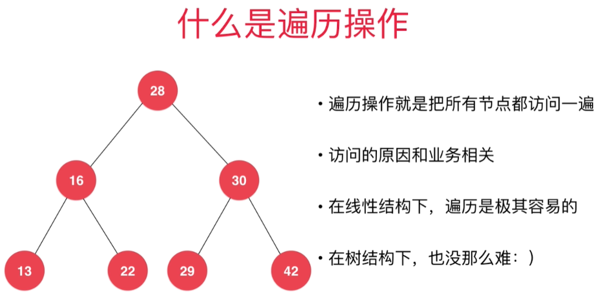

### 遍历操作的通用伪代码
> 第1步访问节点的顺序在相对于2和3的位置决定了是前、中、后序遍历的哪一种
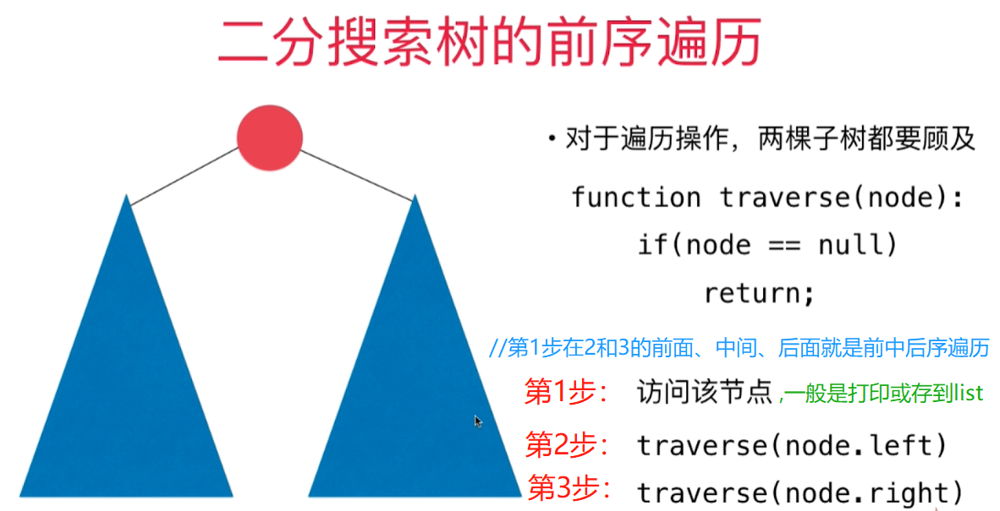

实现代码如下：
```java
/**
 * 遍历以node作为根节点的二分搜索树
 */
private void preOrder(Node node) {
    // 递归终止条件
    if (node == null) {
        // 遍历到null节点就返回上一层递归
        return;
    }

    // 递归组成逻辑
    // 1.访问当前节点。需要存储时可以放到list中
    System.out.print(node.e + " ");
    // 2.遍历左子树
    preOrder(node.left);
    // 3.遍历右子树
    preOrder(node.right);
}

/**
 * 前序遍历
 */
public void preOrder() {
    preOrder(root);
}
```

## 6.7 中序遍历和后续遍历
> 上一节有提"访问当前节点"步骤的位置决定是了前序、中序还是后序遍历，中序和后序的伪代码如下：

### 中序遍历
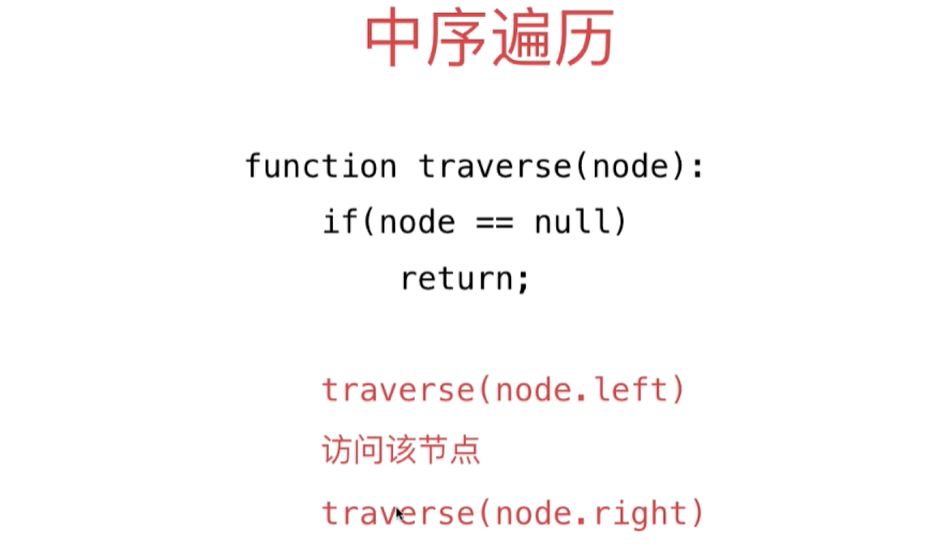
> 中序遍历有个特殊性质：中序遍历的结果是从小到大排序地~~
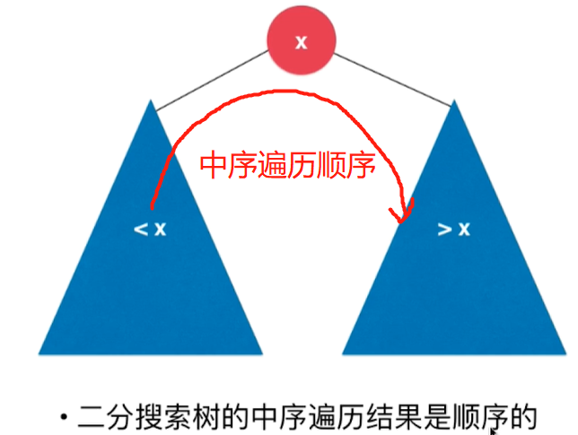

代码实现：

```java
/**
 * 中序遍历以node作为根节点的二分搜索树
 */
private void inOrder(Node node) {
    // 递归终止条件
    if (node == null) {
        // 遍历到null节点就返回上一层递归
        return;
    }

    // 递归组成逻辑
    // 2.遍历左子树
    inOrder(node.left);
    // 1.访问当前节点。需要存储时可以放到list中
    System.out.print(node.e + " ");
    // 3.遍历右子树
    inOrder(node.right);
}

/**
 * 中序遍历
 */
public void inOrder() {
    inOrder(root);
}
```
### 后序遍历
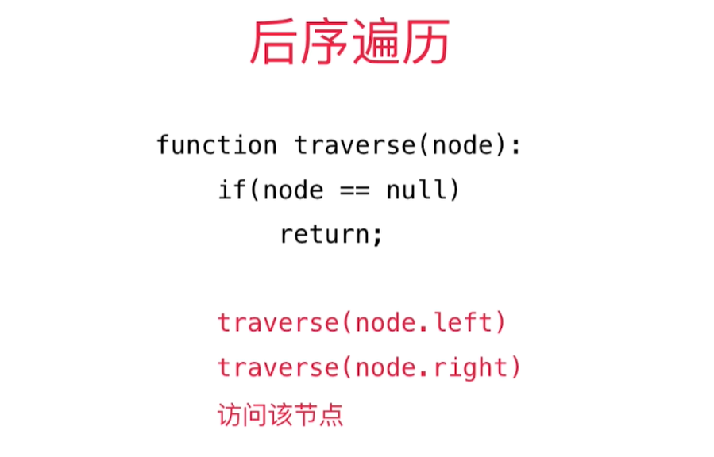

后序遍历应用
> 为二分搜索树释放内存

代码实现：
```java
/**
 * 后序遍历以node作为根节点的二分搜索树
 */
private void postOrder(Node node) {
    // 递归终止条件
    if (node == null) {
        // 遍历到null节点就返回上一层递归
        return;
    }

    // 递归组成逻辑
    // 2.遍历左子树
    postOrder(node.left);
    // 3.遍历右子树
    postOrder(node.right);
    // 1.访问当前节点。需要存储时可以放到list中
    System.out.print(node.e + " ");
}

/**
 * 后序遍历
 */
public void postOrder() {
    postOrder(root);
}
```

## 6.8 理解前、中、后序遍历的简单方法
> 可以给二分搜索树每个节点标记上左中右三个紫色小点，然后沿着二分搜索树的边沿从左往右走：
+ 遇到节点左侧的紫色小点就输出对应节点的元素值--前序遍历
+ 遇到节点中间的紫色小点就输出对应节点的元素值--中序遍历
+ 遇到节点右侧的紫色小点就输出对应节点的元素值--后序遍历
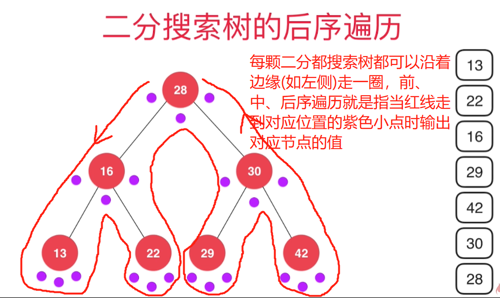

用上述方法，可以很容易得到前、中、后序遍历的结果：
+ 前序遍历：28 16 13 22 30 29 42
+ 中序遍历：13 16 22 28 29 30 42
+ 后序遍历：13 22 16 29 42 30 28

## 6.9 前序遍历的非递归实现
> 参考图的DFS递归和非递归实现。前中后序遍历实际都是深度优先遍历DFS的思想
+ 递归中我们是有一个系统调用栈来决定节点的访问顺序
+ 非递归中我们自己维护一个栈。通过把节点和子节点压栈和入栈来实现节点的访问顺序控制

## 6.10 层序遍历
> 和图的BFS类似，参考[图中的BFS遍历](Part2BasicGraph/第05章_图的广度优先遍历.md#51-从树的广度优先遍历到图的广度优先遍历)和[dfs和bfs的神奇联系](../Part2BasicGraph/第05章_图的广度优先遍历.md#510-dfs和bfs的神奇联系)，一般用地是基于队列的非递归实现。
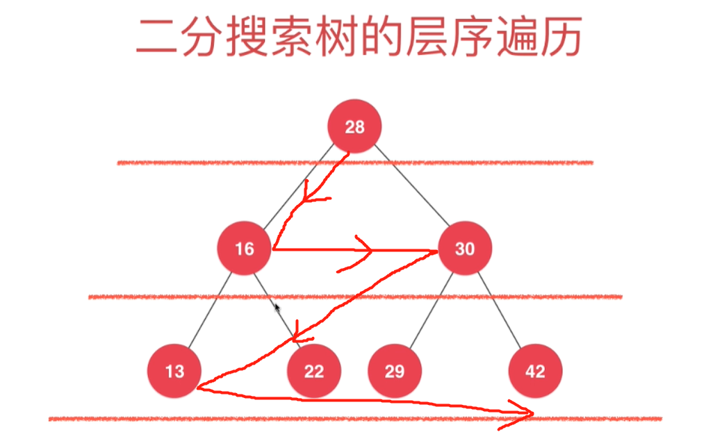

### 代码实现如下：

```java
 /**
  * 层序遍历
  */
public void levelOrder() {
    levelOrder(root);
}

/**
  * 层序遍历以node作为根节点的二分搜索树
  *
  * @param root 二分搜索树的根节点
  */
private void levelOrder(Node root) {
    Queue<Node> queue = new ArrayDeque<>();
    queue.add(root);
    while (!queue.isEmpty()) {
        Node node = queue.remove();
        // 每次弹出一个元素就打印下
        System.out.print(node.e + " ");
        if (node.left != null) {
            queue.add(node.left);
        }
        if (node.right != null) {
            queue.add(node.right);
        }
    }
}
```

### 层序遍历(也称为广度优先遍历的应用)

+ 当目标存在图的靠上位置时，可以更快地找到问题的解
+ 常用语算法设计中--比如图的最短路径
+ 图的`深度优先遍历DFS(实际就是前中后序遍历)`和`广度优先遍历BFS(实际就是层序遍历)`

## 6.11 删除最大元素和最小元素
> 为下一节删除任意一个二分搜索树中的元素做准备

### 二分搜索树的最小值和最大值非常容易找到：
+ 1.左子树的终点就是元素的最小值；（不一定是叶节点）
+ 2.右子树的终点就是元素的最大值。（不一定是叶节点）
+ 3.最小值和最大值都不一定是叶子节点
  > 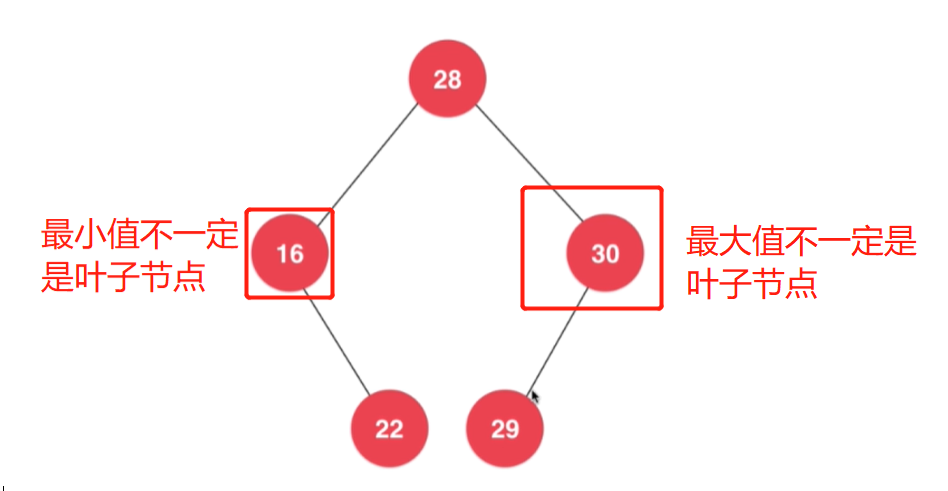
二者操作类似于左子树链表和右子树链表（相较而言，非递归算法更简单一些）

### 二分搜索树删除最小或最大节点的情况：
+ 1、极值位于叶子节点上，直接删除叶子节点；
+ 2、最小值位于内部节点上，其后是一个右子树。此时删除节点后将剩余子树接到删除节点父节点位置作为他的左子树。（删除最大值同理）
+ 3、最大值位于内部节点上，其后是一个左子树。此时删除节点后将剩余子树接到删除节点父节点位置作为他的右子树。（删除最小值同理）
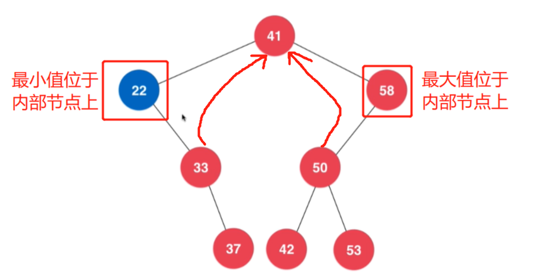

```java
 /**
 * 从二分搜索树种删除最小元素并返回
 *
 * @return 删除的最小元素
 */
public E removeMin() {
    // 这里先记录下最小值，防止下面removeMin()后树结构变了
    E min = minimum();
    // 这个递归函数返回地是新子树的根节点，不是我们要找地最小值
    root = removeMin(root);
    // 直接用我们前面找到的最小元素来返回
    return min;
}

/**
 * 删除以node作为根节点的二分搜索树中的最小节点，并返回删除节点后的新的二分搜索树的根节点
 *
 * @param node 根节点
 */
private Node removeMin(Node node) {
    // 递归终止条件
    if (node.left == null) {
        // 递归遍历到左子树为空，说明找到了最小节点node
        // node.right是否为空都可以正常返回给上一级的父节点来设置父节点的左节点直接指向当前节点的右子树
        Node rightNode = node.right;
        node.right = null;
        size--;
        return rightNode;
    }

    // 递归组成逻辑
    // 当左节点不是null时就正常往下递归，返回当前节点给上一层节点设置下自己的左节点
    node.left = removeMin(node.left);
    return node;
}

/**
 * 从二分搜索树种删除最大元素并返回
 *
 * @return 删除的最大元素
 */
public E removeMax() {
    // 这里先记录下最大值，removeMax()后树结构变了
    E max = maximum();
    // 这个递归函数返回地是新子树的根节点，不是我们要找地最大值
    root = removeMax(root);
    // 直接用我们前面找到的最大元素来返回
    return max;
}

/**
 * 删除以node作为根节点的二分搜索树中的最大节点，并返回删除节点后的新的二分搜索树的根节点
 *
 * @param node 根节点
 */
private Node removeMax(Node node) {
    // 递归终止条件
    if (node.right == null) {
        // 递归遍历到右子树为空，说明找到了最大节点node
        // node.left是否为空都可以正常返回给上一级的父节点来设置父节点的右节点直接指向当前节点的左子树
        Node leftNode = node.left;
        node.left = null;
        size--;
        return leftNode;
    }

    // 递归组成逻辑
    // 当右节点不是null时就正常往下递归，返回当前节点给上一层节点设置下自己的右节点
    node.right = removeMax(node.right);
    return node;
}
```