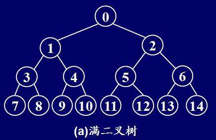
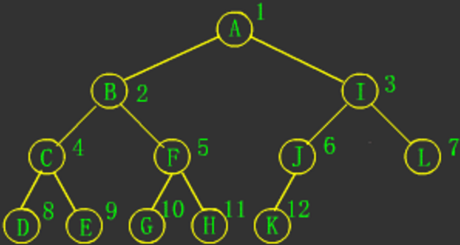
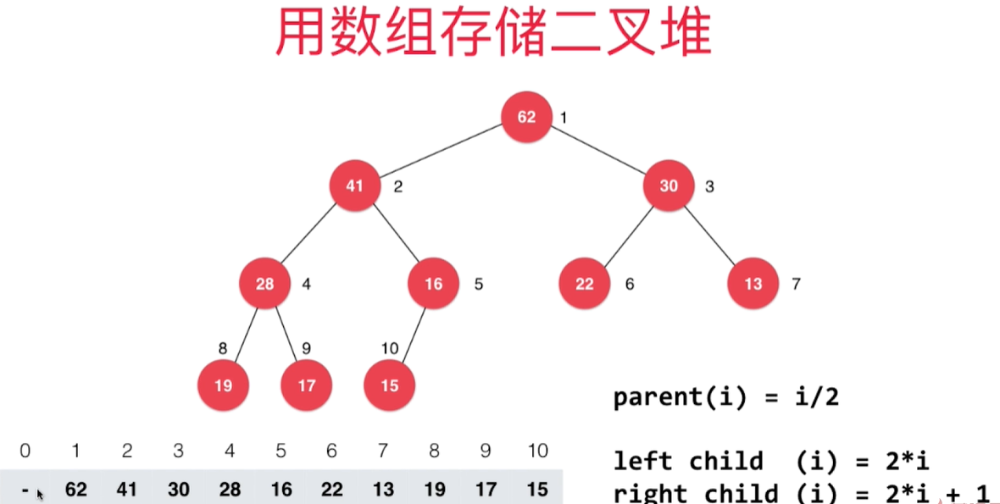
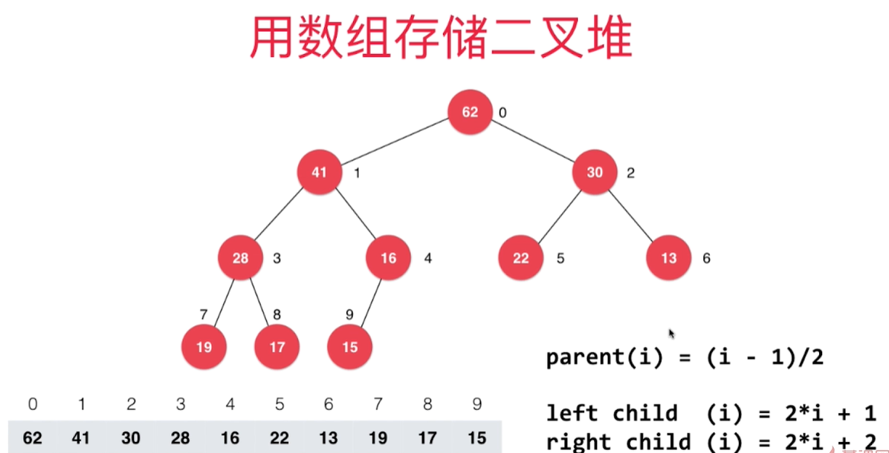
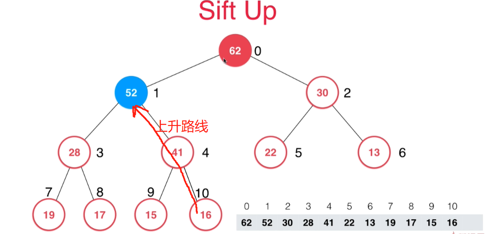
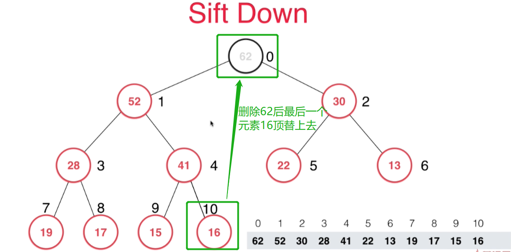
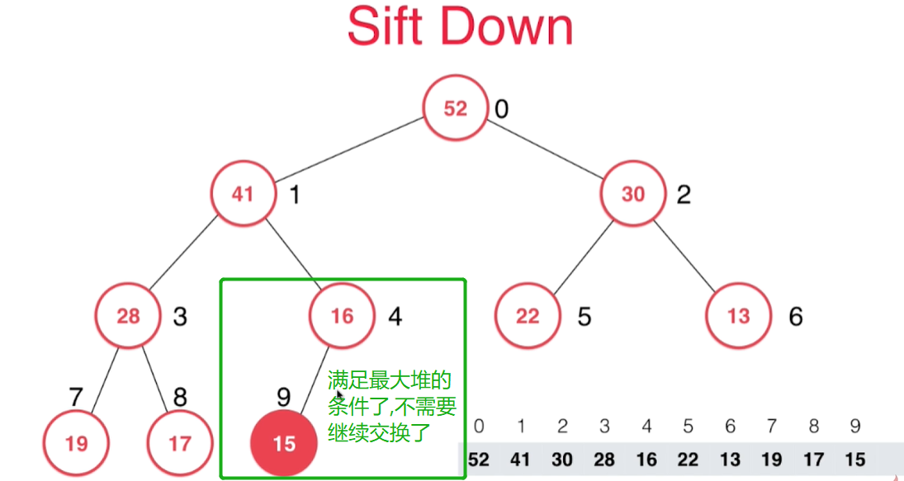

# 第08章 堆和优先队列

## 8.1 什么是优先队列？
### 普通队列和优先队列的比较
+ 普通队列：先进先出；后进后出
+ 优先队列：出队顺序和入队顺序无关，和优先级相关，优先级高地先出队
### 优先队列的应用
+ 医院排队，VIP客户优先
+ Windows任务管理器，系统任务优先
### 优先队列不同实现方式的时间复杂度


## 8.2 堆的基础
### 二叉堆与二叉树的区别和联系
> 二叉堆是一棵完全二叉树。
### 完全二叉树与满二叉树的比较
+ 满二叉树和完全二叉树的区别：
  > 对于满二叉树，除最后一层无任何子节点外，每一层上的所有结点都有两个子结点二叉树。
                   
  > 而完全二叉树是效率很高的数据结构，完全二叉树是由满二叉树而引出来的。对于深度为K的，有n个结点的二叉树，当且仅当其每一个结点都与深度为K的满二叉树中编号从1至n的结点一一对应时称之为完全二叉树。
+ 满二叉树定义
  > 定义：一个二叉树，如果每一个层的结点数都达到最大值，则这个二叉树就是满二叉树。也就是说，如果一个二叉树的层数为K，且结点总数是(2^k) -1 ，则它就是满二叉树。
  > 
+ 完全二叉树
  > 定义：若设二叉树的深度为h，除第 h 层外，其它各层 (1～h-1) 的结点数都达到最大个数，第 h 层所有的结点都连续集中在最左边，这就是完全二叉树。
  > 

### 二叉堆的性质
> 对比：二分搜索树是左节点小于父节点、右节点大于父节点的二叉树
+ 每个每个节点的值不大于其父亲节点的值--->最大二叉堆，简称最大堆，因为此时根节点肯定是值最大的节点
+ 每个每个节点的值不小于其父亲节点的值--->最小二叉堆，简称最小堆，因为此时根节点肯定是值最小的节点

注意：最大堆中，第k层的节点不一定比第k-1层的节点小，只要保证比自己的父亲节点小即可


### 最大堆的表示
> 基于数组表示最大堆，注意数组下标是从1开始的


一个节点在数组中的索引为i，则其父亲节点和左右孩子节点在数组中的索引表示如下：
+ 父亲节点索引 = `i / 2`，注意是整除
+ 左孩子的索引 = `2 * i`
+ 右孩子的索引 = `2 * i + 1`


数组下标从0开始存储最大堆时，节点索引公式需要修改如下：
+ 父亲节点索引 = `(i - 1) / 2`，注意是整除
+ 左孩子的索引 = `2 * i + 1`
+ 右孩子的索引 = `2 * i + 2`


## 8.4 向堆中添加元素ShiftUp
+ 根据完全二叉树的特点，添加元素需要添加到动态数组的最后，即用addLast添加元素
+ 添加完新元素，虽然仍然是完全二叉树，但是已经不满足所有节点都不大于父节点的要求了，所以新加的元素需要上浮ShiftUp
  > 
+ 不断把新加入的节点和父节点进行比较，如果大于父节点就和父节点进行进行位置对调，一直到满足不大于父节点的要求
  > 
```java
/**
 * 向堆中添加元素
 */
public void add(E e) {
    data.addLast(e);
    // 新加入的元素一定在末尾，所以上浮它即可
    shiftUp(data.getSize() - 1);
}

/**
 * 上浮data中索引为k的元素
 *
 * @param k 索引
 */
private void shiftUp(int k) {
    // 只要k处节点大于其父亲节点，就交换两个节点继续上浮。不断更新k但要保证k>0
    while (k > 0 && data.get(k).compareTo(data.get(parent(k))) > 0) {
        // k和父亲节点交换
        data.swap(k, parent(k));
        // 交换会更新k为父亲节点的索引
        k = parent(k);
    }
}
```

## 8.4 从堆中取出最大元素(即根节点)和ShiftDown
+ 删除根节点后，把数组中最后一个元素覆盖到根节点处，并把最后一个节点位置清空。
  > 
  > 最后位置的元素覆盖根节点后清理最后位置的元素空间
  > 
+ 然后新的根节点和左右孩子节点进行比较，不大于左右孩子节点地话，就选择较大的孩子节点进行位置交换。如此一直ShiftDown下沉到合适位置
  > 
  > 交换一次后还不满足，接着交换
  > 
  > 继续下沉到满足最大堆的性质为止
  > 

```java
/**
 * 取出堆中最大元素
 */
public E popMax() {
    E ret = getMax();
    // 交换根节点和最后一个节点
    data.swap(0, data.getSize() - 1);
    // 删除最后一个节点，此时最大值就被正式删除了
    data.removeLast();
    // 调整新的二叉堆直到满足最大堆的性质
    siftDown(0);
    // 返回前面暂存的最大节点
    return ret;
}

private void siftDown(int k) {
    while (leftChild(k) < data.getSize()) {
        /* 在此轮循环中,data[k]和data[j]交换位置 */
        int j = leftChild(k);
        // j+1表右孩子，首先要在数组索引范围内，而且右孩子比左孩子大，则j取左右孩子中的较大值即右孩子的索引
        if (j + 1 < data.getSize() && data.get(j + 1).compareTo(data.get(j)) > 0) {
            j++;
        }
        // data[j] 是 leftChild 和 rightChild 中的最大值
        if (data.get(k).compareTo(data.get(j)) >= 0) {
            break;
        }
        data.swap(k, j);
        k = j;
    }
}
```
