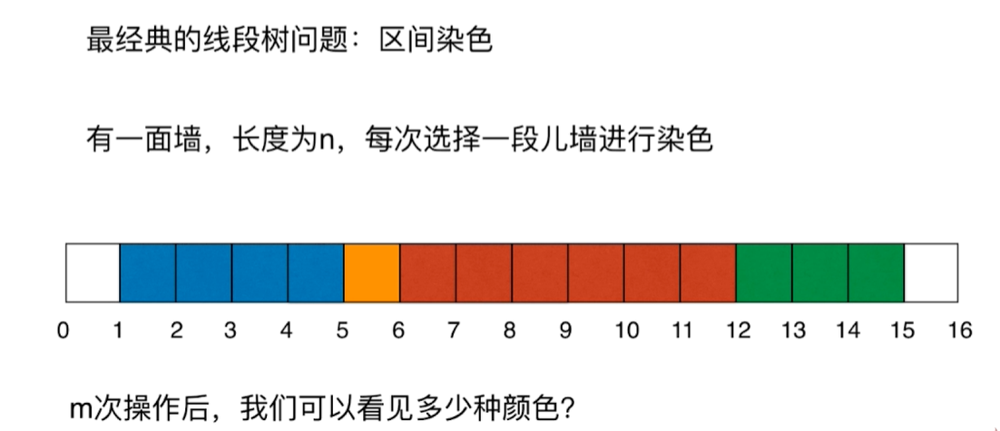
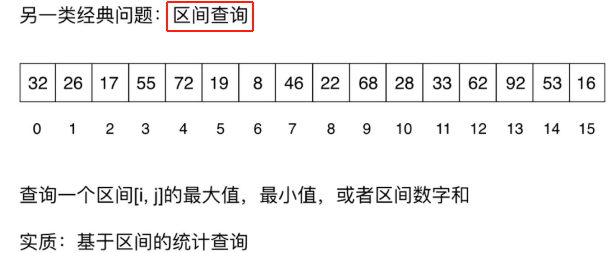
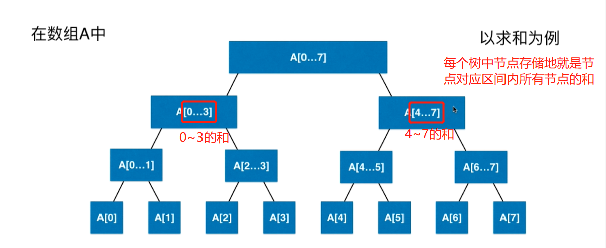
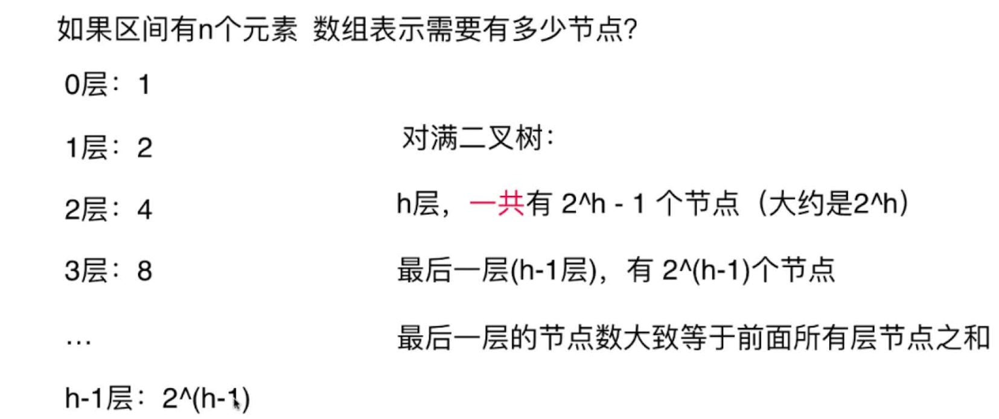
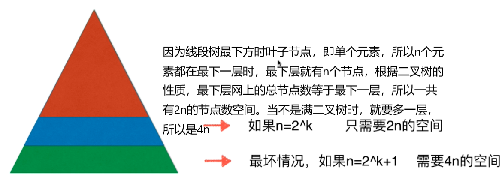
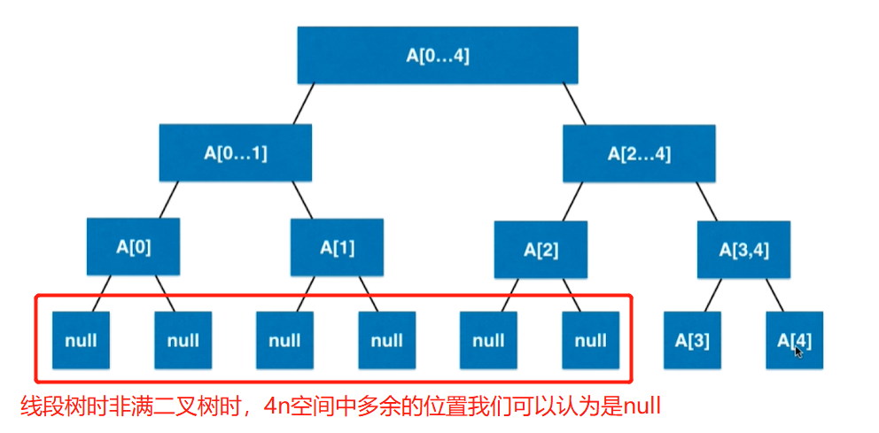

# 第09章 线段树
> 也称区间树，表明我们关系的是一个区间内的问题
## 9.1 什么是线段树
> 对于有一类问题，我们关系地是线段(即区间)

### 线段树的应用举例
+ 染色问题
  > 
  > 
  
  > 染色问题的操作步骤如下：

  | 操作               | 使用数组实现 | 使用线段树实现 |
  | ------------------ | ------------ | -------------- |
  | 染色操作(更新区间) | O(n)         | O(logn)        |
  | 查询操作(查询区间) | O(n)         | O(logn)        |
+ 区间查询问题
  > 
  
  > 线段树的常见操作：
  
  | 操作     | 使用数组实现 | 使用线段树实现 |
  |-------- | ------------ | -------------- |
  | 更新区间 | O(n)         | O(logn)        |
  | 查询区间 | O(n)         | O(logn)        |

### 总结：区间问题的常见操作
| 操作     | 含义 | 使用数组实现 | 使用线段树实现 |
|-------- | ------------ | -------------- | -------------- |
| 更新 | 更新区间中一个元素或者一个区间的值 | O(n)         | O(logn)        |
| 查询 | 查询一个区间[i, j]中的最大值、最小值或区间数字和 | O(n)         | O(logn)        |

显然我们应该用线段树来解决问题

### 线段树举例
> 每个节点存储地就是这个区间的特征值



## 9.2 线段树基础表示

### 线段树不一定是满二叉树
> 上一届的A[0...7]的例子比较特殊，区间长度为2的3次方，正满填满一棵二叉树

下面的例子中，当区间长度不是2的整数次方时，区间没法均分，线段树就不是满二叉树了


不是满二叉树，我们仍然可以用数组来表示线段树，不满的地方我们用空来在数组中表示即可

### 区间有n个元素时，线段树的数组需要多少个节点？




总上：
+ 如果区间有n个元素，表示线段树的数组需要4n的空间
+ 因为线段树不考虑添加元素，即区间固定，所以使用4n的静态空间即可

线段树时非满二叉树时，4n空间中多余的位置我们可以认为是null,如下图：


## 9.3 构建线段树
> 基于递归来做，好好体会下

```java
public SegmentTree(E[] arr, Merger<E> merger) {
    this.data = (E[]) new Object[arr.length];
    this.merger = merger;
    // 数组复制
    for (int i = 0; i < arr.length; i++) {
        data[i] = arr[i];
    }
    tree = (E[]) new Object[4 * arr.length];
    // 构建线段树
    buildSegmentTree(0, 0, data.length - 1);
}

/**
 * 创建线段树：在treeIndex的位置创建区间[l...r]的线段树
 *
 * @param treeIndex 要创建的线段树的根节点
 */
private void buildSegmentTree(int treeIndex, int l, int r) {
    assert (l <= r);
    // 递归终止条件
    if (l == r) {
        // 当只有一个元素的时候，即到了线段树的最下层叶子节点的位置
        tree[treeIndex] = data[l];
        return;
    }

    // 递归逻辑
    // 获取左孩子的索引
    int leftTreeIndex = leftChild(treeIndex);
    int rightTreeIndex = rightChild(treeIndex);
    // 确定左右区间的分界点，[leftTreeIndex, mid] [mid+1, rightTreeIndex]
    // 中间位置 当(l+r)/2会有溢出问题，，可以使用l+(r-l)/2来解决
    int mid = l + (r - l) / 2;
    buildSegmentTree(leftTreeIndex, l, mid);
    buildSegmentTree(rightTreeIndex, mid + 1, r);

    // 这里根据业务特点决定每个节点的值是sum、max、min、avg等.综合左右子树来得到父节点的数据
    tree[treeIndex] = merger.merge(tree[leftTreeIndex], tree[rightTreeIndex]);
}
```

## 9.4 线段树的查询操作
> 要查的区间要分如下3种场景，进行递归查找
+ 完全在根节点左子树
+ 完全在根节点右子树
+ 部分在在根节点左子树，部分在在根节点右子树

```java
/**
 * 查询指定区间[queryL,queryR]的merge结果
 *
 * @param queryL 区间左边界
 * @param queryR 区间右边界
 * @return 返回得到的merge结果
 */
public E query(int queryL, int queryR) {
    assert queryL <= queryR;
    if (queryL < 0 || queryL >= data.length || queryR < 0 || queryR >= data.length) {
        throw new IllegalArgumentException("Index is illegal");
    }
    return query(0, 0, data.length - 1, queryL, queryR);
}

/**
 * 在以treeIndex为跟的线段树种[l...r]的范围内，搜索区间[queryL...queryR]的值
 *
 * @param treeIndex 开始查找的根节点
 * @param l         区间左边界
 * @param r         区间右边界
 * @param queryL    要查询的左边界
 * @param queryR    要查询的右边界
 * @return 查询并Merge后的结果
 */
private E query(int treeIndex, int l, int r, int queryL, int queryR) {
    // 1.递归终止条件
    if (l == queryL && r == queryR) {
        // 当区间边界和指定的完全重合的时候，直接返回根节点的值就行
        return tree[treeIndex];
    }

    // 2.递归具体逻辑
    // 获取左孩子的索引
    int leftTreeIndex = leftChild(treeIndex);
    int rightTreeIndex = rightChild(treeIndex);
    // 中间位置 当(l+r)/2会有溢出问题，，可以使用l+(r-l)/2来解决
    int mid = l + (r - l) / 2;
    // 只在右侧或者只在左侧，都可以直接计算结果后返回
    if (queryL >= mid + 1) {
        // 2.1 只在右侧找，因为左边界都比左右子树的中间位置大，所以一定在右侧找
        return query(rightTreeIndex, mid + 1, r, queryL, queryR);
    } else if (queryR <= mid) {
        // 2.2 只在左侧找，因为右边界都比左右子树的中间位置小，所以一定在左侧找
        return query(leftTreeIndex, l, mid, queryL, queryR);
    }

    // 2.3在左右两侧各有一部分,不会有一个区间完全满足我们的查找边界[queryL, queryR]，所以要分开查，然后用自定义的Merge计算最终的结果
    E leftResult = query(leftTreeIndex, l, mid, queryL, mid);
    E rightResult = query(rightTreeIndex, mid + 1, r, mid + 1, queryR);
    return merger.merge(leftResult, rightResult);
}
```

## 9.5 线段树查询操作相关的的[leetCode303号问题](https://leetcode-cn.com/problems/range-sum-query-immutable/)
> 一定要注意传入的nums为空的情况，会导致SegmentTree无法创建从而为null
+ [题目地址](https://leetcode-cn.com/problems/range-sum-query-immutable/)
+ [实现代码](src/main/java/Chapter09SegmentTree/Section5LeetCodeAboutSegmentTreeQuery/NumArray.java)

## 9.6 线段树的更新

