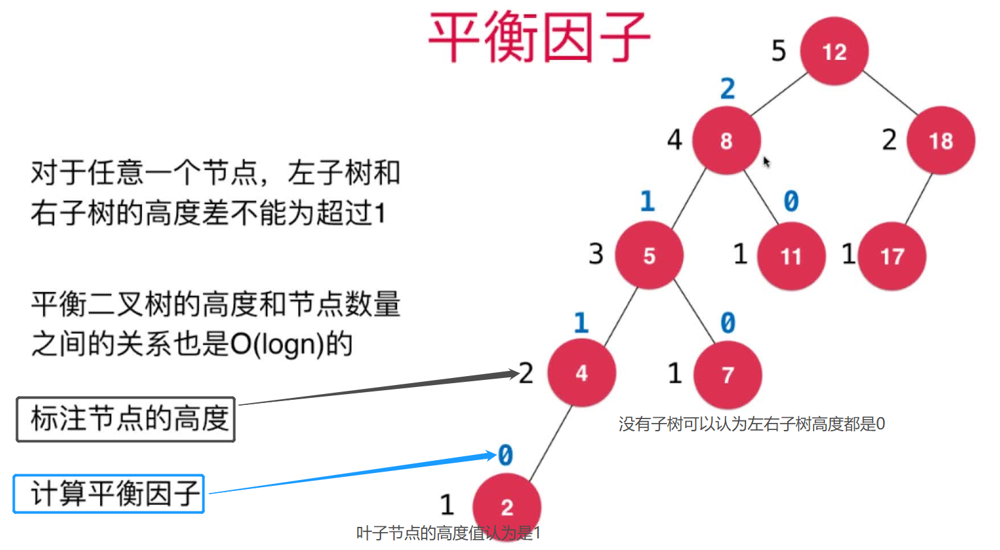

# 第12章 AVL平衡树
## 12.1 什么是AVL平衡树
> AVL是两个人的任命 `Adelson-Velsky`和`Landis`，；两个人都是俄罗斯人，是两人在1962年的论文中首次提出，是最早的自平衡二分搜索树
## 什么是平衡二叉树？
+ 对任意一个节点，其左子树和右子树的高度差不能超过1
+ 平衡二叉树的高度和节点数量之间的关系也是`O(logn)`的
+ 平衡二叉树某个节点的高度值=`max(左子树高度值，右子树高度值)` + 1。+1时因为父亲节点比子节点高一层。叶子节点的高度值认为是1，左右子树为空高度认为是0
  > 。在下图中用黑色表示
+ 平衡二叉树某个节点的平衡因子=`左子树高度-右子树高度值`，子树为空平衡因子认为是0
  > 在下图中用蓝色表示

### 平衡二叉树中"平衡"的含义
+ 如果说一棵树是“平衡”的，就隐含着“这棵树的高度和节点数量成 log(n) 的关系”这样的信息，这也就是“平衡”的意义所在。
+ 之所以要区分一棵树是否平衡，就是因为需要知道这棵树的操作复杂度是什么量级的。比如说“堆是一种平衡树”，实际上就是从操作复杂度说“堆的各种操作（insert、extract）的复杂度都是 O(logn)”。