# 第13章 红黑树
## 13.1 红黑树与2-3树
### 红黑树举例
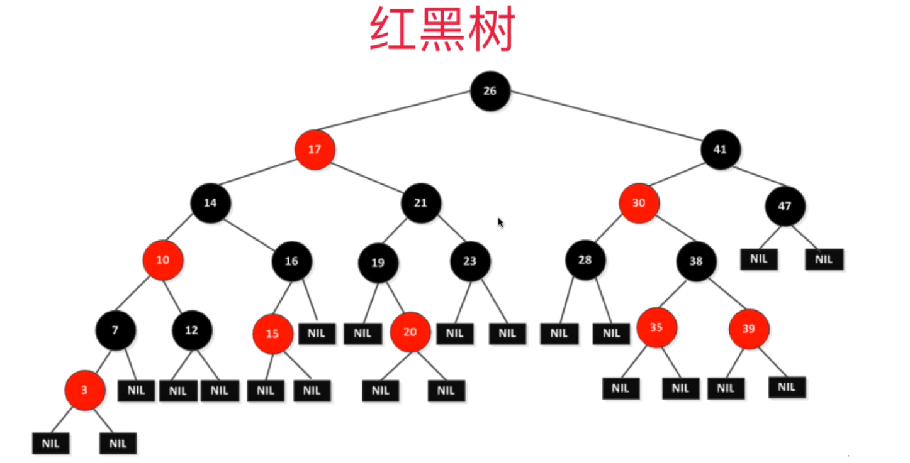
### 《算法导论》中堆红黑树的定义
> 首先红黑树一定是一棵二分搜索树BST
+ 1.每个节点或者是红色的，或者是黑色的
+ 2.根节点是黑色的
+ 3.每一个叶子节点(最后的空节点)是黑色的
+ 4.如果一个节点是红色的，那么它的孩子节点都是黑色的
+ 5.从任意一个节点到叶子节点，经过的黑色节点时一样的
### 红黑树的作者
> Robert Sedgewick，也是《算法(第4版)》的作者


> 红黑树作者的师傅正是TAPCP(《计算机编程艺术》)的作者`高德纳`


### 红黑树与2-3树之间的等价关系
> 理解了红黑树与2-3树之间的等价关系的等价关系，红黑树并不难。2-3树堆理解B类树也有很大的帮助。

### 2-3树的基本性质
+ 满足`二分搜索树BST(见第6章)`的基本性质
+ 节点可以存在一个元素或者两个元素
+ 每个节点可以有2个孩子或者3个孩子
+ 2-3树是一种绝对平衡的树。
  > 绝对平衡的含义：从根节点到任意一个叶子节点所经历的节点数都是相同的

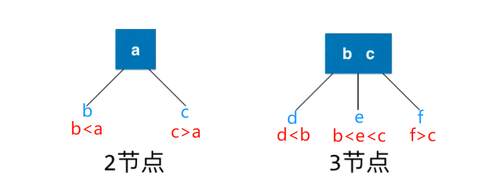

举例如下：  


## 13.2 2-3树的绝对平衡性：`从根节点到任意一个叶子节点所经历的节点数都是相同的`

### 2-3树插入新节点的原则
+ 2-3树添加节点永远不会添加到一个空(NULL)的位置
+ 一个框内有3个数字我们称之为4节点(3个数字可以劈处4个叉，所以叫4节点)
  > 如下图，6插入已有的树中，因为不能插入到空节点子树上，所以只能和12、18组成4节点
  > 
+ 2-3树其实就是不断地形成3节点、4节点，然后`拆分4节点成三个2节点`并`保持绝对平衡`的过程
  + 比如上面4节点的图，不能按照如下的方式，因为这样拆就不能保持绝对平衡了
    > 
  + 正确的拆法应该是把4节点的中间节点12往上提，和父亲节点进行合并
    + 如果往上提的12和父亲节点37形成了3节点，就等待再有新节点来和12、37组成4节点
      > 
    + 一旦12、37加上新来的节点组成了4节点，就可以4节点变成3个2节点，而且还能保持二叉树的绝对平衡
      > 

### 2-3树插入新节点的情况分类
+ 被插入地是2节点，直接和已有节点合并成3节点即可
  > 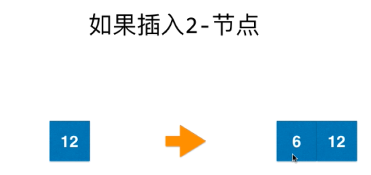
+ 被插入地是3节点而且是根节点，可以先和3节点合并成4节点，然后把一个4节点拆分成3个2节点，仍能保持2-3树的绝对平衡
  > 
+ 被插入地是3节点但是是叶子节点，其父亲节点是2节点。可以先和被插入地3节点合并成4节点，把4节点的中间那个数上移到父亲节点和其组成3节点
  > 
+ 被插入地是3节点但是是叶子节点，其父亲节点是3节点。可以先和被插入地3节点合并成4节点，把4节点的中间那个数上移到父亲节点和其组成4节点,这个4节点可以拆分成3个2节点
  > 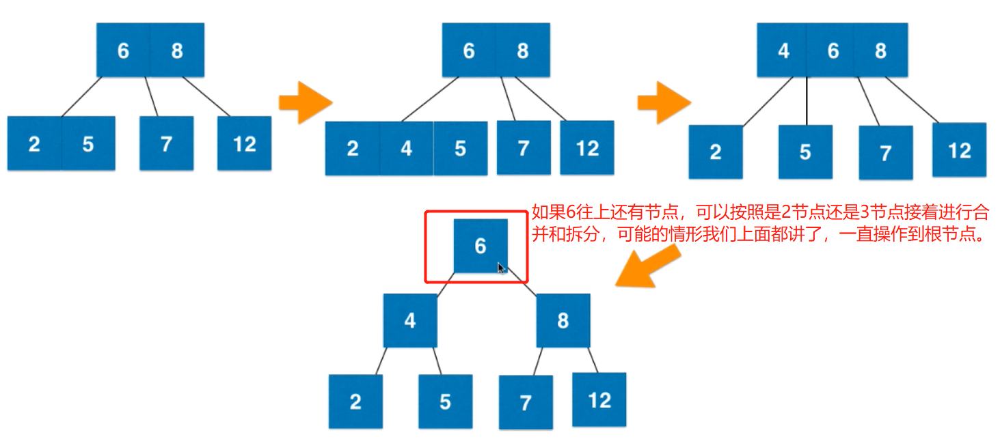

通过上面的4操作，所有的新节点插入后都可以保持2-3树的绝对平衡。

## 13.3 2-3树和红黑树的等效关系
### 2节点和3节点的等效关系
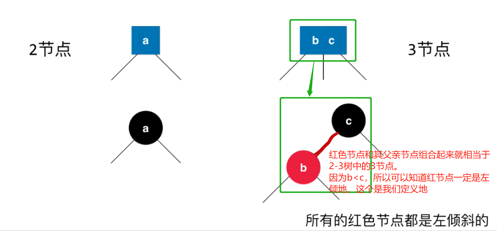

上面的对应关系的举例如下，自己画一下


### 红黑树的基础结构代码
> 架构还是用地支持键值对的BST，给每个节点加入了color属性
+ [实现代码](src/main/java/Chapter13ReadBlackTree/Section3RBTreeBasic/BSTKV_RBTree.java)

## 13.4 红黑树的基本性质和复杂度分析
### 红黑树的基本性质
> 红黑树是保持`黑平衡`的二叉树，严格意义上不是平衡二叉树。黑红合一形成的2-3才是绝对平衡的二叉树

+ 1.每个节点要么是红色的，要么是黑色的
+ 2.根节点是黑色的
+ 自己补充地：红黑树添加的节点初始一定是红色的
+ 3.每一个叶子节点(最后的空节点null)是黑色的
+ 4.如果一个节点是红色的，那么它的孩子节点都是黑色的
+ 自己补充地：黑色节点的右孩子一定是黑色的
  > 我们定义地2-3节点拆分时，红色节点一定是左倾地
+ 5.从任意一个节点到叶子节点，经过的黑子节点数是相等的
  > 因为是从绝对平衡的2-3树转化来地


### 红黑树的复杂度分析
> 红黑树的最大高度是2logn，所以增删改查的时间复杂度是O(logn)，并且绝对不会蜕化成链表。

## 13.5 红黑树添加元素：保持根节点为黑色和左旋转
> 时时记住13.2节2-3树添加节点步骤和情形
### 参考2-3树中添加一个元素，只是要针对红黑树做对应的颜色设置
+ 添加进一个2节点，形成一个3节点
+ 添加进一个3节点，暂时形成一个4节点，4节点可以拆分成3个2节点

对应2-3树永远添加到非空节点组成3节点或4节点：红黑树添加节点，永远添加红色节点。好好回下2-3树和红黑树的节点等效关系

### 2-3树中的4节点拆分时向上融合的元素在红黑树中一定是红色的，一直上浮到根节点才能变成黑色
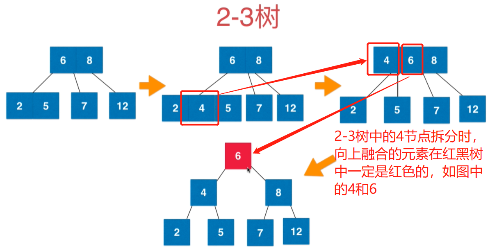

### 新加入的节点的情况
> 新插入的节点初始一定是作为红色节点
+ 插入的位置是左节点，不用做调整，这样就行，符合红黑树的定义
  > 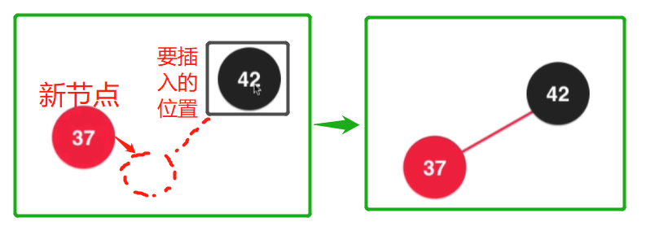
+ 插入的位置是右节点，需要进行左旋转，这样是为了把新插入节点的父节点变为它的左节点，然后颜色取反，就又满足红黑树的特点了。
  >

### 左旋转的详细解析
+ 仍以42作为新节点插入到37的右侧为例，37称为node，42称为x。插入后的树如下：
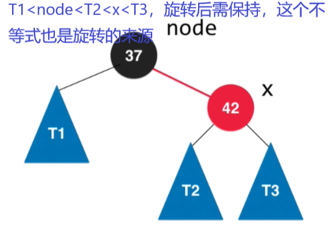
+ x的左子树T2卸下来挂到node的右子树上：`node.right = x.left`
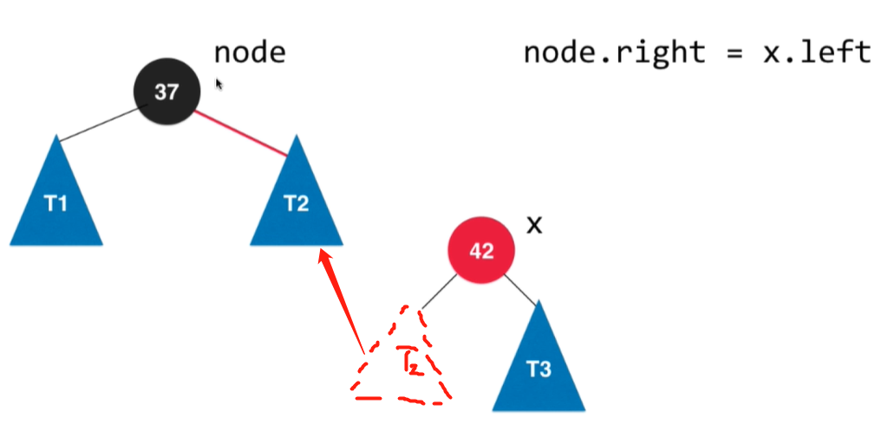
+ x的左子树连接到node上：`x.left=node`
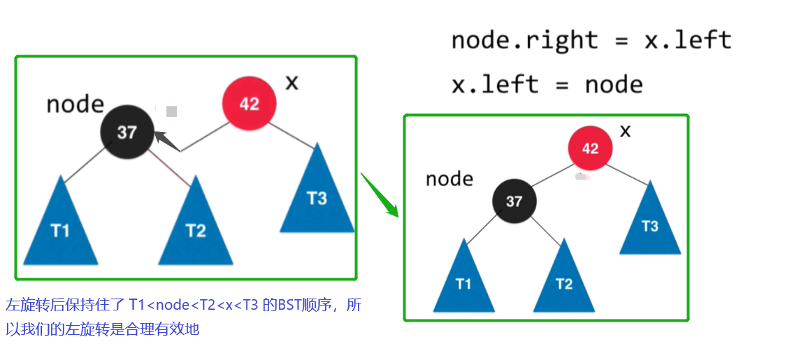
+ 根据红黑树的性质更新节点的颜色
  + `x.color = node.color`：x替代了原来node节点的位置变成了新的根节点，所以要继承node的颜色
  + `node.color = RED`：`node-x`相当于2-3树中的3节点，node作为左侧节点，按照红黑树的定义应该是红色
    > 原来node的颜色红或者黑都可能，如果原来node就是红色，那么node和x作为连接的父子节点就都是红色，产生了两个连续的红色节点，这不符合红黑树的性质第4条。其实左旋转只是一个中间步骤，当遇到两个连续的红色节点时还会有进一步的操作(递归传给父节点让父节点处理)，见后面的课程。
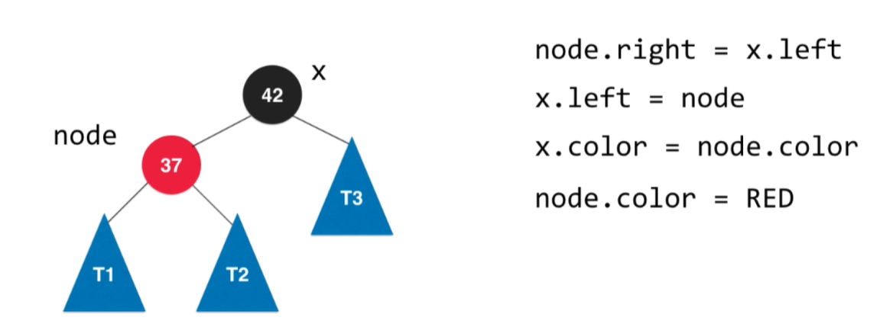

### 左旋转的代码实现

```java
/**
     * 新加入节点后进行左旋转
     * node.right = x.left;
     * x.left=node;
     * x.color = node.color;
     * node.color = RED
     * 图示如下：
     * //   node                     x
     * //  /   \     左旋转         /  \
     * // T1   x   --------->   node   T3
     * //     / \              /   \
     * //    T2 T3            T1   T2
     *
     * @param node 新加入节点的父节点
     * @return 左旋转后原本以node作为根节点的子树的新的根节点
     */
private Node rotateLeft(Node node) {
    // 暂存节点
    Node x = node.right;
    // 左旋转
    node.right = x.left;
    x.left = node;
    // 更新颜色
    x.color = node.color;
    node.color = RED;
    return x;
}
```

## 13.6 颜色翻转和右旋转
> 上一节的两种情况实际是新的节点x插入到一个已有的2节点中，本节我们将看向红黑树中的`3节点(要被新节点插入的节点是红色，且其父节点是黑色，红色节点是其父亲节点的左节点)`，如下图就是一个红黑树中等效于2-3树中3节点的两个相连节点
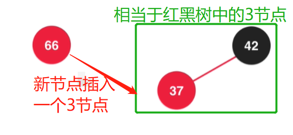

### 红黑树中新插入的节点和已有节点组成了4节点，而且是平衡的一个小树，则需要进行颜色翻转

```java
/**
 * 把以node为根的节点和左右孩子节点的颜色进行翻转(红变黑，黑变红)
 * 红黑树中新插入的节点和已有节点组成了4节点，而且是平衡的一个小树，则需要进行颜色翻转.
 *
 * @param node 要翻转子树的根节点
 */
private void flipColors(Node node) {
    node.color = RED;
    node.left.color = BLACK;
    node.right.color = BLACK;
}
```
### 红黑树中新插入的节点和已有节点组成了4节点，而且是不平衡的一个小树，则需要先进行右旋转，然后颜色翻转
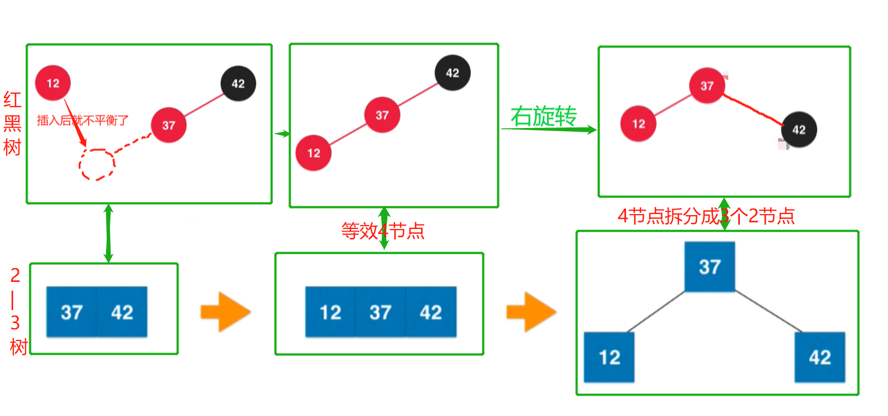

右旋转的详细图示如下：
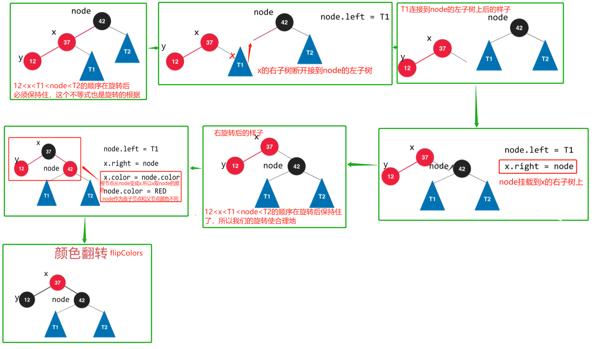
```java
/**
 * 新加入节点后进行右旋转
 * 下面的伪代码
 * node.left = T1
 * x.right = node
 * x.color = node.color
 * node.color = RED
 * flipColors()
 * 下面是图示：
 * //     node                   x
 * //    /   \     右旋转       /  \
 * //   x    T2   ------->   y   node
 * //  / \                       /  \
 * // y  T1                     T1  T2
 *
 * @param node 新加入节点的父节点
 * @return 右旋转后原本以node作为根节点的子树的新的根节点
 */
private Node rotateRight(Node node) {
    // 暂存节点
    Node x = node.left;
    Node T1 = x.right;
    // 右旋转
    node.left = T1;
    x.right = node;
    // 颜色更新
    x.color = node.color;
    node.color = RED;
    return x;
}
```

## 13.7 红黑树添加新元素的完整代码
> 综合前两节，新节点加入红黑树的情况有如下几种
+ 一、新加入的节点被添加到`2节点`下作为孩子节点
  + 1.作为左孩子，和父节点组成一个2-3树中的3节点，且符合红黑树定义，所以不用任何调整
  + 2.作为右孩子，和父节点组成一个2-3树中的3节点，不符合红黑树定义，实际恰好相反，需要进行左旋转
+ 二、新加入的节点被添加到`3节点`下作为孩子节点
  > 红黑树中的3节点：要被新节点插入的节点是红色，且其父节点是黑色，红色节点是其父亲节点的左节点
  + 1.作为3节点的右孩子(被插入节点的父节点的右孩子)，直接就是平衡地，不需要旋转，只需要`颜色翻转`即可
  + 2.作为3节点的左孩子(被插入节点的左孩子)，需要先进行`右旋转`，然后`颜色翻转`
  + 3.作为3节点的中孩子(被插入节点的右孩子)，需要先进行`左旋转`，变成上一种情况，然后按照上一种情况先后进行`右旋转`和`颜色翻转`即可
    > 这种情况前面没有讲，其实是前面几种情况的综合，用下面的图示自己体会下吧。
    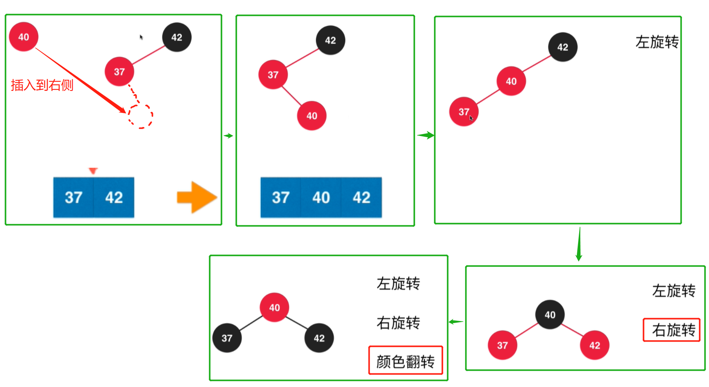
  > 被添加到3节点的3这种情况总结如下图：
  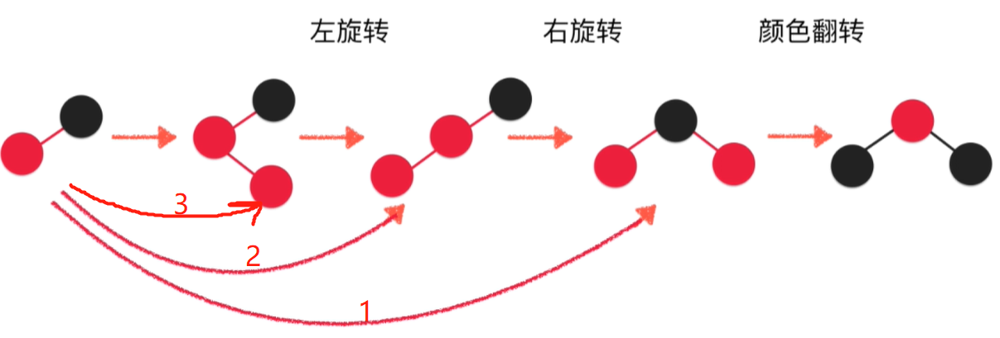

```java
/**
 * 新加入节点后进行左旋转
 * node.right = T2;
 * x.left=node;
 * x.color = node.color;
 * node.color = RED
 * 图示如下：
 * //   node                     x
 * //  /   \     左旋转         /  \
 * // T1   x   --------->   node   T3
 * //     / \              /   \
 * //    T2 T3            T1   T2
 *
 * @param node 新加入节点的父节点
 * @return 左旋转后原本以node作为根节点的子树的新的根节点
 */
private Node rotateLeft(Node node) {
    // 暂存节点
    Node x = node.right;
    Node T2 = x.left;
    // 左旋转
    node.right = T2;
    x.left = node;
    // 更新颜色
    x.color = node.color;
    node.color = RED;
    return x;
}

/**
 * 新加入节点后进行右旋转
 * 下面的伪代码
 * node.left = T1
 * x.right = node
 * x.color = node.color
 * node.color = RED
 * flipColors()
 * 下面是图示：
 * //     node                   x
 * //    /   \     右旋转       /  \
 * //   x    T2   ------->   y   node
 * //  / \                       /  \
 * // y  T1                     T1  T2
 *
 * @param node 新加入节点的父节点
 * @return 右旋转后原本以node作为根节点的子树的新的根节点
 */
private Node rotateRight(Node node) {
    // 暂存节点
    Node x = node.left;
    Node T1 = x.right;
    // 右旋转
    node.left = T1;
    x.right = node;
    // 颜色更新
    x.color = node.color;
    node.color = RED;
    return x;
}

/**
 * 把以node为根的节点和左右孩子节点的颜色进行翻转(红变黑，黑变红)
 * 红黑树中新插入的节点和已有节点组成了4节点，而且是平衡的一个小树，则需要进行颜色翻转.
 *
 * @param node 要翻转子树的根节点
 */
private void flipColors(Node node) {
    node.color = RED;
    node.left.color = BLACK;
    node.right.color = BLACK;
}
/**
 * 红黑树的颜色和节点平衡
 *
 * @param node 要维护的节点
 * @return 维护后新的根节点
 */
private Node rbManage(Node node) {
    // 左孩子不是红色，右孩子是红色，就左旋转
    if (!isRed(node.left) && isRed(node.right)) {
        node = rotateLeft(node);
    }
    // 左孩子是红色，左孩子的左孩子还是红色，就左旋转
    if (isRed(node.left) && isRed(node.left.left)) {
        node = rotateRight(node);
    }
    // 左孩子和右孩子都是红色
    if (isRed(node.left) && isRed(node.right)) {
        flipColors(node);
    }
    return node;
}
// 在添加节点时调用下即可
private Node add(Node node, K key, V val) {
    ......
    return rbManage(node);
}
``` 