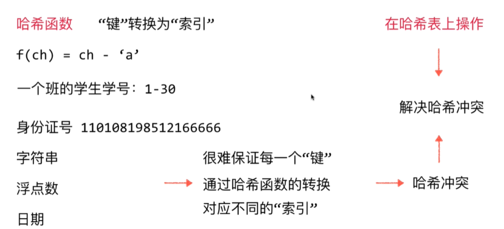
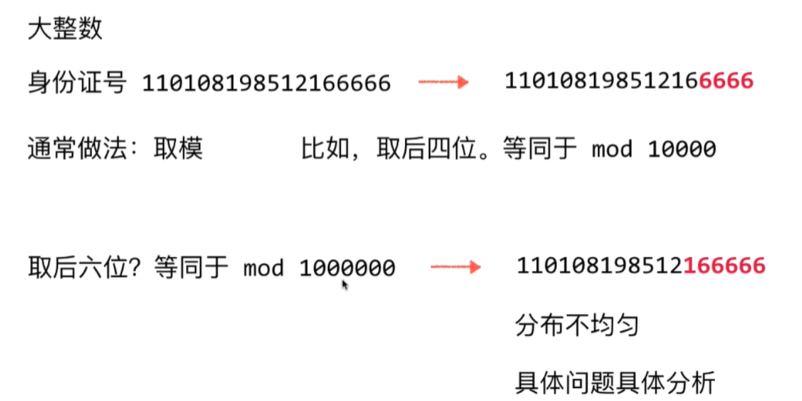
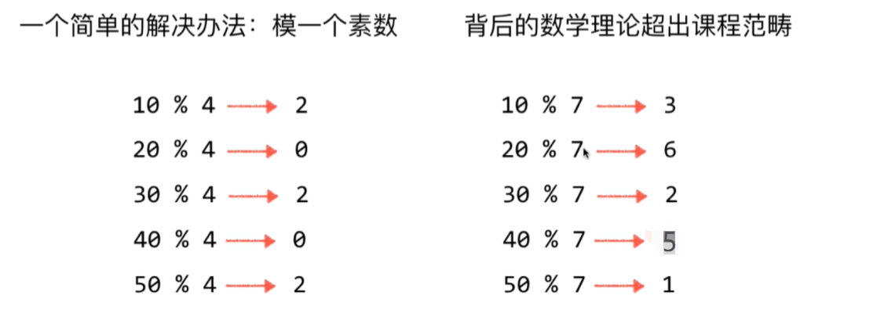
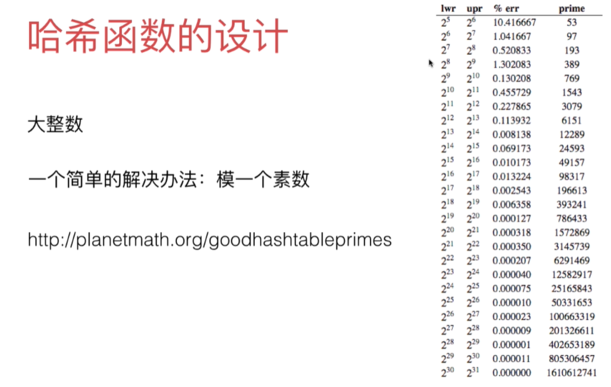
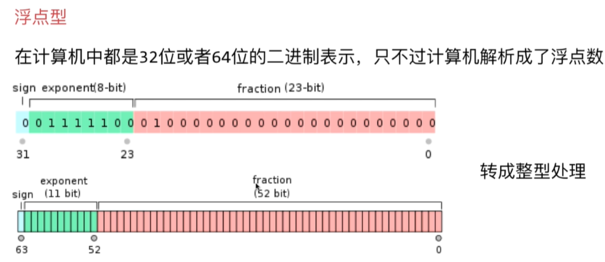
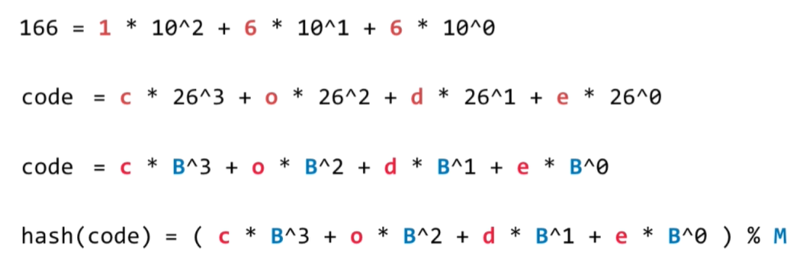
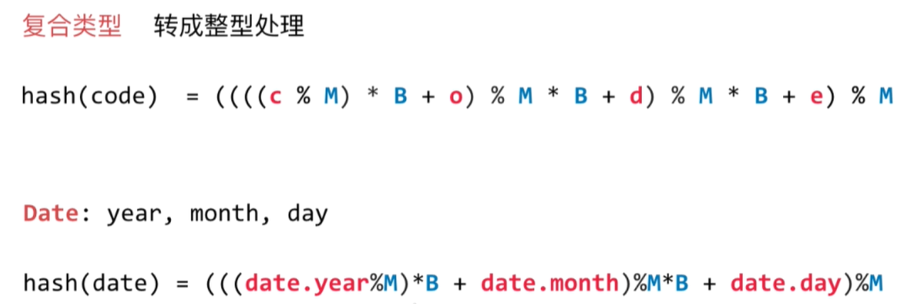
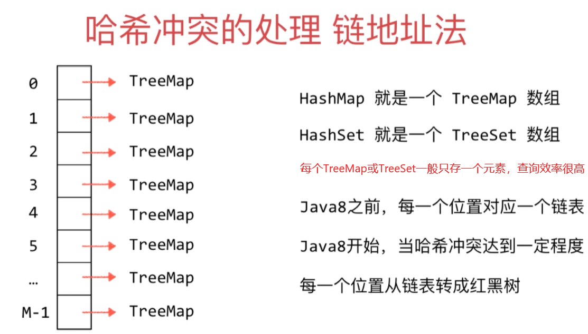
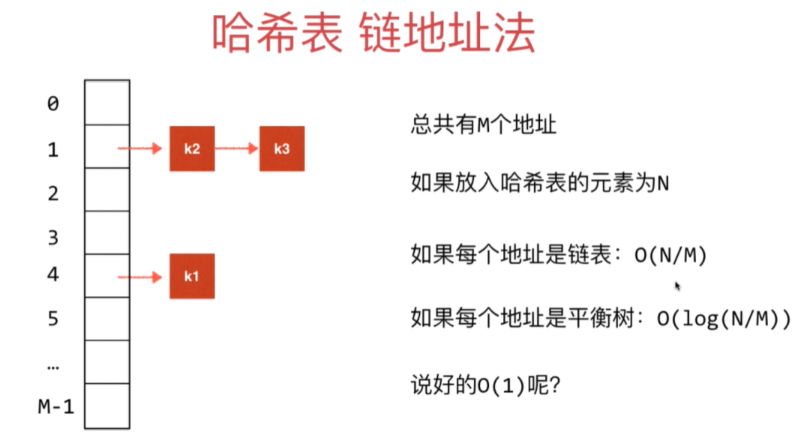

# 第14章 哈希表
## 14.1 哈希表基础
### 以LeetCode387号问题为例
```java
/***********************************************************
 * @Description : LeetCode387号问题
 * https://leetcode-cn.com/problems/first-unique-character-in-a-string/
 * 给定一个字符串，找到它的第一个不重复的字符，并返回它的索引。如果不存在，则返回 -1
 * 案例:
 *
 * s = "leetcode"
 * 返回 0.
 *
 * s = "loveleetcode",
 * 返回 2.
 * @author      : 梁山广(Liang Shan Guang)
 * @date        : 2020/1/5 17:28
 * @email       : liangshanguang2@gmail.com
 ***********************************************************/
package Chapter14HashTable.Section1HashTableBasic;

class Solution {
    public int firstUniqChar(String s) {
        int[] freq = new int[26];
        for (int i = 0; i < s.length(); i++) {
            // 对应字符的频率+1
            freq[s.charAt(i) - 'a']++;
        }
        for (int i = 0; i < s.length(); i++) {
            if (freq[s.charAt(i) - 'a'] == 1) {
                return i;
            }
        }
        return -1;
    }
}
```
上面代码中的int[26] freq就是一个哈希表，每个字符都和一个索引相对应，查找的时间复杂度都是O(1)
把具体的数据类型转换成唯一的索引的函数就叫`哈希函数`，我们


其实要实现所有数据类型的通用哈希函数还是很麻烦地，关键问题是哈希冲突


+ 哈希表充分体现了算法设计领域的经典思想：空间换时间
+ 哈希表是时间和空间的平衡
+ 哈希函数的设计是很重要的
+ “键”通过哈希函数得到的“索引”分布越均匀越好

## 14.2 哈希函数的设计

### 整型
> 其他的数据类型如浮点型、字符串等都可以转换为求整型的哈希函数
+ 小范围正整数直接使用
+ 小范围负整数进行偏移 比如：`-100~100`-->`0~200`
+ 大整数：取模，但是取模可能导致分布不均匀，所以要具体问题具体分析
  
  <br/>
  
  <br/>
  模一个素数可以保证模后的数保持区分度，不会出现不同的数模一个素数后的值相等的情况，这个是有数学理论支撑的，此处不深研究~
  
  如何取合适的素数：
  
### 浮点型
> 在计算机中都是32位或者64位的二进制表示，只不过计算机解析成了浮点数，所以我们可以转成整型处理


### 字符串
> 仍然可以转成整型处理




### 复合类型


### 哈希函数的原则
+ 1.一致性：如果a==b，则`hash(a)==hash(b)`
+ 2.高效性：计算高效简便
+ 3.均匀性：哈希值分布均匀

## 14.3 Java中的hashCode方法
> 自定义类对象判断是否相等，要重写`hashCode()`和`equals()`方法，[例子参考](src/main/java/Chapter14HashTable/Section3HashCodeInJDK/Student.java)
>IDEA可以自动生成hashCode()和equals()方法，`Alt+Insert`很方便
```java
@Override
public int hashCode() {
    // B只要是素数即可，素数取值参考网上经验总结
    int B = 31;
    int hash = 0;
    hash = hash * B + grade;
    hash = hash * B + cls;
    hash = hash * B + firstName.hashCode();
    hash = hash * B + lastName.hashCode();
    return hash;
}

@Override
public boolean equals(Object o) {
    if (this == o) {
        return true;
    }
    if (!(o instanceof Student)) {
        return false;
    }
    Student student = (Student) o;
    return grade == student.grade &&
            cls == student.cls &&
            firstName.equals(student.firstName) &&
            lastName.equals(student.lastName);
}
```

## 14.4 哈希冲突的解决方法：链地址法，Separate Chaining


##  14.5 实现自己的哈希表
+ [实现代码](src/main/java/Chapter14HashTable/Section5MyHashTable/HashTable.java)
+ [测试代码](src/main/java/Chapter14HashTable/Section5MyHashTable/Main.java)
 > 哈希表是空间换时间，所以耗时最短

## 14.6 哈希表的动态空间处理和复杂度分析

+ [实现代码](src/main/java/Chapter14HashTable/Section6DynamicHashTable/HashTable.java)

## 14.7 哈希表更复杂的动态空间处理方法
+ [代码实现](src/main/java/Chapter14HashTable/Section7PerfectHashTable/HashTable.java)

## 14.8 更多关于哈希冲突的方法
+ 开放地址法
+ 再哈希法 Rehashing
+ Coalesced Hashing

总结：哈希表其实就是个超大的数组，每个数组元素都是一个TreeMap或TreeSet，因为一般哈希地址是唯一的(hashCode返回地值唯一)，所以TreeMap或TreeSet一般只存一个元素，所以HashTable查询元素时先通过哈希索引直接定位到map再从map中取出唯一的元素，整个过程的时间复杂度几乎是O(1)，所以当对时间要求高时，建议用HashTable。同时HashTable为了时间牺牲了性能，HashTable数组开地一般都非常大，所以说哈希表是在时间和空间上做权衡的经典例子。为了降低空间的消耗，第7节我们实现了动态调节哈希表的size,第8节我们根据网上的经验表，选取了初始时最合适的size，这些都是为了改善哈希表的空间占用 
