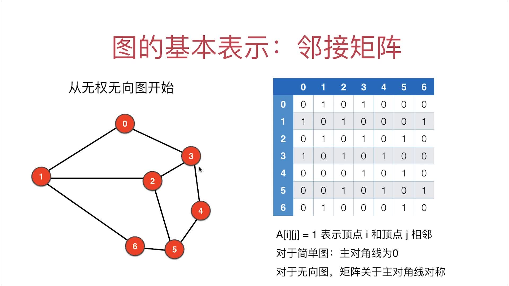
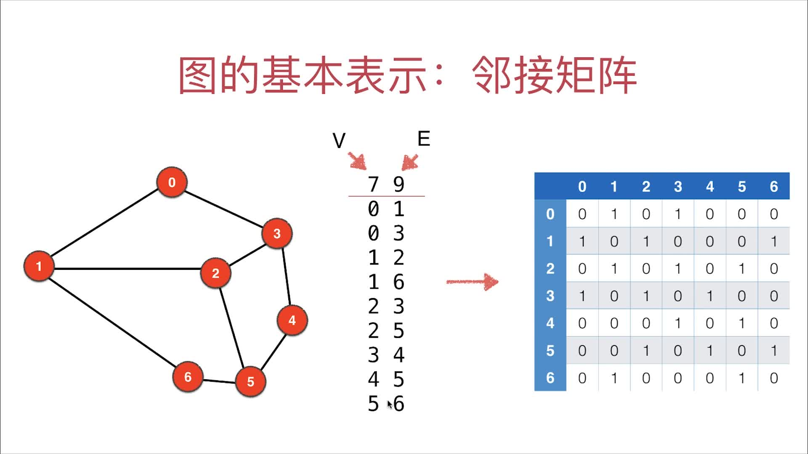
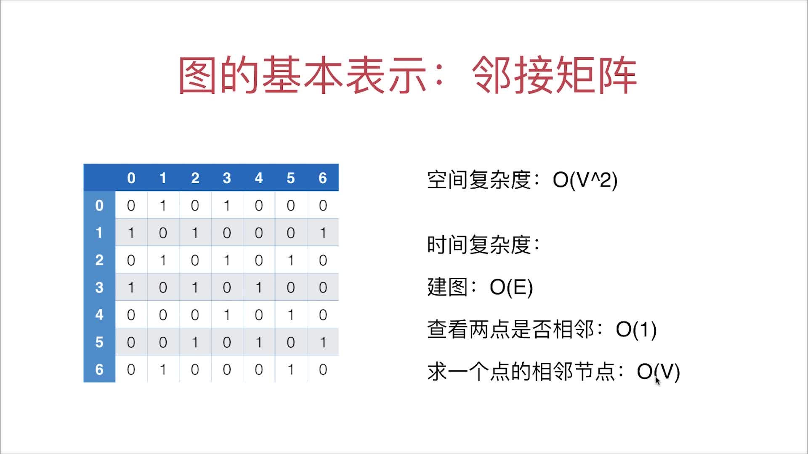
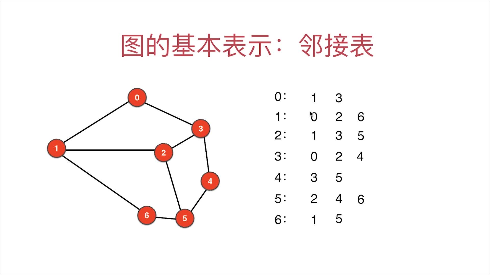

# 第2章 图的基本表示

>  [参考代码：算法基础课的第7章](../Part1Basic/JAVA/src/main/java/Chapter7GraphBasics)，[对应的笔记](../Part1Basic/第7章_图论基础.md)


## 2.1 图的分类
+ 无向图 Undirected Graph
+ 有向图 Directed Graph
+ 无权图 Unweighted Graph
+ 有权图 Weighted Graph

方向和权重组合可以得到如下四种常见的图：

> 优先讲无向无权图

+ 无向无权图
+ 无向有权图
+ 有向无权图
+ 有向有权图

## 2.2 图的基础概念

+ 顶点 Vertex
+ 边 Edge
+ 点的邻边
+ 路径Path
+ 环Loop：一个图中，一个顶点沿着某条路径出发可以回到自己，这条路径称为环
+ 无环图：没有环的图,可以看做一棵树，其实树可以看做是一种无环图
  > 但是无环图不一定是树，比如多个不联通的分量组成的图
+ 自环边：自己指向自己的边
+ 平行边：两个点之间有两条边，可以认为是互相平行地，即平行边
+ 简单图：没有自环边也没有平行边的图，本课程中讨论地图都是简单图
+ 联通分量：一个图中相互连接并可以相互抵达的子图称为联通分量，注意：
  + 一个图中的所有节点不一定全部相连
  + 一个图中可能有多个联通分量
+ 连通图的生成树：包含原图所有的定点但是不联通的一棵树(边数是v-1)
  + 求最小生成树是很常见的问题
  + 包含所有定点，边数是v-1，不一定是连通图的生成树，可以是有多个联通分量
  + 一个图一定有生成树吗？否。`联通图`才有生成树,多个联通分量的生成树集合我们一般叫生成森林，所以`一个图一定有生成森林`的说法是正确的
+ 一个顶点的度degree:对于无向图，就是指这个顶点相邻的边数

## 2.3 图的基本表示：邻接矩阵

### 邻接矩阵的图示

### 邻接矩阵的数据来源graph.txt的解析
> 第一行的V是vertices(vertex的复数)即顶点数目；E是Edges即边数。第2行往后是各个边的连接情况(两端连接点)


### 邻接矩阵的各种复杂度



## 图的存储结构：邻接矩阵与邻接表（稠密图与稀疏图）

> 平时遇到的图多是稀疏图，用邻接表表示，邻接矩阵用于稠密图

+ 稠密图用 邻接矩阵存储
+ 稀疏图用 邻接表存储

原因：

+ 邻接表只存储非零节点，而邻接矩阵则要把所有的节点信息(非零节点与零节点)都存储下来。
+ 稀疏图的非零节点不多，所以选用邻接表效率高，如果选用邻接矩阵则效率很低，矩阵中大多数都会是零节点！
+ 稠密图的非零界点多，零节点少，选用邻接矩阵是最适合不过！

## 2.4 邻接矩阵的代码实现

> 这里忽略吧，不放代码了。平时基本都用基于TreeSet的邻接表的实现

## 2.5 图的基本表示：邻接表
> 邻接表是稀疏图的表示方法

### 邻接表的图示




## 2.8 图实现(邻接表)的改进

> 源于刘宇波老师的图论课 https://coding.imooc.com/lesson/370.html#mid=27328

代码见[Part1Basic/JAVA/src/main/java/Chapter7GraphBasics/Section4ReadGraphOptimize](../Part1Basic/JAVA/src/main/java/Chapter7GraphBasics/Section4ReadGraphOptimize)

+ 边的编号不能超过边的总数vertices,要加校验,最好整理成校验函数
  ```java
  public void validateVertex(int v) {
      assert (v >= 0 && v < vertices);
  }
  ```
+ 稀疏图的邻接表实现改进:vector换成TreeSet，把查询邻接表的时间复杂度从O(n)提高到了O(logN),而且元素还是有序地
  ```java
   private TreeSet<Integer>[] adj;
  ```
+ 添加degree()函数，用于统计图里每个定点的度(即每个定点有几个邻边)
  ```java
  // 稀疏图，adj是TreeSet
  public int degree(int v) {
      return adj[v].size();
  }
  ```
  
  ```java
  // 稠密图，adj是二维数组
  public int degree(int v) {
      return adj[v].length;
  }
  ```
  
## 2.9 图的多种表示方法和实现的比较

> 后面所有的图都会用基于TreeSet的邻接表来表示


## 最终的最优化图显示代码

> 基于TreeSet的邻接表表示

见[Chapter2GraphExpress](src/main/java/Chapter02GraphExpress)