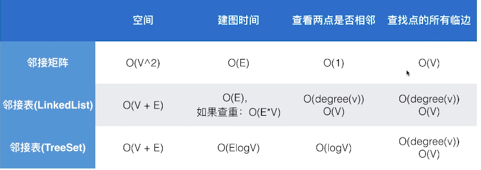

# 图的基本表示

> 参考 [算法基础课的第7章](https://github.com/19920625lsg/liuyubobobo-algorithms/tree/master/Part1Basic/JAVA/src/main/java/Chapter7GraphBasics)

[本章的笔记](https://github.com/19920625lsg/liuyubobobo-algorithms/blob/master/Part1Basic/JAVA/src/main/java/Chapter7GraphBasics/README.md)


## 图的基础概念

+ 顶点 Vertex
+ 边 Edge
+ 无向图 Undirected Graph
+ 有向图 Directed Graph
+ 无权图 Unweighted Graph
+ 有权图 Weighted Graph

方向和权重组合可以得到如下四种常见的图：

> 优先讲无向无权图

+ 无向无权图
+ 无向有权图
+ 有向无权图
+ 有向有权图


## 图的存储结构：邻接矩阵与邻接表（稠密图与稀疏图）

> 平时遇到的图多是稀疏图，用邻接表表示，邻接矩阵用于稠密图

+ 稠密图用 邻接矩阵存储
+ 稀疏图用 邻接表存储

原因：

+ 邻接表只存储非零节点，而邻接矩阵则要把所有的节点信息(非零节点与零节点)都存储下来。
+ 稀疏图的非零节点不多，所以选用邻接表效率高，如果选用邻接矩阵则效率很低，矩阵中大多数都会是零节点！
+ 稠密图的非零界点多，零节点少，选用邻接矩阵是最适合不过！

## 图实现的改进

> 源于刘宇波老师的图论课 https://coding.imooc.com/lesson/370.html#mid=27328

代码见[Part1Basic/JAVA/src/main/java/Chapter7GraphBasics/Section4ReadGraphOptimize](../../Part1Basic/JAVA/src/main/java/Chapter7GraphBasics/Section4ReadGraphOptimize)

+ 边的编号不能超过边的总数vertices,要加校验,最好整理成校验函数
  ```java
  public void validateVertex(int v) {
      assert (v >= 0 && v < vertices);
  }
  ```
+ 稀疏图的邻接表实现改进:vector换成TreeSet，把查询邻接表的时间复杂度从O(n)提高到了O(logN),而且元素还是有序地
  ```java
   private TreeSet<Integer>[] adj;
  ```
+ 添加degree()函数，用于统计图里每个定点的度(即每个定点有几个临边)
  ```java
  // 稀疏图，adj是TreeSet
  public int degree(int v) {
      return adj[v].size();
  }
  ```
  
  ```java
  // 稠密图，adj是二维数组
  public int degree(int v) {
      return adj[v].length;
  }
  ```
  
## 图的多种表示方法和实现的比较

> 后面所有的图都会用基于TreeSet的邻接表来表示



## 最终的最优化图显示代码

> 基于TreeSet的邻接表表示

见[Chapter2GraphExpress](../src/main/java/Chapter2GraphExpress)