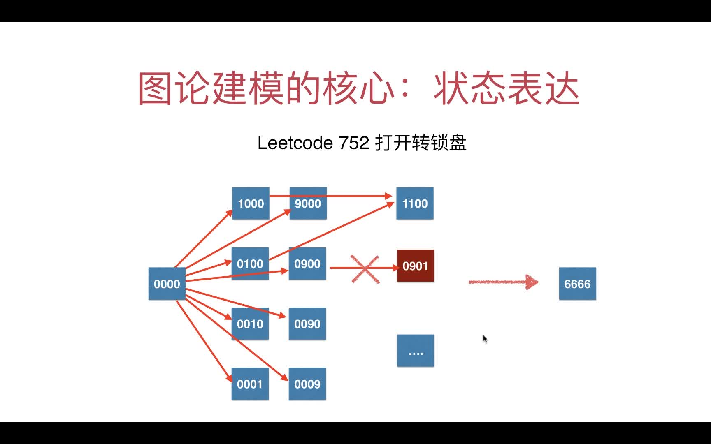

# 第7章 图论搜索和人工智能

> 主要是BFS(广度优先遍历)的应用

## 7.1 算法笔试面试中的BFS问题

### 八连通矩阵例题：[1091. 二进制矩阵中的最短路径](https://leetcode-cn.com/problems/shortest-path-in-binary-matrix)

+ 无权图的最短路径：BFS
+ 八连通分量
+ 不单独键图，直接在二维矩阵中计算

代码实现如下：

+ [基础实现](src/main/java/Chapter07AISearchAndBFS/Section1EightConnectedAndBFS/Solution.java)
+ [可打印完整路径的实现](src/main/java/Chapter07AISearchAndBFS/Section1EightConnectedAndBFS/SolutionOptimize.java)
+ [测试代码](src/main/java/Chapter07AISearchAndBFS/Section1EightConnectedAndBFS/Main.java)

## 7.2~7.3 图论建模的核心：状态表达

> 可以把一个状态当成一个顶点，那么最少状态问题就可以转换成最短路径问题

以[752. 打开转盘锁](https://leetcode-cn.com/problems/open-the-lock)为例

转盘锁一共有`18*10*10*10=10000`中可能性，每个可能性都是一个状态，都可以看做图的一个顶点

+ [超时的实现，因为存deadends用了ArrayList](src/main/java/Chapter07AISearchAndBFS/Section2And3RotaryLock/Solution.java)
+ [超时实现的测试代码](src/main/java/Chapter07AISearchAndBFS/Section2And3RotaryLock/Main.java)
+ [完美实现，把deadends的实现由ArrayList换成了HashSet，瞬间效率就提上来了](src/main/java/Chapter07AISearchAndBFS/Section2And3RotaryLock/SolutionOptimize.java)
+ [完美实现的测试代码](src/main/java/Chapter07AISearchAndBFS/Section2And3RotaryLock/MainOptimize.java)

## 7.4~7.5 智力题略

## 7.6~7.7 滑动谜题略

> [LeetCode 773号 滑动谜题](https://leetcode-cn.com/problems/sliding-puzzle/)

## 7.8 图论搜索和人工智能

