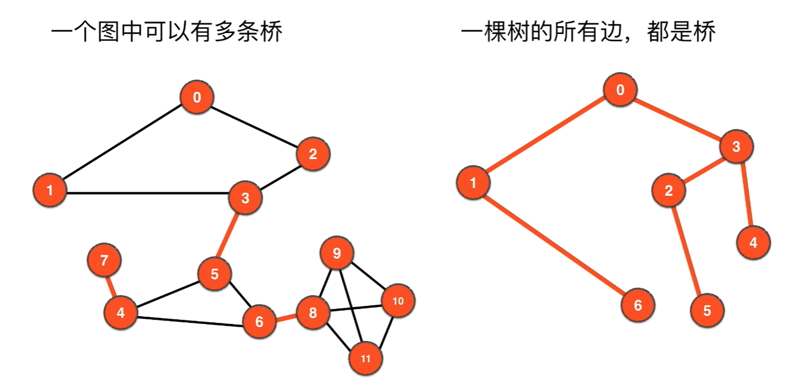

# 第08章 桥和割点以及图的遍历树

## 8.1 什么是桥

### 定义
> 对于无向图，如果删除了一条边，整个图联通分量数量就会变化，则这条边称为`桥(Bridge)`。桥意味着图中最脆弱的关系

### 应用
+ 交通系统
  > 比如两个城市上海和南京仅通过长江大桥相连，如果长江大桥被毁坏了，那么两个城市就分开各自为战了
+ 社交网络
  > 两个班级通过班长联系在一起，大家有活动时可以一起参加，一旦班长之间的关系断了，那么两个班就各自为战了

### 桥的特点
+ 一个图中可以有多条桥
+ 一棵树的所有边都是桥

### 寻找桥的算法
+ 使用DFS就可以解决，但是有难度，因为记录的信息更多元
+ 一般面试不会涉及，竞赛可能会涉及

## 8.2 寻找桥的算法思路

### 桥和环的关系
> 一张图中找环的算法：当检测到一个节点(当前节点current)的相邻节点已经被visited但是这个相邻节点不是current的上一个visited节点，就说明图中有环了

和判断一张图是否有环不同
+ 判断一张图是否有环，是整张图的属性
+ 判断一张图是否有桥，是一条边的属性
寻找桥的过程需要遍历每一条边，DFS正好能用上

DFS遍历点和边的过程如下：

### 举例如何找桥
> 关键是能不能找到另一条路径回到当前节点的上一个访问节点，找到不到就说明当前节点和上一个访问节点组成了桥

如何判断边`v-w`是不是桥？
> 看通过w，能否从另外一条不同的路径回到v或者v之前的顶点

### 寻找桥的代码逻辑
> 看通过w，能否从另外一条路回到v或者`v之前的任何一个顶点`，核心是理解order和lowest数组
+ 对于每一个顶点，记录DFS的顺序。order[v]表示顶点v在DFS中的访问顺序
+ 对于每一个顶点，记录能到达的最小order。lowest[v]表示DFS过程中，顶点v能到达的最小order值

## 8.3 模拟寻找桥的算法
