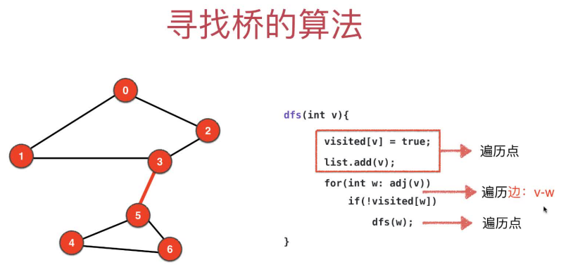
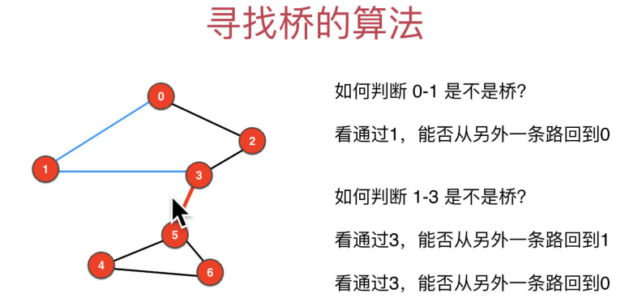
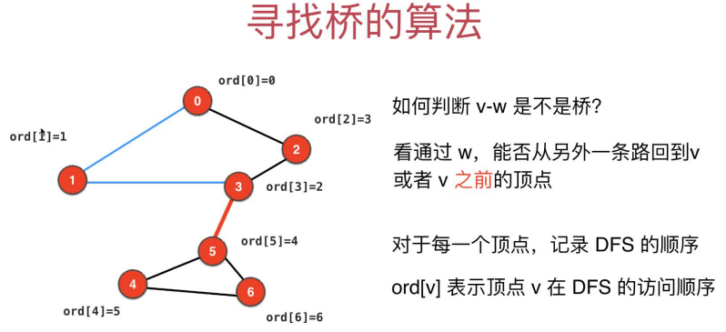
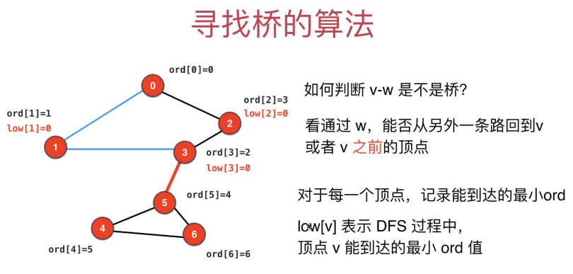
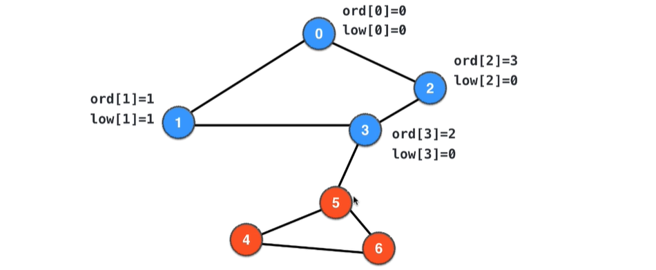
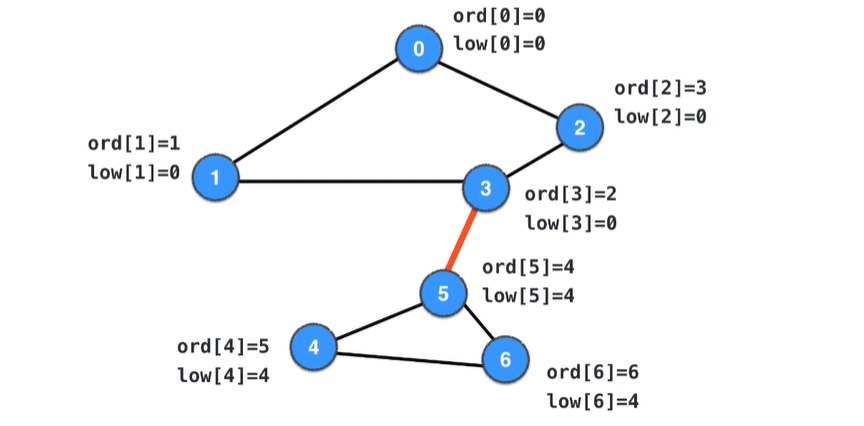
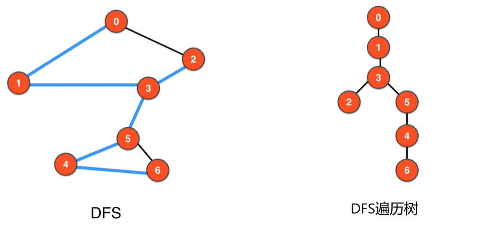
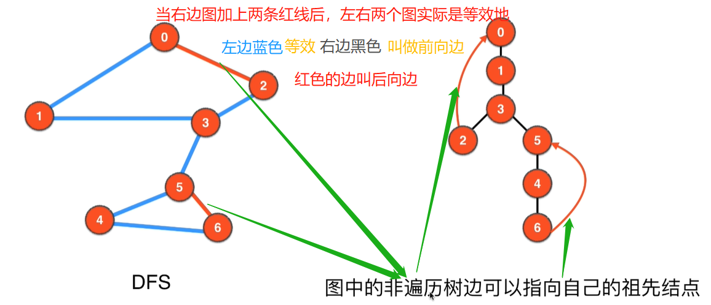
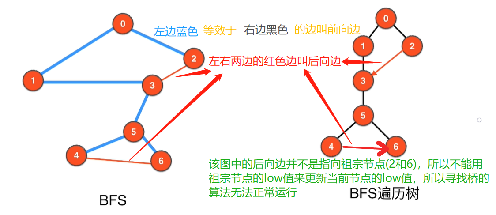
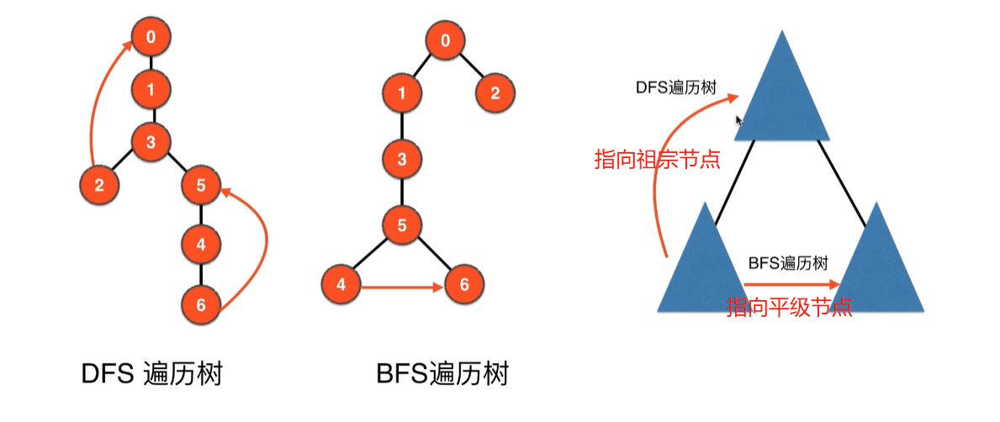

# 第08章 桥和割点以及图的遍历树

## 8.1 什么是桥

### 定义
> 对于无向图，如果删除了一条边，整个图联通分量数量就会变化，则这条边称为`桥(Bridge)`。桥意味着图中最脆弱的关系

### 应用
+ 交通系统
  > 比如两个城市上海和南京仅通过长江大桥相连，如果长江大桥被毁坏了，那么两个城市就分开各自为战了
+ 社交网络
  > 两个班级通过班长联系在一起，大家有活动时可以一起参加，一旦班长之间的关系断了，那么两个班就各自为战了

### 桥的特点
+ 一个图中可以有多条桥
+ 一棵树的所有边都是桥

### 寻找桥的算法
+ 使用DFS就可以解决，但是有难度，因为记录的信息更多元
+ 一般面试不会涉及，竞赛可能会涉及

## 8.2 寻找桥的算法思路

### 桥和环的关系
**一张图中检测环的算法：**当检测到一个节点(当前节点current)的相邻节点已经被visited但是这个相邻节点不是current的上一个visited节点(即父节点)，就说明图中有环了

和判断一张图是否有环不同
+ 判断一张图是否有环，是整张图的属性
+ 判断一张图是否有桥，是一条边的属性

寻找桥的过程需要遍历每一条边，DFS正好能用上

DFS遍历点和边的过程如下：

### 举例如何找桥
> 关键是能不能找到另一条路径`回到当前节点的上一个访问节点或上一个访问节点的父节点`，找到不到就说明当前节点和上一个访问节点组成了桥。**两条路径不能有边重合**

**总结：如何判断边`v-w`是不是桥？**
> 看通过w，能否从另外一条不同的路径回到v或者v之前的顶点

### 寻找桥的代码逻辑
> 看通过w，能否从另外一条路回到v或者`v之前的任何一个顶点`，核心是理解ord和low数组
+ **对于每一个顶点，记录DFS遍历过的点顺序，用数组ord[]来记录。ord[v]表示顶点v在DFS中的访问顺序**
  > 方便找当前节点的父节点以及父节点的父节点....
  + 以边1-3为例，判断1-3是否是桥，只需要判断是否存在一条和DFS遍历不同的路径使得3能连接上`1或0(在ord[]中对应的值小于ord[3]的点)`
  + 以便3-5为例，判断3-5是否是桥，只需要判断是否存在一条和DFS遍历不同的路径使得5能连接上`3、1或0(在ord[]中对应的值小于ord[5]的点)`
  + ...
  
+ **对于每一个顶点，记录能到达的最小ord。low[v]表示DFS过程中，顶点v能到达的最小ord值(也可以认为是能联通的最远的节点)**
  + DFS遍历过程中，low[v]取v除了父节点以外所有已经被访问过地邻接点中最小的ord值(所以递归遍历过程中需要传一下父节点，方便从邻接点中排除父节点去计算low值)。**是否更新low中对应的值需要满足如下三个条件(8.3的模拟桥算法处处都会根据这三个条件决定，务必掌握)**：
    + **1.邻接点**
    + **2.被访问过，即`visited[x]=true`**
    + **3.不是父节点，即`邻接点序号不等于父节点的序号parent，parent在递归中会作为参数传进来`**
    + **4.满足前3条的v的邻接点记为w，那么边`v-w`一定是在一个环内，所以边`v-w`一定不是桥，因为一个环内连接两个点肯定有两条不同的路径**，这一条只有在部分DFS递归步骤中会出现，见`8.3寻找桥的算法`
  + 以边1-3为例，判断1-3是否是桥，只需要判断是否存在一条和DFS遍历不同的路径使得3能连接上`1或0(在ord[]中对应的值小于ord[3]的点)`，因为`low[3]=0`<`order[1]=1`,索引3一定能连接上1的某个祖上节点，所以1-3一定不是桥
  + 以便3-5为例，判断3-5是否是桥，只需要判断是否存在一条和DFS遍历不同的路径使得5能连接上`3、1或0(在ord[]中对应的值小于ord[5]的点)`，因为`low[5]=4`>`order[3]=2`,索引5一定连接不上3的某个祖上节点，所以3-5一定不是桥
  + ...
  

## 8.3 模拟寻找桥的算法
> 本节基于递归DFS进行阐述。ps：想看DFS递归的过程可以参考[举例详解递归调用的过程](https://gitee.com/lsgwr/algorithms/blob/master/Part2BasicGraph/第03章_图的深度优先遍历.md#举例详解递归调用的过程)

### 注意
+ 从0开始进行DFS递归遍历，图都是基于TreeSet的邻接表实现，所以邻接点的访问都是按节点顺序从小到大进行地
+ 每次更新low值时都要判断下是否出现桥
+ 递归往下过程中，根据图中环的判断来更新low值，有环说明`当前点`和`非父已被访问邻接点`之间的边一定不是桥，`low[当前点]`取`low[当前点]`和`low[非父已被访问邻接点]`的较小值
+ 递归回退过程中，根据`整个递归过程中的上一步访问的节点`来判断是桥还是更新low值(**整个递归过程包含向下递归和递归回退**，即下面`详细递归过程`中分析的顺序)
  + 如果`low[整个递归过程中的上一步访问的节点] <= order[当前节点]`,则边`整个递归过程中的上一步访问的节点-当前节点`一定不是桥，用两者地较小。好好体会下，满足这个小于的条件，说明`整个递归过程中的上一步访问的节点`一定可以通过非递归访问的路径到达当前节点的父节点，所以这条边肯定不是桥
  + 如果`low[整个递归过程中的上一步访问的节点] >  order[当前节点]`,则边`整个递归过程中的上一步访问的节点-当前节点`一定是桥，因为`整个递归过程中的上一步访问的节点`一定没办法通过非递归访问的路径到达当前节点的父节点。

### 详细递归过程

+ 1.访问节点0
  + 1.1 初始化：设置`ord[0]=0`，`low[0]=0`，`visited[0]=true`
  + 1.2 更新low值: 节点0的邻接点有节点1、节点2，`都没被访问`，所以不用更新low[0]
  + 1.3 继续递归：节点0未被访问的邻接点有节点1、节点2，节点1序号小，所以下一层递归进入节点1
+ 2.访问节点1
  + 2.1 初始化：设置`ord[1]=1`，`low[1]=1`，`visited[1]=true`
  + 2.2 更新low值：节点1的邻接点有节点0、节点3，只有`visited[0]=true`但是节点0是节点1的父节点，所以不用更新`low[1]`
  + 2.3 继续递归：节点1未被访问的邻接点只有节点3，所以下一层递归进入节点3
+ 3.访问节点3
  + 3.1 初始化：设置`ord[3]=2`，`low[3]=2`，`visited[3]=true`
  + 3.2 更新low值：节点3的邻接点有节点1、节点2、节点5，只有`visited[1]=true`但是节点1是节点3的父节点，所以不用更新`low[1]`
  + 3.3 继续递归：节点3未被访问的邻接点只有节点2、节点5，节点2的序号较小，所以下一层递归进入节点2
+ 4.访问节点2，
  + 4.1 初始化：设置`ord[2]=3`，`low[2]=3`，`visited[2]=true`
  + 4.2 更新low值：节点2的邻接点有节点0、节点3，`visited[3]=true`但是是父节点，`visited[0]=true`而且不是父节点，所以所以边`0-2`在一个环内肯定不是桥并更新`low[2]=low[0]=0`，即`low[2]=0`
  + 4.3 继续递归：节点2的邻接点都已经被访问，所以回退到父节点3
+ 5.回退到节点3
  + 5.1 更新low值：上一步的节点是节点2，因为`low[2]=0` < `order[3]=2`，所以边`2-3`肯定不是桥并更新`low[3]=low[2]=0`，即`low[3]=0`
  + 5.3 继续递归：节点3未被访问的的邻接点只有节点5，所以下一层递归进入节点5
  > 
+ 6.访问节点5：
  + 6.1 初始化：设置`ord[5]=4`，`low[5]=4`，`visited[5]=true`
  + 6.2 更新low值：节点5的邻接点有节点3、节点4、节点6，只有`visited[3]=true`但是节点3是节点5的父节点，所以不用更新`low[5]`
  + 6.3 继续递归：节点5未被访问的邻接点有节点4、节点6，节点4序号小，所以下一层递归进入节点4
+ 7.访问节点4：
  + 7.1 初始化：设置`ord[4]=5`，`low[4]=5`，`visited[4]=true`
  + 7.2 更新low值：节点4的邻接点有节点5、节点6，只有`visited[5]=true`但是节点5是节点4的父节点，所以不用更新`low[5]`
  + 7.3 继续递归：节点4未被访问的邻接点只有节点6了，所以下一层递归进入节点6
+ 8.访问节点6：
  + 8.1 初始化：设置`ord[6]=6`，`low[6]=6`，`visited[6]=true`
  + 8.2 更新low值：节点6的邻接点有节点4、节点5，`visited[4]=true`但是节点4是节点6的父节点；`visited[5]=true`而且不是父节点，所以边`5-6`在一个环内肯定不是桥并更新`low[6]=low[5]=4`，即`low[6]=0`
  + 8.3 继续递归：节点6的邻接点4、5都已经被访问，所以回退到节点4
+ 9.回退到节点4
  + 9.1 更新low值：上一步的节点是节点6，因为`low[6]=4`<`order[4]=5`，所以边`6<-4`肯定不是桥并更新`low[4]=low[6]=4`，即`low[4]=5`
  + 9.2 继续递归：节点4的邻接点5、6都已经被访问，所以回退到父节点5
+ 10.回退到节点5
  + 10.1 更新low值：上一步的节点是节点4，因为`low[4]=4` = `order[5]=4`，所以边`4<-5`肯定不是桥并更新`low[4]=low[5]=4`，即`low[5]=4`(相等时等于没变，但是为了统一，赋值操作还是要有的，其实点5和点0是桥两边联通分量的根节点，所以其low值肯定不用变)
  + 10.2 继续递归：节点5的邻接点3、4、6都已经被访问，所以回退到父节点3
+ 11.回退到节点3
  + 11.1 更新low值：上一步的节点是节点5，因为`low[5]=4` > `order[3]=2`，**所以边`5<-3`是桥**
  + 11.2 继续递归：节点3的邻接点1、2、5都已经被访问，所以回退到父节点1
+ 12.回退到节点1
  + 12.1 更新low值：上一步的节点是节点3，因为`low[3]=0` < `order[1]=1`，所以边`3<-1`肯定不是桥并更新`low[1]=low[3]=0`，即`low[1]=0`
  + 12.2 继续递归：节点1的邻接点0、3都已经被访问，所以回退到节点0
+ 13.回退到节点0
  + 13.1 更新low值：上一步的节点是节点1，因为`low[1]=0` = `order[0]=0`，所以边`1<-0`肯定不是桥并更新`low[0]=low[1]=0`，即`low[0]=0`(相等时等于没变，但是为了统一，赋值操作还是要有的，其实点5和点0是桥两边联通分量的根节点，所以其low值肯定不用变)
  + 13.2 继续递归：递归完成，退出，**检测到桥3-5**
  >

## 8.4 实现寻找桥的算法
> 只能用`基于递归的DFS`来做，用`基于非递归的DFS`或`BFS(只有非递归实现)`记录不了w的邻接点v的父节点parent，从而没法更新部分节点的low值

[代码实现](src/main/java/Chapter08BridgesAndCutPoints/Section1To4Bridges/GraphDFSFindBridges.java)

## 8.5 图的遍历树
> 一旦遍历完所有节点(即visited数组全为true)就跳出, 此时遍历经过的路径和顶点组成一棵树，就叫遍历树

### 寻找桥的算法能否用BFS完成？
> 不能

### DFS遍历树

### DFS遍历树的前向边和后向边以及一个重要特性
> 重要特性：`DFS遍历树种的非遍历树边(即后向边)可以指向自己的祖先节点`。如图中的`2->0`和`6->5`。正因为这个特性，所以在寻找图中的桥的过程中，
+ 遍历到2时，发现0作为2的临界点并不是2的父节点却已经被访问(说明0是2的非父祖宗节点)，所以可以用0的low值来更新2的low值，接下来1、3的low值也得以随着更新
+ 遍历到6时，发现5作为6的临界点并不是6的父节点却已经被访问(说明5是6的非父祖宗节点)，所以可以用5的low值来更新6的low值，接下来4的low值也可以随着跟新

### `BFS的遍历树`以及`为什么BFS不具备DFS上面的那个重要特性`

### DFS遍历树和BFS遍历树的对比

