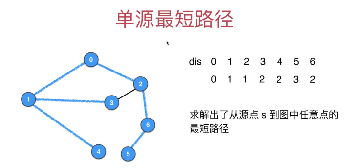
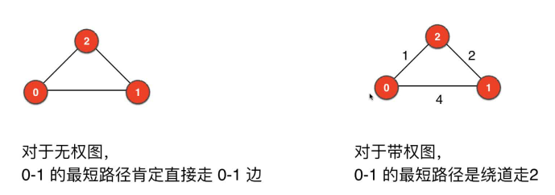
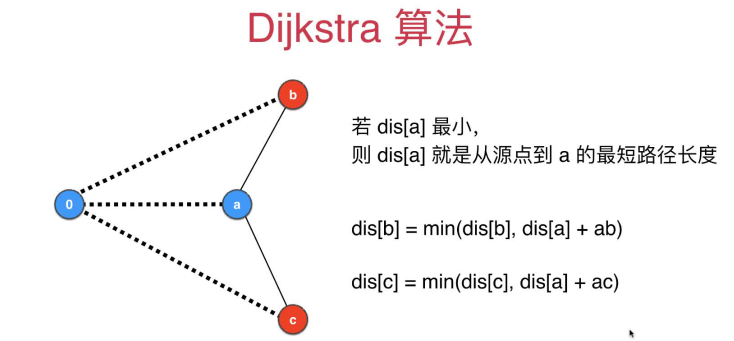
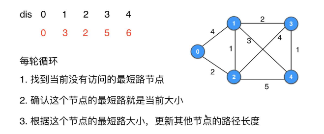
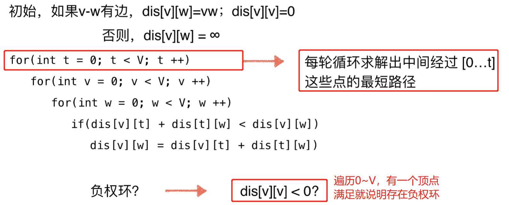

# 第12章 无向有权图之最短路径问题

## 12.1 有权图的最短路径问题

### 什么是有权图的最短路径问题？
> 从图中的一个点到另一个点的路径中，权值总和最小的路径就是最短路径

### 最短路径的应用场景
+ 高德导航两个地点之间的路线，一般都是规划地最短路径
+ 互联网中对数据进行路由，一般都是选最优的路径进行数据传送

### 单源最短路径问题

### 无权图和带权图的最短路径的区别

### 求带权图的最短路径的算法
+ Dijkstra算法：不能处理负权边，处理负权边会使得复杂度上升
  > 实际大部分应用是不涉及负权边地，所以Dijkstra算法是够用地
+ Bellman-Ford算法：可以处理负权边
+ Floyd算法

## 12.2 Dijkstra算法的原理和模拟

+ 1.根据上一个确定了到起始点最小值的节点，获取其到其所有还未被访问的邻接点路径，临时更新到表中(比原来地更小就更新，大于等于地话就不变)
+ 2.找到还没确定到起始点最小值的节点中距离值最小地,确定这个节点的当前大小就是最小距离，更新到表中
  > 这条是Dijkstra算法的核心

下面以下图为例，`选择0作为起始点`，模拟Dijkstra算法的详细过程，获取0到其他各个点的最短路径，
+ 确定了最小路径的就加粗
+ 不确定地就用斜体表示

### 1.初始化0到各个顶点的距离均为`+∞`，Java中为`Integer.MAX_VALUE`
| 顶点标号 | 0  | 1  | 2  | 3  | 4  |
| -------- | -- | -- | -- | -- | -- |
| 最小距离 | +∞ | +∞ | +∞ | +∞ | +∞ |
### 2.遍历从0开始
+ 0到起始点的距离为0，**0到0的最小值确认为0**，直接设置到表中  
  | 顶点标号 | 0  | 1  | 2  | 3  | 4  |
  | -------- | -- | -- | -- | -- | -- |
  | 最小距离 | **0** | +∞ | +∞ | +∞ | +∞ |

### 3.访问0的`未确定到起始点最小距离值`的邻接点
+ 0的`未确定到起始点最小距离值`的邻接点1、2到0的距离分别为2和4，还不确定是到0的最小距离值，先把这两个临时最小距离值更新到表中
  | 顶点标号 | 0  | 1  | 2  | 3  | 4  |
  | -------- | -- | -- | -- | -- | -- |
  | 最小距离 | **0** | *4* | *2* | +∞ | +∞ |

+ `不确定到起始点最小距离值的顶点`1、2、3、4中，顶点2到起始点的0值最小，**所以0到2的最小值为2**，更新到表中 **这行是Dijkstra算法的核心**
  > 因为0到2以外的点的距离本来就都比2要大，又因为Dijkstra只考虑无负权边的图，所以经由其他顶点再到2的距离肯定会更大，故0到2的最短举例肯定是2

  | 顶点标号 | 0  | 1  | 2  | 3  | 4  |
  | -------- | -- | -- | -- | -- | -- |
  | 最小距离 | **0** | *4* | **2** | +∞ | +∞ |

### 4.访问2的`未确定到起始点最短距离值`的邻接点
+ 2的`未确定到起始点最小距离值`的邻接点1、3、4到2的距离分别为1、4、3，下面根据这些距离值更新对应的点到起始点的最小距离值(临时的，是不是最终的最小距离值等待后面确定)
  + `0到2的最小距离为2`+`2到1的距离为1`=3 < `上面表中0到1的距离为4`，所以更新0到1的临时最小距离为3
  + `0到2的最小距离为2`+`2到3的距离为4`=6 < `上面表中0到3的距离为∞`，所以更新0到3的临时最小距离为6
  + `0到2的最小距离为2`+`2到4的距离为5`=7 < `上面表中0到4的距离为∞`，所以更新0到4的临时最小距离为7
    | 顶点标号 | 0  | 1  | 2  | 3  | 4  |
    | -------- | -- | -- | -- | -- | -- |
    | 最小距离 | **0** | *3* | **2** | *6* | *7* |

+ `不确定到起始点最小距离值的顶点`1、3、4中，顶点1到起始点0的值3最小，**所以0到1的最小值确定为3**，更新到表中 **这行是Dijkstra算法的核心**
  > 因为0到1以外的点的距离本来就都比2要大(不考虑已经确认最小距离的顶点0和2，因为0到1就是从0->2->1过来地)，又因为Dijkstra只考虑无负权边的图，所以经由其他顶点再到1的距离肯定会更大，故0到1的最短举例肯定是3

  | 顶点标号 | 0  | 1  | 2  | 3  | 4  |
  | -------- | -- | -- | -- | -- | -- |
  | 最小距离 | **0** | **3** | **2** | *6* | *7* |

### 5.访问1的`未确定到起始点最小距离值`的邻接点
+ 1的`未确定到起始点最小距离值`的邻接点3、4到1的距离分别为2、3，下面根据这些距离值更新对应的点到起始点的最小距离值(临时的，是不是最终的最小距离值等待后面确定)
  + `0到1的最小距离为3`+`1到3的距离为2`=5 < `上面表中0到3的距离为6`，所以更新0到3的临时最小距离为5
  + `0到1的最小距离为3`+`1到4的距离为3`=6 < `上面表中0到4的距离为7`，所以更新0到4的临时最小距离为6
    | 顶点标号 | 0  | 1  | 2  | 3  | 4  |
    | -------- | -- | -- | -- | -- | -- |
    | 最小距离 | **0** | **3** | **2** | *5* | *6* |

+ `不确定到起始点最小距离值的顶点`3、4中，顶点3到起始点的0值最小，**所以0到3的最小值确定为5**，更新到表中 **这行是Dijkstra算法的核心**
  > 因为0到3以外的点的距离本来就都比5要大(不考虑已经确认最小距离的顶点0、2、1，因为0到3就是从0->2->1->3过来地)，又因为Dijkstra只考虑无负权边的图，所以经由其他顶点再到3的距离肯定会更大，故0到3的最短举例肯定是5

  | 顶点标号 | 0  | 1  | 2  | 3  | 4  |
  | -------- | -- | -- | -- | -- | -- |
  | 最小距离 | **0** | **3** | **2** | **5** | *6* |

### 6.访问3的`未确定到起始点最小距离值`的邻接点
+ 3的`未确定到起始点最小距离值的邻接点4到1的距离分别为1，下面根据这些距离值更新对应的点到起始点的最小距离值(临时的，是不是最终的最小距离值等待后面确定)
  + `0到3的最小距离为5`+`3到4的距离为1`=6 = `上面表中0到4的距离为6`，所以不用更新0到3的临时最小距离
    | 顶点标号 | 0  | 1  | 2  | 3  | 4  |
    | -------- | -- | -- | -- | -- | -- |
    | 最小距离 | **0** | **3** | **2** | **5** | *6* |

+ `不确定到起始点最小路径值的顶点`只剩4了，**所以0到4的最小值确定为6**，更新到表中 **这行是Dijkstra算法的核心**
  > 因为0到6以外的点的已经没了(不考虑已经确认最小距离的顶点0、2、1、3，因为0到6就是从0->2->1->3->6过来地)，故0到6的最小距离值为6
  
  | 顶点标号 | 0  | 1  | 2  | 3  | 4  |
  | -------- | -- | -- | -- | -- | -- |
  | 最小距离 | **0** | **3** | **2** | **5** | **6** |

## 12.3 Dijkstra算法的基本实现
> 时间复杂度：O(V^2)，不推荐使用，仅用于理解上一节的算法模拟过程
+ [代码实现](src/main/java/Chapter12WeightedGraphAndShortestPath/Section1to3Dijkstra/ShortestPathDijkstra.java)
+ [测试代码](src/main/java/Chapter12WeightedGraphAndShortestPath/Section4DijkstraOptimize/Main.java)

## 12.4 Dijkstra算法的优化：基于优先队列改进查找最小距离值
> 时间复杂度：O(ElogE)，推荐正式的生产环境中使用这个算法
+ [代码实现](src/main/java/Chapter12WeightedGraphAndShortestPath/Section4DijkstraOptimize/ShortestPathDijkstra.java#L98)
+ [测试代码](src/main/java/Chapter12WeightedGraphAndShortestPath/Section4DijkstraOptimize/Main.java)

## 12.5 更多关于Dijkstra的讨论

### 实现记录路径的功能
> 类似DFS那里，使用pre数组记录每个顶点的上一个访问节点，获取路径的使用逐个往前取值放入到list中即可
+ [实现代码](src/main/java/Chapter12WeightedGraphAndShortestPath/Section4DijkstraOptimize/ShortestPathDijkstra.java#L124)
+ [参考提交记录](https://gitee.com/lsgwr/algorithms/commit/eace18d4213d1cb7e44cb1ab376d4d6eed7d3214?view=parallel)

### 优化到ElogV级别
> 可以基于索引堆来实现，参考[算法与数据结构c++版--第4章：堆和堆排序](https://coding.imooc.com/learn/list/71.html)

### 更多堆相关的问题
+ **只关注从start到定点v的最短路径**：一旦findShortest[v]=true，就可以提前退出了
+ **求所有点对的最短路径？**：依次循环选取不同的顶点作为Dijkstra算法的起始点即可，时间复杂度`O(V*ElogE)`
+ **溢出问题**：路径的权值不能超过`Integer.MAX_VALUE`，可以改成长整型，或者改成是否找到最小距离值的标记位
+ **Dijkstra算法不能处理负权边**：为了能处理负权边，引入了接下来的Bellman-Ford算法.

## 12.6 可以处理含负权边的图的求最短路径的算法：Bellman-Ford算法

### 松弛操作
> 加上个负权边(多经过一条边,k-->k+1)比原来还小，就叫松弛操作

+ 松弛操作定义
  > 
+ 松弛操作举例
  > 

### Bellman-Floyd算法的执行过程概述
+ 初始化distances[start]=0，其余distance值为`+∞`
+ 对所有的边进行第1次松弛操作,则求出了到所有点`经过的边数最多为1`的最短路
+ 对所有的边进行第2次松弛操作,则求出了到所有点`经过的边数最多为2`的最短路
+ 对所有的边进行第3次松弛操作,则求出了到所有点`经过的边数最多为3`的最短路
......
+ 对所有的边进行第v-1次松弛操作,则求出了到所有点`经过的边数最多为v-1`的最短路
+ 如果对所有边再进行一次松弛操作，还能更新最小路径的值数组distances，则说明图中包含负权环

经过上面的操作，就得到了所有点到起始点的最短路径。

## 12.7 Bellman-Ford算法的问题：负权环
> 负权环即环上的所有边的权值之和为负数，绕着负权环不停转圈路径便会向着负无穷的趋势一直减少，是不合理地，所以说

+ 当图中存在负权环时，没有最短路径
+ 对于无向图来说，**有负权边等同于有负权环**，因为可以在一条边上来来回回，所以Bellman-Ford算法指针地是经过的边数"最多为v-1"的最短路

总结：
> 一共要进行v轮松弛操作，其中第v轮用于检测负权环
+ 少于v-1轮的松弛操作也可能得到最小路径值
+ 做v-1轮操作一定可以得到最小路径值
+ 如果多进行一轮松弛操作(即第v轮)，仍可以得到更小的距离值，则图中存在负权环

## 12.8 Bellman-Ford算法实现
+ [实现代码](src/main/java/Chapter12WeightedGraphAndShortestPath/Section6to8BellmanFord/ShortestPathBellmanFord.java)
+ [测试代码](src/main/java/Chapter12WeightedGraphAndShortestPath/Section6to8BellmanFord/Main.java)

## 12.9 Bellman-Ford算法的更多讨论
### 添加最短路径的详情数组pre
> 在松弛操作的时候进行更新`pre[w]=v`

+ [实现代码](src/main/java/Chapter12WeightedGraphAndShortestPath/Section6to8BellmanFord/ShortestPathBellmanFord.java#L79)
+ [提交记录](https://gitee.com/lsgwr/algorithms/commit/b7c5c34ef171198c6506671b59b6b2fef3912470?view=parallel)

### Bellman-Ford算法的更多问题
+ **只关注从start到定点v的最短路径**：不能提前终止
+ 算法性能优化：SPFA(Shortest Path First Algorithm)
+ 时间复杂度：O(VE)

##  12.10 Floyd算法
### 用途
> 可以求所有点对的最短路径
### 图的直径
> 所有点对最短路径的最大值
### 常见求`所有点对最短路径`的算法的比较
> 下面的性能是求所有点对的最短路径；求单个点对去掉时间复杂度中的一个V，注意Floyd只能求全部点对的最短路径，不能求单个点对

| 算法名    | 时间复杂度 | 性能描述                               | 功能局限                                               |
| ------------ | ---------- | ------------------------------------------ | ---------------------------------------------------------- |
| Dijkstra     | O(VElogE)  | 性能最高                               | 不能包含负权边                                      |
| Bellman-Ford | O(V*V*E)   | 性能最低，主要针对有向图       | 可以包含负权边；可以检测负权环，有负权环时求最小路径无意义 |
| Floyd        | O(V*V*V)   | 性能居中，在稀疏图中和Dijkstra算法性能相近 | 可以包含负权边；可以检测负权环，有负权环时求最小路径无意义 |

### Floyd算法原理
+ 下面图中的虚线连接两点，表示两点间不一定是一条边直接相连，也可能是经过了多条变组成的一个路径连接到了一起；
+ 前面几节Dijkstra和Bellman-Ford算法中有虚线也有实线，实线连接地两点表示两个点之间有且只有一条边把两个点连接到一起
+ Floyd的松弛操作不再像Bellman-Ford一样针对一条边了，而是针对一条两个点a-b之间的最短路径进行松弛

### Floyd算法伪代码
> t表示从v到w是否可以多绕一个弯到w使得v-w的距离更短，t在`for(int t=0; t < V; t++)`过程中，每轮循环都会求解出v-w中间经过[0...t]这些点的最短路径

### `for(int t=0; t < V; t++)`的含义以及求负权环

## 12.11 Floyd算法实现
+ [实现代码](src/main/java/Chapter12WeightedGraphAndShortestPath/Section10to11Floyd/ShortestPathAllFloyd.java)
+ [测试代码](src/main/java/Chapter12WeightedGraphAndShortestPath/Section10to11Floyd/Main.java)

