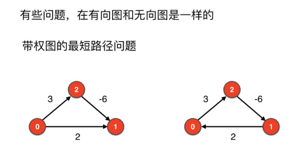
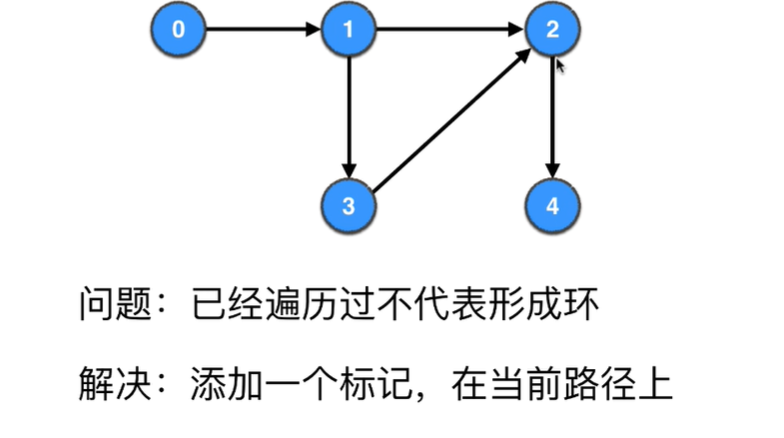
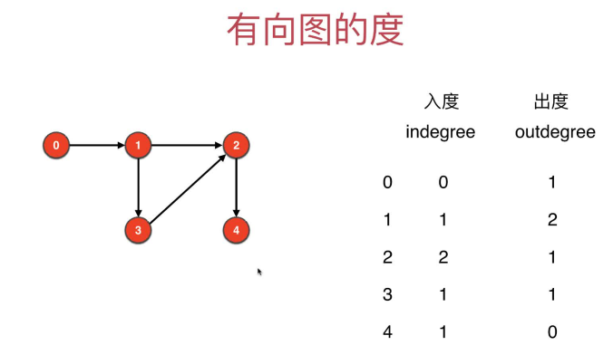

# 第13章 有向图及相关算法

## 13.1 有向图的实现
### 有向图的的应用场景
+ 社交网络中的关注
+ 互联网连接
+ 程序模块的引用
+ 任务调度
+ 学习计划
+ 食物链
+ 论文引用
+ 无向图是特殊的有向图，即每条边都是双向的

### 改进Graph和WeightedGraph类使之支持有向图
+ [Graph类的改动](https://gitee.com/lsgwr/algorithms/commit/645b7af222577cc83f252034adc00de8a04f8561?view=parallel)
+ [WeightedGraph类的改动](https://gitee.com/lsgwr/algorithms/commit/a886001f8724d38ad02a6f42ea11326fb6644a83?view=parallel)

## 13.2 有向图算法
### 有些问题，在有向图中不存在，或者我们通常不考虑
+ floodfill
+ 最小生成树
+ 桥和割点
+ 二分图检测
### 有些问题，在无向图和有向图中是一样的
+ [DFS的代码](src/main/java/Chapter03DepthFirstTraversal/GraphDFS.java)迁移到有向图完全不用改，[测试代码](src/main/java/Chapter13DirectedGraph/Section02CommonAlgorithms/DFSTest.java)
  > 
+ [BFS的代码](src/main/java/Chapter05BreadthFirstTraversal/Section2GraphBFS/GraphBFS.java)迁移到有向图完全不用改，[测试代码](src/main/java/Chapter13DirectedGraph/Section02CommonAlgorithms/BFSTest.java)
  > 
+ BFS用来[求无向无权图最短路径的代码](src/main/java/Chapter05BreadthFirstTraversal/Section8And9ShortestPath/GraphBFSUnweightedGraphShortestPath.java)用来求`有向无权图`也完全不用改

### 有向有权图的最短路径
> 无向有权图有负权边一定有负权环；有向有权图有负权边不一定有负权环。所以最短路径问题针对有负权边的无向有权图没有意义，但是对有负权边的有向有权图可能是有意义地。

上面图片中，左右两边都是有向有权图，左边的图不存在负权环，右边的图就存在负权环，所以有向有权图中有负权边不一定有负权环
+ [Bellman-Ford算法测试](src/main/java/Chapter13DirectedGraph/Section02CommonAlgorithms/ShortestPathBellmanFordTest.java)
+ [Floyd算法测试](src/main/java/Chapter13DirectedGraph/Section02CommonAlgorithms/ShortestPathFloydTest.java)

## 13.3 有向图环检测和DAG
> 
### 原理
> 无向图中的环的判定方法在有向图中不适用，通过在遍历过程中添加标记即可，递归回退时取消对应顶点的标记

### 实现
+ [实现代码](src/main/java/Chapter13DirectedGraph/Section03CycleDetectAndDAG/GraphDFSCycleDetectDirected.java)
+ [测试代码](src/main/java/Chapter13DirectedGraph/Section03CycleDetectAndDAG/Main.java)

### 有向图环检测的现实意义
> 现实中很多场景都是追求`有向无环图(Directed Acyclic Graph即DAG)`的

+ 程序模块的循环引用检测
+ 任务调度冲突检测
+ 学习计划

## 13.4 有向图的度：入度和出度

## 举例

## 对Graph类的修改和测试
+ [对Graph类的修改](https://gitee.com/lsgwr/algorithms/commit/e22842514010575e2c5867aba3794d4f0c724f4b?view=parallel)
+ [对修改后的Graph类的测试](src/main/java/Chapter13DirectedGraph/Section04InDegreeAndOutDegree/Main.java)

## 13.5 有向图求解欧拉回路

### 和无向图进行比较
|          | 无向图          | 有向图            |
| ---------------------- | ------------------ | -------------------- |
| 存在欧拉回路的充要条件 | 每个点的度数为偶数 | 每个点的入度等于出度 |

### 寻找有向图欧拉回路的代码
+ [递归实现](src/main/java/Chapter13DirectedGraph/Section05EulerLoopDirected/GraphDFSEulerLoopDirected.java)
+ [非递归实现](src/main/java/Chapter13DirectedGraph/Section05EulerLoopDirected/GraphDFSNoRecursionEulerLoopDirected.java)
+ [测试代码](src/main/java/Chapter13DirectedGraph/Section05EulerLoopDirected/Main.java)

### 寻找欧拉路径的充要条件
> 主要是无向图和有向图的对比

|          | 无向图          | 有向图            |
| ---------------------- | ------------------ | -------------------- |
| 存在欧拉路径的充要条件 | 除了两个点(起始点和终止点)两个点的度数为奇数，其余每个点的度数为偶数 | 除了两个点(起始点和终止点)，其余每个点的入度等于出度 |

