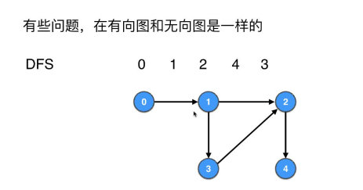
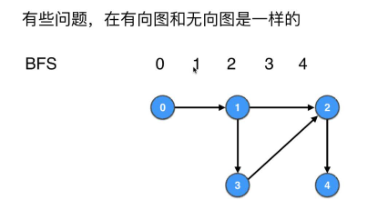
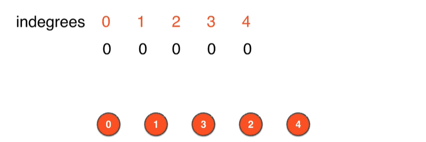
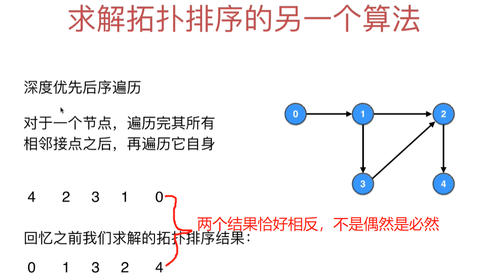
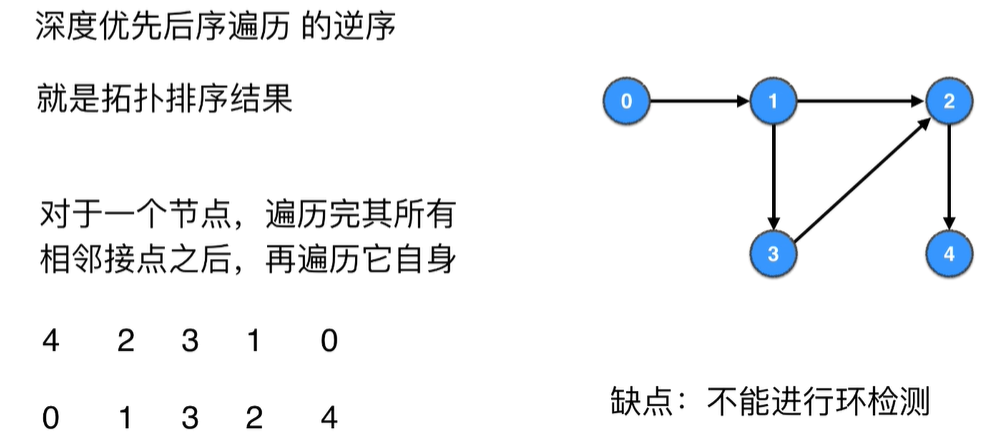
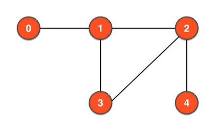
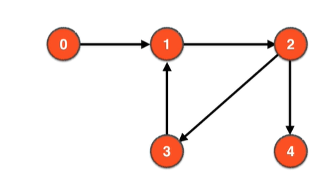
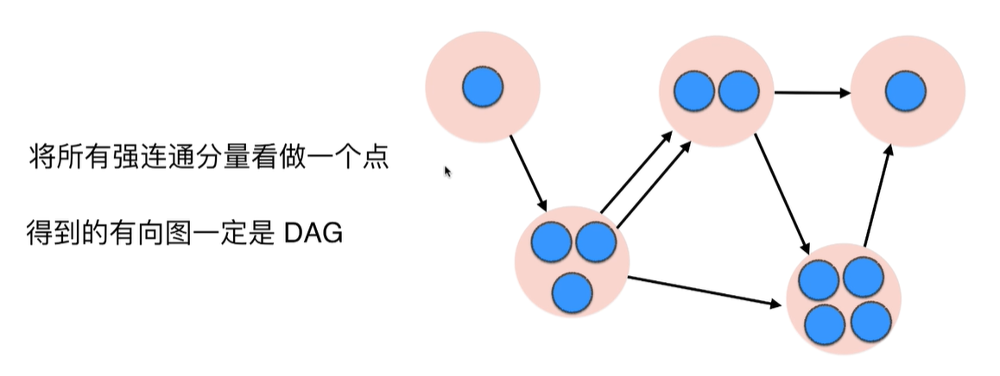
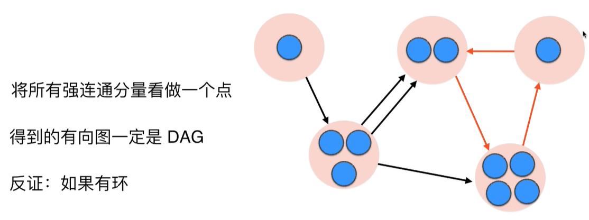
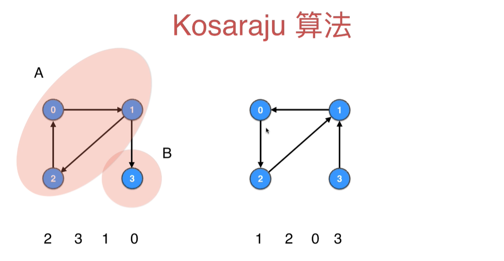

# 第13章 有向图及相关算法

## 13.1 有向图的实现
### 有向图的的应用场景
+ 社交网络中的关注
+ 互联网连接
+ 程序模块的引用
+ 任务调度
+ 学习计划
+ 食物链
+ 论文引用
+ 无向图是特殊的有向图，即每条边都是双向的

### 改进Graph和WeightedGraph类使之支持有向图
+ [Graph类的改动](https://gitee.com/lsgwr/algorithms/commit/645b7af222577cc83f252034adc00de8a04f8561?view=parallel)
+ [WeightedGraph类的改动](https://gitee.com/lsgwr/algorithms/commit/a886001f8724d38ad02a6f42ea11326fb6644a83?view=parallel)

## 13.2 有向图算法
### 有些问题，在有向图中不存在，或者我们通常不考虑
+ floodfill
+ 最小生成树
+ 桥和割点
+ 二分图检测
### 有些问题，在无向图和有向图中是一样的
+ [DFS的代码](src/main/java/Chapter03DepthFirstTraversal/GraphDFS.java)迁移到有向图完全不用改，[测试代码](src/main/java/Chapter13DirectedGraph/Section02CommonAlgorithms/DFSTest.java)
  > 
+ [BFS的代码](src/main/java/Chapter05BreadthFirstTraversal/Section2GraphBFS/GraphBFS.java)迁移到有向图完全不用改，[测试代码](src/main/java/Chapter13DirectedGraph/Section02CommonAlgorithms/BFSTest.java)
  > 
+ BFS用来[求无向无权图最短路径的代码](src/main/java/Chapter05BreadthFirstTraversal/Section8And9ShortestPath/GraphBFSUnweightedGraphShortestPath.java)用来求`有向无权图`也完全不用改

### 有向有权图的最短路径
> 无向有权图有负权边一定有负权环；有向有权图有负权边不一定有负权环。所以最短路径问题针对有负权边的无向有权图没有意义，但是对有负权边的有向有权图可能是有意义地。

上面图片中，左右两边都是有向有权图，左边的图不存在负权环，右边的图就存在负权环，所以有向有权图中有负权边不一定有负权环
+ [Bellman-Ford算法测试](src/main/java/Chapter13DirectedGraph/Section02CommonAlgorithms/ShortestPathBellmanFordTest.java)
+ [Floyd算法测试](src/main/java/Chapter13DirectedGraph/Section02CommonAlgorithms/ShortestPathFloydTest.java)

## 13.3 有向图环检测和DAG
> 
### 原理
> 无向图中的环的判定方法在有向图中不适用，通过在遍历过程中添加标记即可，递归回退时取消对应顶点的标记

### 实现
+ [实现代码](src/main/java/Chapter13DirectedGraph/Section03CycleDetectAndDAG/GraphDFSCycleDetectDirected.java)
+ [测试代码](src/main/java/Chapter13DirectedGraph/Section03CycleDetectAndDAG/Main.java)

### 有向图环检测的现实意义
> 现实中很多场景都是追求`有向无环图(Directed Acyclic Graph即DAG)`的

+ 程序模块的循环引用检测
+ 任务调度冲突检测
+ 学习计划

## 13.4 有向图的度：入度和出度

## 举例

## 对Graph类的修改和测试
+ [对Graph类的修改](https://gitee.com/lsgwr/algorithms/commit/e22842514010575e2c5867aba3794d4f0c724f4b?view=parallel)
+ [对修改后的Graph类的测试](src/main/java/Chapter13DirectedGraph/Section04InDegreeAndOutDegree/Main.java)

## 13.5 有向图求解欧拉回路

### 和无向图进行比较
|    对比项      | 无向图          | 有向图            |
| ---------------------- | ------------------ | -------------------- |
| 存在欧拉回路的充要条件 | 每个点的度数为偶数 | 每个点的入度等于出度 |

### 寻找有向图欧拉回路的代码
+ [递归实现](src/main/java/Chapter13DirectedGraph/Section05EulerLoopDirected/GraphDFSEulerLoopDirected.java)
+ [非递归实现](src/main/java/Chapter13DirectedGraph/Section05EulerLoopDirected/GraphDFSNoRecursionEulerLoopDirected.java)
+ [测试代码](src/main/java/Chapter13DirectedGraph/Section05EulerLoopDirected/Main.java)

### 寻找欧拉路径的充要条件
> 主要是无向图和有向图的对比

|     对比项     | 无向图          | 有向图            |
| ---------------------- | ------------------ | -------------------- |
| 存在欧拉路径的充要条件 | 除了两个点(起始点和终止点)两个点的度数为奇数，其余每个点的度数为偶数 | 除了两个点(起始点和终止点)，其余每个点的入度等于出度。这两个点，起始点出度比入度大1，终止点入度比出度大1 |

## 13.6~13.7 拓扑排序--仅针对有向图
### 原理
> 删除入度为0的顶点，然后删除这个和顶点连接的边，更新剩下顶点的入度；然后再删除剩下顶点中入度为0的顶点，删除这个顶点和这个顶点连接的边，更新剩下顶点的入度....一直到图中没顶点，拓扑排序就完成了，按照删除顺序得到的顶点列表就是拓扑排序结果。

### 过程模拟(不短寻找、删除和更新入度为0的顶点)
+ 1.初始化计算得到各个顶点的入度inDegrees数组
  > 
+ 2.删除此时图中入度为0的顶点即顶点0，并删除和顶点0相连的边`0->1`，更新删除边影响的其他顶点的入度，即把顶点1的入度更新为0
  > 
+ 3.删除此时图中入度为0的顶点即顶点1，并删除和顶点1相连的边`1->2`、`1->3`，更新删除边影响的其他顶点的入度，即把顶点2的入度更新为1、顶点3的入度更新为0
  > 
+ 4.删除此时图中入度为0的顶点即顶点3，并删除和顶点3相连的边`3->2`，更新删除边影响的其他顶点的入度，即把顶点2的入度更新为0
  > 
+ 5.删除此时图中入度为0的顶点即顶点2，并删除和顶点2相连的边`2->4`，更新删除边影响的其他顶点的入度，即把顶点4的入度更新为0
  > 
+ 6.删除此时图中入度为0的顶点即顶点4，此时图中已经没有顶点，拓扑排序完成，上面节点删除的顺序即拓扑排序的结果，即[0, 1, 3, 2, 4]
  > 

### 代码实现侧层面的优化
+ 删除边和点不一定要真删除，可以深度clone后只更新入度即可~
+ 使用队列记录当前入度为0的顶点，每次更新入度值时一般会把一个以上的更新后入度为0的顶点放入一个队列，每次从队列中取出一个点作为拓扑排序的下一个定点

### 拓扑排序可能无解
> 如下图,相当于1、2、3有循环依赖的关系~虽然此时拓扑排序无解，但是正好可以用于有向图的环检测。只有`有向无环图即DAG`才有拓扑排序~
>

### 代码实现
+ [实现代码](src/main/java/Chapter13DirectedGraph/Section06to09TopoSort/TopoSort.java)
+ [测试代码](src/main/java/Chapter13DirectedGraph/Section06to09TopoSort/Main.java)

## 13.8~13.9 拓扑排序的另一种方法，方便后续学习有向图的强联通分量
> 用到了[图的DFS的后序遍历](src/main/java/Chapter03DepthFirstTraversal/GraphDFSPostOrder.java),自己复习下

### 重要结论：深度优先后续遍历的逆序就是拓扑排序的结果
> 缺点是不能做环检测，所以我们给这个算法的图必须是有向无环图

### 代码实现和测试
> 太简单，直接调用前面的[图的DFS的后序遍历](src/main/java/Chapter03DepthFirstTraversal/GraphDFSPostOrder.java)代码了
+ [代码实现和测试](src/main/java/Chapter13DirectedGraph/Section06to09TopoSort/TopoSort2.java)

## 13.10~13.12 有向图的强联通分量
### 有向图因为有方向，相似的的图对无向图是连通图，对有向图就不是

### 有向图的强联通分量
> 在一个有向图中，任何两点都可达的联通分量就叫强联通分量。如下图中的1、2、3组成强联通分量

### 将所有强联通分量看做一个点，得到的图一定是DAG(有向无环图)

证明：反证法，如果有几个强联通分量看做的点组成了环，那么这个环还可以一个强联通分量，和我们最初的假设"所有的强联通分量各自看做一个点"矛盾。

### 求强联通分量各自含有的点和一共有的强联通分量个数
> DFS一旦走入一个强联通分量就出不来(因为每个强联通分量一定是个环，DFS只会在环里绕圈)~~可以作为找到一个强联通分量的标志

## 13.11 Kosaraju算法
### 为了解决DFS后续遍历不是我们想要的强联通分量各自分开的结果
> 我们上来先把原有的图每条边进行反向处理(v->w)变成(w->v)，在进行DFS后序遍历的结果就是我们想要地了
