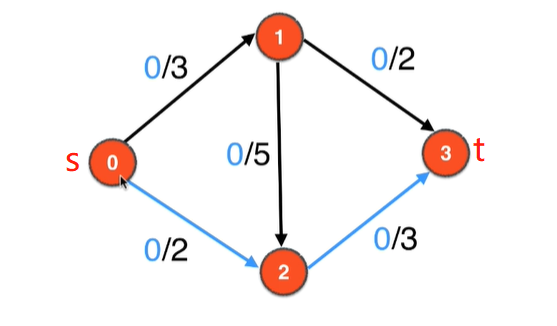
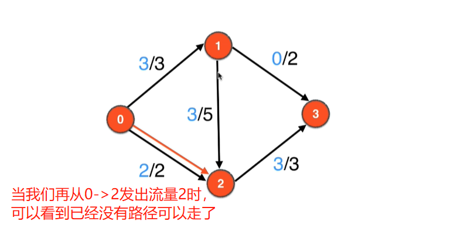

# 第14章 网络流和最大流问题

## 14.1 网络流和最大流问题阐述
### 网络流基本概念
> 网络流图中，从源点出发，在满足每条边容量限制的条件下，汇点t最多能接收多少流量

+ s:source
+ t:target
### 网络流需要满足的限制
+ 容量限制
+ 平衡限制：除了源点s和汇点t，对于每一个点，流入量等于流出量
+ 从源点s流出的流量，一定等于最终汇入汇点t的流量

### 引出最大流问题
> 网络流图中，从源点s出发，在满足每条边容量限制、平衡限制的条件下，汇点t最多能接收多少流量？

## 14.2 Ford-Fulkerson思想
> Ford-Fulkerson思想的核心是当路径上的容量限制小于流量时，把流量改成负值加到图上，这个加上的流量叫残量，在残量图中不算找增广路径，直到没有增广路径为止~~

### 手动求最大流的风险
+ 1.初始化网络流图：建立一个有向图，标注上流量(蓝色字体)和容量(黑色字体)
  > 
+ 2.手动模拟不难得出该图的最大流应该是5，路线如下图所示：
  > 
+ 3.手动找最大流方法的思想：随便找一条s到t的路径，只要路径还没满就接着找~直到无法再继续往t汇入流量。
  > 这个思路是有问题的，前面选择的路径不对很可能得不到正确的最大流.如下图，如果上来就走0->1->2->3的路线，路线上直接传流量3，那么后续其他路径也没法走了，最终t只能得到3，显然不是最大流
  > 
  > 
### 引入Ford-Fulkerson思想
+ 1.针对上面手动法的问题，我们可以引入`负流量和反向边`，即虚拟一条`2->1`的流量值2，和原来的3抵消，`1->2`的流量还剩1，再从1->2把流入1的2个流量流入到3，即完成了最大流5的求解。这便是Ford-Fulkerson思想
  > 
+ 2.残量图和增广路径的概念和图示
  > 
+ 3.上面描述经过理论抽象后为：在残量图中不断寻找增广路径，直到没有增广路径，汇入点的流量即为图的最大流。
  > 

## 14.3 Edmonds-Karp算法
> 不断进行BFS寻找增光路经和更新残差网络，最后所有增广路径的流量加起来就是最大流

