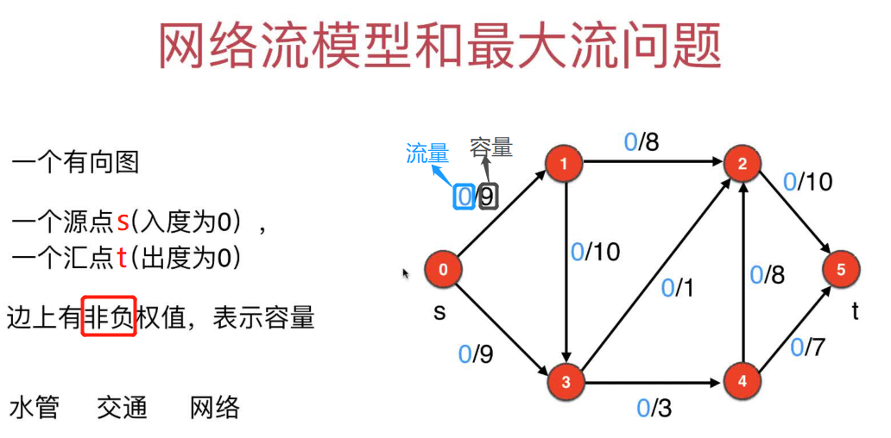

# 第14章 网络流和最大流问题

## 14.1 网络流和最大流问题阐述
### 网络流基本概念
> 网络流图中，从源点出发，在满足每条边容量限制的条件下，汇点t最多能接收多少流量

+ s:source
+ t:target
### 网络流需要满足的限制
+ 容量限制
+ 平衡限制：除了源点s和汇点t，对于每一个点，流入量等于流出量
+ 从源点s流出的流量，一定等于最终汇入汇点t的流量

### 引出最大流问题
> 网络流图中，从源点s出发，在满足每条边容量限制、平衡限制的条件下，汇点t最多能接收多少流量？

## 14.2 Ford-Fulkerson思想
> Ford-Fulkerson思想的核心是当路径上的容量限制小于流量时，把流量改成负值加到图上，这个加上的流量叫残量，在残量图中不算找增广路径，直到没有增广路径为止~~

## 14.3 Edmonds-Karp算法
> 不断进行BFS寻找增光路经和更新残差网络，最后所有增广路径的流量加起来就是最大流

