# 第15章 无向图的匹配问题
> 之所以把无向图的这个匹配问题放到最后讲是因为匹配问题借鉴了有向图中一些算法的思想

## 15.1 最大匹配和完美匹配

### 二分图回顾
> 二分图：把一个图中的所有顶点分成两部分，如果每条边的两端分别属于不同部分，则这个图是二分图。更多二分图内容参考[第4章 二分图相关](第04章_图的深度优先遍历的应用.md#410411-二分图检测)

### 最大匹配和完全匹配的概念
+ 一旦在二分图中找到一条边是我们想要的匹配，那么这两个点在下面的匹配就不能再被访问了(类似相亲时两个人看对眼了，其他相亲的就不能掺和了)。
+ 在二分图中像上面那样的匹配最多有多少对就是最大匹配问题(类似一堆人去相亲，最多能成多少对)
+ 如果所有顶点都找到了自己的匹配，那么这个最大匹配就成了完全匹配(即一堆人去相亲，每个人在不干涉其他成功牵手的情侣前提下，都找到了自己心仪的对象)
  > 完全匹配一定是最大匹配，但是最大匹配不一定是完全匹配。
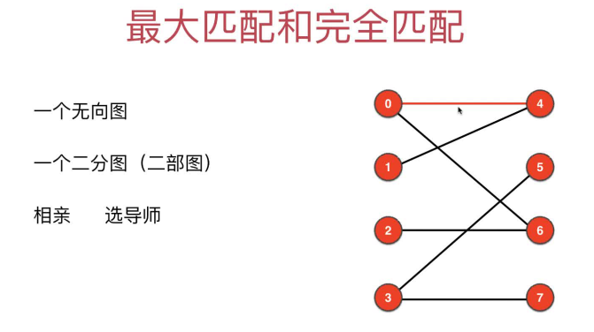

## 15.2 `无向图的最大匹配`问题转化为`有向图的最大流`问题
> 所有边的容量都为1，最大流即为最大匹配数
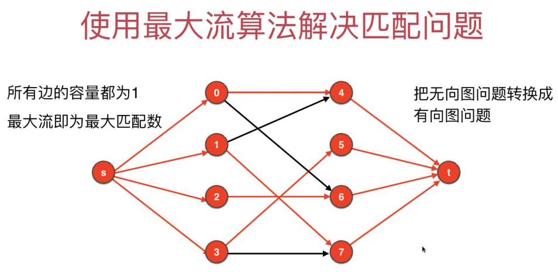

## 15.3 实现二分图匹配算法
+ [实现代码](src/main/java/Chapter15Matching/Section1to3Matching/BipartiteMaxMatching.java)
+ [测试代码](src/main/java/Chapter15Matching/Section1to3Matching/Main.java)

## 15.4 [LeetCode LCP4.覆盖](https://leetcode-cn.com/problems/broken-board-dominoes/)

### 题目分析
> 可以用黑白两种颜色覆盖栅格，两种颜色的格子可以看做二分图，则问题可以转换为二分图的最大匹配问题
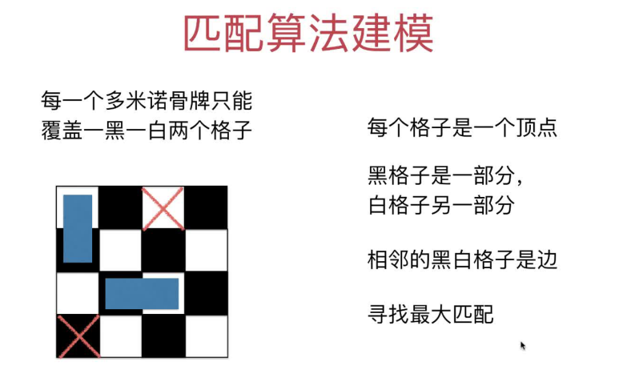

### 黑白块的坐标规律
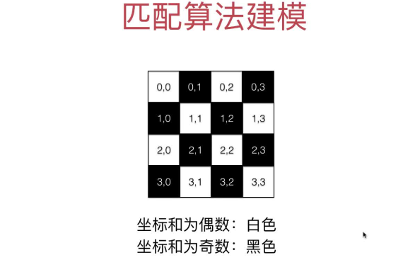

### 代码实现
+ [代码实现](src/main/java/Chapter15Matching/Section4LeetCodeLCP4/Solution.java)

## 15.5 匈牙利算法：不借助有向图和网络流模型求解最大匹配问题

### 匈牙利算法的定义
> 下面的`增广路径`是指`首尾都是非匹配点`的路径，和[上一章残量图中的增广路径](第14章_网络流和最大流问题.md#引入ford-fulkerson思想)不同
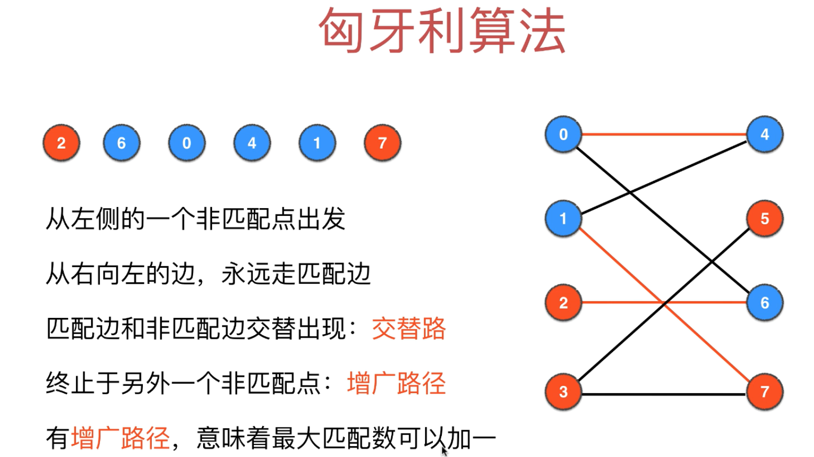
+ 1.在二分图中
+ 2.从左侧的一个非匹配点出发
+ 3.从右向左的边，永远走匹配边
+ 4.匹配边和非匹配边交替出现(称为`交替路`)
+ 5.终止与另外一个非匹配点(即`增广路径`，`首尾都是非匹配点`)
  > 交替路和增广路径的区别：增广路径是起始点都是非匹配点的交替路。增广路径一定是交替路，但交替路不一定是增广路径
+ 6.有增广路径，意味着最大匹配数可以加1
+ 7.遍历完左侧所有尚未匹配的点，即找到最大匹配

总结：匈牙利算法就是对二分图左侧每个尚未匹配的点，不断地寻找可以增广的交替路的过程。
> 可以用前面的BFS来实现，不同的是来到二分图的右侧的点不需要寻路，代码中的那个队列只存储左边的顶点。

### 匈牙利算法距离模拟
+ 以下图为例.匹配即配对，相当于相亲中的一对人，一旦看对眼，别人就不能插足了
+ 每次匹配起始都是左侧->右侧。
+ 匈牙利算法的核心：对每条增广路径上顶点的匹配状态取反(非匹配边变匹配边，匹配边变非匹配边)，则可以多得到一条匹配边，直到找到所有的匹配边。
> 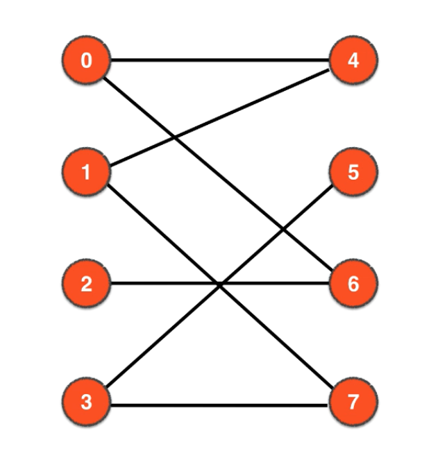

+ 1.先把左侧的0开始，把0-4匹配到一起(匹配顶点标为蓝色代表已访问，匹配顶点之间的边标为红色)
+ 2.第1次找增广路径：
  + 再从左侧的1开始，访问到右侧的邻接点4
  + 4已经被访问，向左侧走4的匹配边4-0
  + 0仍然已经被访问，再向右侧访问0的邻接点即6
  + 6还未被匹配，所以找到增广路径`1-4-0-6`
  > 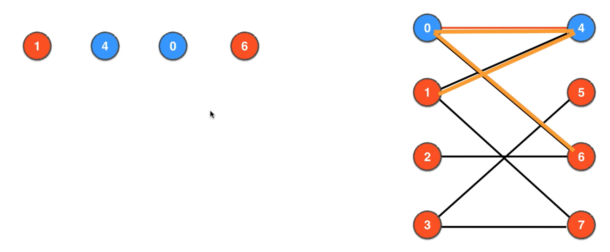
+ 3.第1次用匈牙利算法：对增广路径`1-4-0-6`匹配状态取反，即1-4变为一对匹配、0-6变成一对匹配。
  > 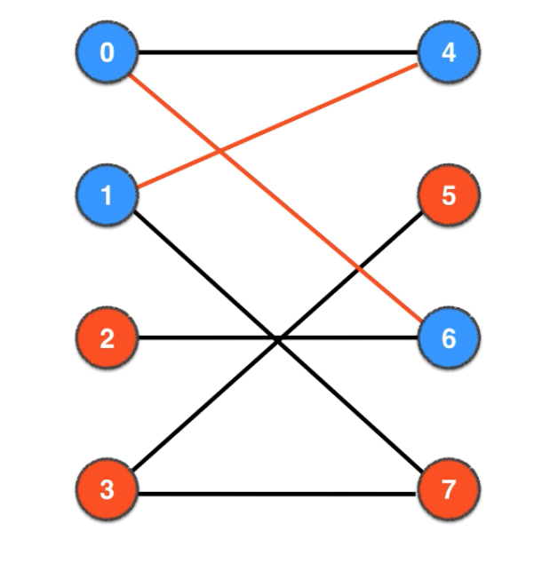
+ 4.第2次找增广路径：
  + 再从左侧的2开始，先访问到邻接点6
  + 6已经被访问，向左走6的匹配变6-0
  + 0为左侧的顶点，所以0继续向右遍历0的邻接点4
  + 4已经被访问，向左走4的匹配4-1，
  + 1在左侧，需要继续向右访问1的邻接点7
  + 7还未被访问，所以我们找到第2条增广路径`2-6-0-4-1-7`
  > 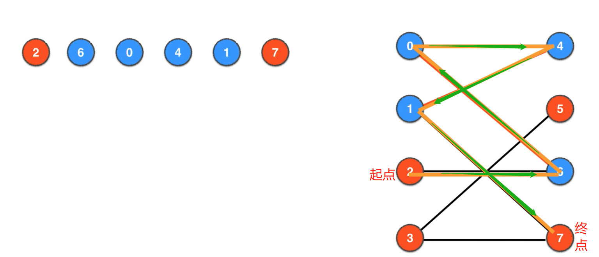
+ 5.第2次用匈牙利算法：对增广路径`2-6-0-4-1-7`匹配状态取反，即2-6变为一对匹配、0-4变成一对匹配、1-7变成一对匹配
  > 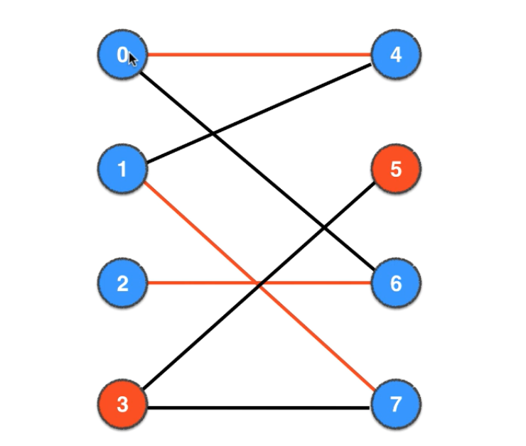
+ 6.第3次找增广路径：从左侧顶点3出发，向右找3的邻接点5，5未被访问，3-5就是一条增广路径
+ 7.第3次用匈牙利算法：把3-5的匹配状态取反，则3-5变成一对匹配边。
  > 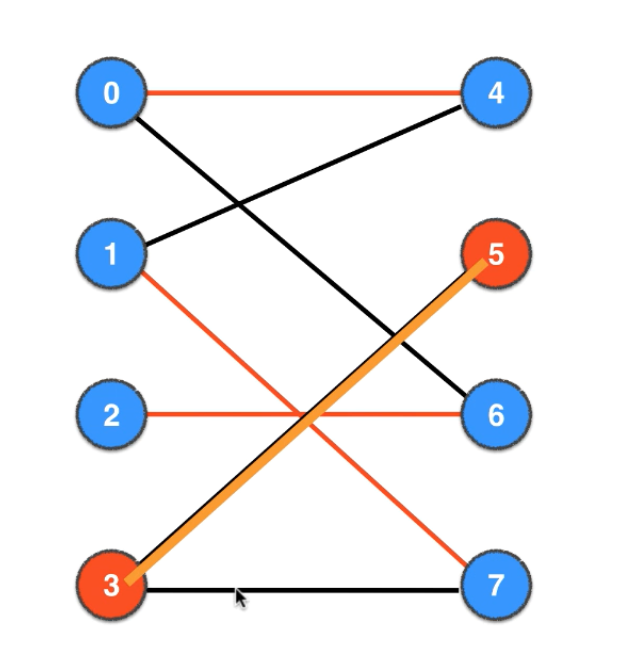
+ 8.至此所有的顶点都已被访问，找到最大匹配完成(即2-6变为一对匹配、0-4变成一对匹配、1-7变成一对匹配、3-5变成一对匹配，一共4对匹配)

起始点从左侧的其他店开始，结果是一样地，自己可以模拟下