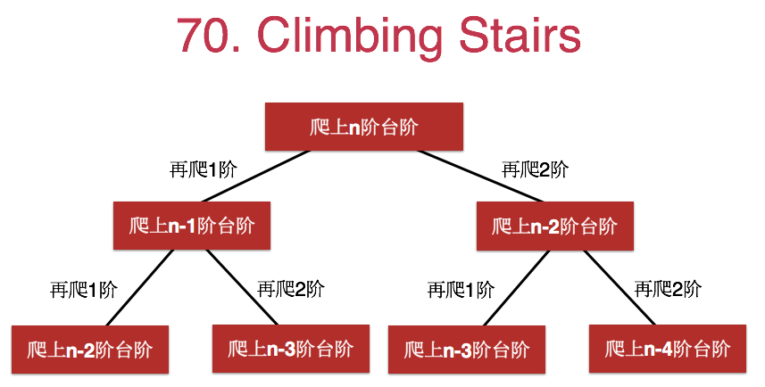
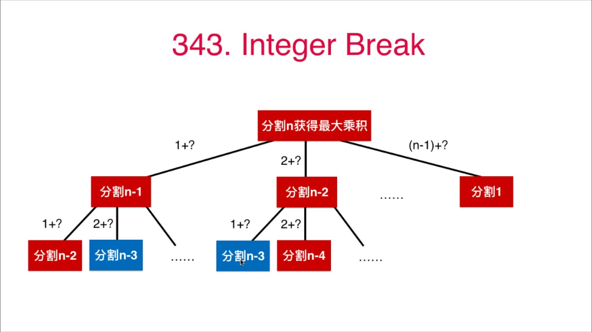

# 第9章 动态规划

## 9.1 什么是动态规划

> 以菲波那切数列求和为例，通过普通的递归-->引入记忆数组memo-->自下而上地解决问题三个步骤引出了动态递归

代码见[动态递归逐步深入](Section1Fibonacci)

### 动态规划的定义


> dynamic programming (also known as dynamic optimization) is a method for solving a complex problem by breaking it down into a collection of simpler subproblems, solving each of those subproblems just once, and storing their solutions – ideally, using a memory-based data structure.

> 将原问题拆解成若干子问题，同时保存子问题的答案，使得每个子问题只求解一次，最终获得原问题的答案。


体会其中自下而上地解决问题的思路，有点类似数学归纳法

### 递归与动态规划的联系和区别


## 9.2 第一个动态规划问题 70.Climbing Stairs


> 有一个楼梯，总共有n阶台阶。每一次，可以上一个台阶，也可以上两个台阶。问，爬上这样的一个楼梯，一共有多少不同的方法？
> 如 n = 3，可以爬上这个楼梯的方法有：[1,1,1] , [1,2] , [2,1]  , 所以答案为3

### 递归法(可以看到有重复子问题存在)



代码见[ClimbingStairs的递归求解](Section2ClimbingStairs/Solution1.java)

但是实际这个方法是存在重复子问题地，如下图蓝框所示：


类似的问题还有120号和64号问题

## 9.3 发现重叠子问题 343. 整数拆分

```text
给定一个正整数 n，将其拆分为至少两个正整数的和，并使这些整数的乘积最大化。 返回你可以获得的最大乘积。

示例 1:

输入: 2
输出: 1
解释: 2 = 1 + 1, 1 × 1 = 1。
示例 2:

输入: 10
输出: 36
解释: 10 = 3 + 3 + 4, 3 × 3 × 4 = 36。
```

### 拆分4为例，发现存在重复子问题


### 扩展搭配拆分n,重复子问题就更多了



### 经过前两节可知，可以用`记忆数组`或者`动态规划`的方法来大大提高代码效率

> 最优子结构的含义：通过求解子问题的最优解，可以获得原问题的最优解


### 代码

