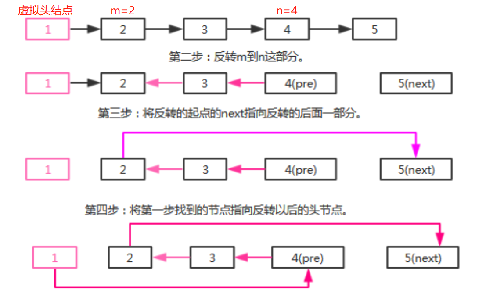
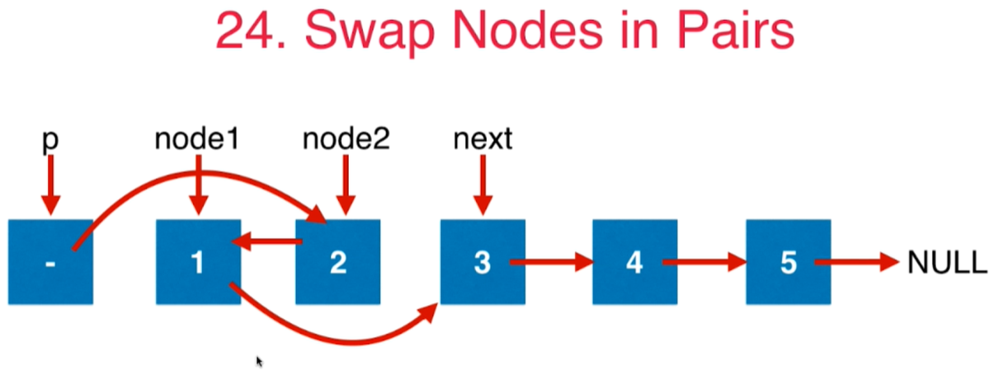
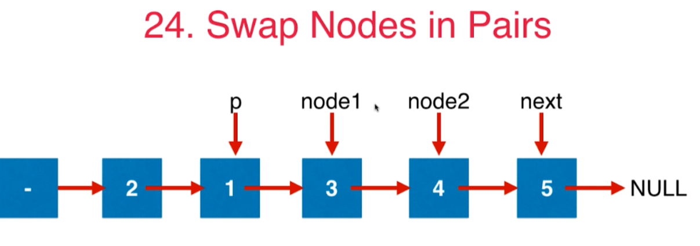
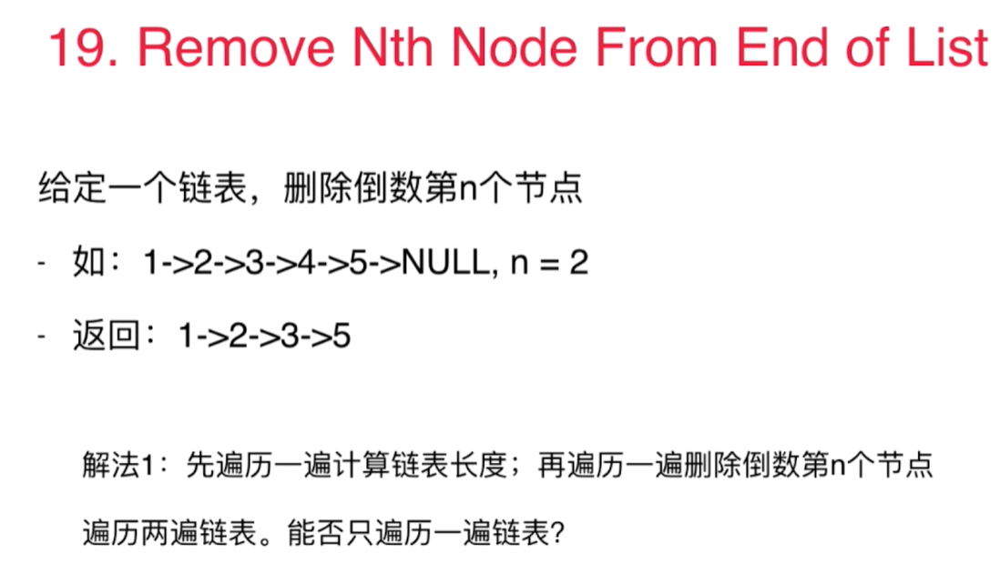
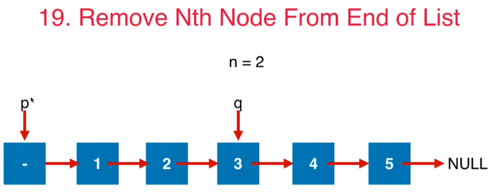
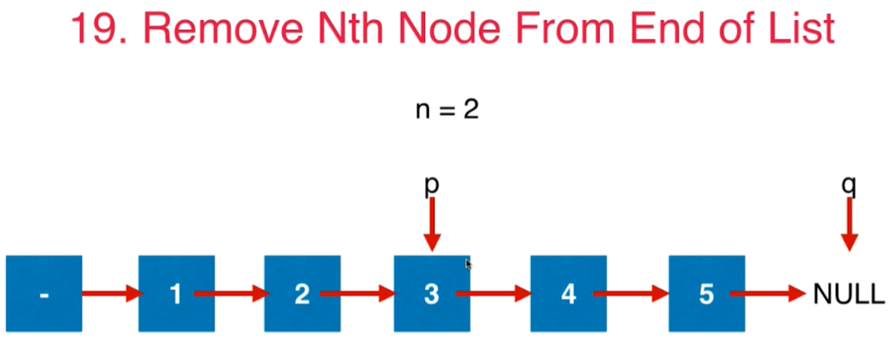

# 第05章 链表相关

本章的两个基础类如下
> 链表的节点类。toString()在debug时实时查看链表很有用
```java
/***********************************************************
 * @Description : 链表的节点
 * @author      : 梁山广(Liang Shan Guang)
 * @date        : 2020/1/17 22:13
 * @email       : liangshanguang2@gmail.com
 ***********************************************************/
package Chapter05LinkedList;

public class ListNode {
    public int val;
    public ListNode next;

    public ListNode(int x) {
        val = x;
    }

    @Override
    public String toString() {
        StringBuilder sb = new StringBuilder();
        ListNode cur = this;
        while (cur != null) {
            sb.append(cur.val).append(" -> ");
            cur = cur.next;
        }
        sb.append("NULL");
        return sb.toString();
    }
}
```

> 链表的显示工具类。create用于从数据创建链表，show用于把head作为头结点的链表表示成一个字符串的形式
```java
/***********************************************************
 * @Description : 链表的显示工具类
 * @author      : 梁山广(Liang Shan Guang)
 * @date        : 2020/1/17 22:14
 * @email       : liangshanguang2@gmail.com
 ***********************************************************/
package Chapter05LinkedList;

class LinkedListTool {
    /**
     * 根据数组创建链表
     *
     * @param nums 数组
     * @return 创建的链表的头节点
     */
    public static ListNode create(int[] nums) {
        if (nums.length == 0) {
            return null;
        }
        ListNode head = new ListNode(nums[0]);
        ListNode curr = head;
        for (int i = 1; i < nums.length; i++) {
            curr.next = new ListNode(nums[i]);
            curr = curr.next;
        }
        return head;
    }

    public static void show(ListNode head) {
        ListNode curr = head;
        while (curr != null) {
            System.out.print(curr.val + " -> ");
            curr = curr.next;
        }
        System.out.println("NULL");
    }
}
```

## 5.1~5.2 [题目206 反转列表](https://leetcode-cn.com/problems/reverse-linked-list/)

```java
反转一个单链表。

示例:

输入: 1->2->3->4->5->NULL
输出: 5->4->3->2->1->NULL
```
代码实现分两步：
+ 1.初始化
  > 
+ 2.指针移动
  > 

```java
public class Solution {
    public ListNode reverseList(ListNode head) {
        // 当前节点的上一个节点，初始化为null，是因为所有所有的链表最后一个元素都可以看为null
        ListNode prev = null;
        // 当前节点
        ListNode curr = head;
        // 当前节点的下一个节点
        while (curr != null) {
            // 当当前节点的下一个节点不为空时
            ListNode next = curr.next;
            // 翻转当前节点，指向上一个节点
            curr.next = prev;
            // 上一个节点后移动一位
            prev = curr;
            // 当前节点后移动一位
            curr = next;
        }
        // 遍历到最后,pre指向了最后一个节点
        return prev;
    }

    public static void main(String[] args) {
        int[] nums = {1, 2, 3, 4, 5};
        ListNode head = LinkedListTool.create(nums);
        LinkedListTool.show(head);
        ListNode headReverse = new Solution().reverseList(head);
        LinkedListTool.show(headReverse);
    }
}

/**
 * 1 -> 2 -> 3 -> 4 -> 5 -> NULL
 * 5 -> 4 -> 3 -> 2 -> 1 -> NULL
 */
```

类似的题目还有[92. 反转部分链表 II](https://leetcode-cn.com/problems/reverse-linked-list-ii/)

```txt
反转从位置 m 到 n 的链表。请使用一趟扫描完成反转。

说明:
1 ≤ m ≤ n ≤ 链表长度。

示例:

输入: 1->2->3->4->5->NULL, m = 2, n = 4
输出: 1->4->3->2->5->NULL
```
+ 第一步：找到待反转节点的前一个节点。
+ 第二步：反转m到n这部分。
+ 第三步：将反转的起点的next指向反转的后面一部分。
+ 第四步：将第一步找到的节点指向反转以后的头节点。

```java
/***********************************************************
 * @Description : 反转链表的m~n的链表
 * @author      : 梁山广(Liang Shan Guang)
 * @date        : 2020/1/17 23:20
 * @email       : liangshanguang2@gmail.com
 ***********************************************************/
package Chapter05LinkedList.LeetCode92ReverseLinkedListPart;

import Chapter05LinkedList.LinkedListTool;
import Chapter05LinkedList.ListNode;

class Solution {

    public ListNode reverseBetween(ListNode head, int m, int n) {
        // 创建虚拟头结点,防止一些null导致的问题
        ListNode dummyHead = new ListNode(0);
        dummyHead.next = head;
        ListNode cur = dummyHead;
        for (int i = 1; i < m; i++) {
            // 找到了m的上一个节点
            cur = cur.next;
        }
        // node.next就是要翻转的起点，mHead表示开始翻转的起点
        ListNode mHead = cur.next;
        ListNode next = null;
        ListNode pre = null;
        // 翻转m到n这一段，起点是mHead，参考206题
        for (int i = m; i <= n; i++) {
            next = mHead.next;
            mHead.next = pre;
            pre = mHead;
            mHead = next;
        }
        // m位置的节点指向n位置的下一个节点
        cur.next.next = next;
        // m前一个节点指向n位置处的节点
        cur.next = pre;
        // 返回虚拟头结点的下一个节点即新的头结点
        return dummyHead.next;
    }

    public static void main(String[] args) {
        int[] nums = {1, 2, 3, 4, 5};
        ListNode head = LinkedListTool.create(nums);
        LinkedListTool.show(head);
        // 返回新链表的dead
        ListNode headNew = new Solution().reverseBetween(head, 2, 4);
        LinkedListTool.show(headNew);
    }
}
/**
 * 1 -> 2 -> 3 -> 4 -> 5 -> NULL
 * 1 -> 4 -> 3 -> 2 -> 5 -> NULL
 */
```

> 还有83、86、328、2、445号问题也是链表相关的问题

### [83.删除排序链表中的重复元素](https://leetcode-cn.com/problems/remove-duplicates-from-sorted-list/)
```java
class Solution {
    public ListNode deleteDuplicates(ListNode head) {
        ListNode cur = head;
        while (cur != null) {
            if (cur.next != null && cur.val == cur.next.val) {
                cur.next = cur.next.next;
            }else {
                cur = cur.next;
            }
        }
        return head;
    }

    /**
     * 1->1->2  ==> 1->2
     * [] -> []
     * [1,1,1,1] ==> [1]
     * {1,1,2,3,3}  ==> [1, 2, 3]
     */
    public static void main(String[] args) {
        int[] nums = {1,1,2,3,3};
        ListNode head = LinkedListTool.create(nums);
        LinkedListTool.show(head);
        ListNode newHead = new Solution().deleteDuplicates(head);
        LinkedListTool.show(head);
    }
}
```

### [86.分隔链表](https://leetcode-cn.com/problems/partition-list/)
> 核心思想是把小于x的节点和大于等于x的节点拆成两个链表，最后把后者连接到前者形成一条新的链表就是满足题目的链表
```java
 // 核心思想是把小于x的节点和大于等于x的节点拆成两个链表，最后把后者连接到前者形成一条新的链表就是满足题目的链表
class Solution {
    public ListNode partition(ListNode head, int x) {
        // 存储所有大于等于x的节点的链表的虚拟头结点
        ListNode bigHead = new ListNode(0);
        // 存储所有小于x的节点的链表的虚拟头结点
        ListNode smallHead = new ListNode(0);
        // 上面两个链表的指针，用于插入元素
        ListNode big = bigHead;
        ListNode small = smallHead;
        while(head != null){
            if(head.val < x){
                // 插入节点到小元素链表
                small.next = head;
                // 指针往后移动
                small = small.next;
            }else {
                // 插入节点到大元素链表
                big.next = head;
                big = big.next;
            }
            head = head.next;
        }
        // 把大元素连接到小元素链表后面
        small.next = bigHead.next;
        // 大元素链表的尾部要清空下，防止还连着些乱七八糟的节点
        big.next = null;
        // 返回小元素链表的头结点，即虚拟头结点的下一个节点
        return smallHead.next;
    }
}
```
### [328.奇偶链表](https://leetcode-cn.com/problems/odd-even-linked-list/)
> 和上面的第86号问题非常类似，区别在于这里是按照奇数编号和偶数编号分成了两个链表，除了if逻辑不通，其他地方完全相同
```java
/***********************************************************
 * @Description : 新建两个不同的链表，遍历一遍原链表后，分别存储奇数编号节点和偶数编号节点，最后把奇数链表连接到偶数链表即可
 * 和LeetCode第86号问题按照边界分成两个链表的思路基本一致
 * @author      : 梁山广(Liang Shan Guang)
 * @date        : 2020/1/18 18:24
 * @email       : liangshanguang2@gmail.com
 ***********************************************************/
package Chapter05LinkedList.LeetCode382OddEvenLinkedList;

import Chapter05LinkedList.ListNode;

class Solution {
    public ListNode oddEvenList(ListNode head) {
        // 奇数链表的虚拟头结点
        ListNode oddHead = new ListNode(0);
        // 偶数链表的虚拟头结点
        ListNode evenHead = new ListNode(0);
        // 上面两个链表的移动指针
        ListNode odd = oddHead;
        ListNode even = evenHead;
        int index = 0;
        while(head != null){
            if(index % 2 == 1){ // 奇数编号节点
                // 插入节点到奇数链表
                odd.next = head;
                // 移动指针往后一位
                odd = odd.next;
            }else { // 偶数编号节点
                even.next = head;
                even = even.next;
            }
            head = head.next;
            index++;
        }
        // 奇数链表连接到偶数链表后面
        even.next = oddHead.next;
        // 奇数链表的最后清空下，防止连接些乱七八糟的节点
        odd.next = null;
        return evenHead.next;
    }
}
```

### [2.两数相加](https://leetcode-cn.com/problems/add-two-numbers/)
> 涉及到大数相加~~需要用到BigDecimal
```java
/**
 * Definition for singly-linked list.
 * public class ListNode {
 *     int val;
 *     ListNode next;
 *     ListNode(int x) { val = x; }
 * }
 */
import java.math.BigDecimal;
class Solution {
    private String add2Sum(String s1, String s2) {
        BigDecimal b1 = new BigDecimal(s1);
        BigDecimal b2 = new BigDecimal(s2);
        return b1.add(b2).toString();
    }

    /**
     * 两个数相加，要考虑大数相加的情况，所以数字都以字符串的形式来存储
     */
    public ListNode addTwoNumbers(ListNode l1, ListNode l2) {
        // 用字符串来存储两个数
        StringBuilder num1 = new StringBuilder();
        StringBuilder num2 = new StringBuilder();
        while (l1 != null) {
            num1.append(l1.val);
            l1 = l1.next;
        }
        while (l2 != null) {
            num2.append(l2.val);
            l2 = l2.next;
        }
        String sum = add2Sum(num1.reverse().toString(), num2.reverse().toString());
        ListNode dummyHead = new ListNode(0);
        ListNode cur = dummyHead;
        for (int i = sum.length() - 1; i >= 0; i--) {
            cur.next = new ListNode(Integer.parseInt(sum.charAt(i) + ""));
            cur = cur.next;
        }
        return dummyHead.next;
    }
}
```

### [445.两数相加 II](https://leetcode-cn.com/problems/add-two-numbers-ii/)
> 和上面的第2题类似，甚至更简单点，因为不用再逆序了
```java
import java.math.BigDecimal;
class Solution {
    private String add2Sum(String s1, String s2) {
        BigDecimal b1 = new BigDecimal(s1);
        BigDecimal b2 = new BigDecimal(s2);
        return b1.add(b2).toString();
    }

    /**
     * 两个数相加，要考虑大数相加的情况，所以数字都以字符串的形式来存储
     */
    public ListNode addTwoNumbers(ListNode l1, ListNode l2) {
        // 用字符串来存储两个数
        StringBuilder num1 = new StringBuilder();
        StringBuilder num2 = new StringBuilder();
        while (l1 != null) {
            num1.append(l1.val);
            l1 = l1.next;
        }
        while (l2 != null) {
            num2.append(l2.val);
            l2 = l2.next;
        }
        String sum = add2Sum(num1.toString(), num2.toString());
        ListNode dummyHead = new ListNode(0);
        ListNode cur = dummyHead;
        for (int i = 0; i < sum.length(); i++) {
            cur.next = new ListNode(Integer.parseInt(sum.charAt(i) + ""));
            cur = cur.next;
        }
        return dummyHead.next;
    }
}
```

## 5.3 设立链表的虚拟头节点DummyHead可以大大简化代码逻辑
> LeetCode203号问题 Remove Linked List Elements

```txt
删除链表中等于给定值 val 的所有节点。

示例:

输入: 1->2->6->3->4->5->6, val = 6
输出: 1->2->3->4->5
```

### 不设置虚拟头结点时，需要对头结点作各种异常判断

```java
package Chapter05LinkedList.RemoveElements;

/***********************************************************
 * 反转一个单链表。
 *
 * 示例:
 *
 * 输入: 1->2->3->4->5->NULL
 * 输出: 5->4->3->2->1->NULL
 *
 * @note      : 创建pre、cur和next三个节点指针，不断移动节点来达到目的
 * @author    : l00379880 梁山广
 * @version   : V1.0 at 2019/8/21 15:23
 ***********************************************************/
public class Solution {
    public ListNode removeElements(ListNode head, int val) {
        // 每次都要更新head
        while (head != null && head.val == val) {
            // 头结点的val就是想找的val，那么就要删除头节点
            head = head.next;
        }

        // 最后的head仍然可能为空
        if (head == null) {
            // 需要对头结点判空
            return null;
        }

        ListNode curr = head;
        while (curr.next != null) {
            if (curr.next.val == val) {
                // 把current.next这个节点释放掉
                curr.next = curr.next.next;
            } else {
                // 没有找到符合的节点就继续向下找
                curr = curr.next;
            }
        }
        return head;
    }

    public static void main(String[] args) {
        int[] nums = {1, 2, 3, 6, 4, 5, 6};
        int val = 6;
        ListNode head = LinkedListTool.create(nums);
        LinkedListTool.show(head);
        ListNode headRemove = new Solution().removeElements(head, val);
        LinkedListTool.show(headRemove);
    }
}

/**
 * 1 -> 2 -> 3 -> 4 -> 5 -> NULL
 * 5 -> 4 -> 3 -> 2 -> 1 -> NULL
 */
```

### 引入虚拟头结点后，算法就简化多了

> 虚拟头节点，可以避免head为空的各种情况，代码逻辑可以大大简化  

```java
class Solution {
    public ListNode removeElements(ListNode head, int val) {
        // 虚拟头节点，可以避免head为空的各种情况，代码逻辑可以大大简化     
        ListNode dummyHead = new ListNode(0);
        dummyHead.next = head;

        // 所有节点的操作都统一了
        ListNode curr = dummyHead;
        while (curr.next != null) {
            if (curr.next.val == val) {
                // 把current.next这个节点释放掉
                curr.next = curr.next.next;
            } else {
                // 没有找到符合的节点就继续向下找
                curr = curr.next;
            }
        }
        // 虚拟头结点后面的点才是真正的头结点
        return dummyHead.next;
    }
}
```


更简化的实现：递归

```java
class Solution {
   public ListNode removeElements(ListNode head, int val) {
        if (head == null) {
            return null;
        }
        head.next = removeElements(head.next, val);
        // head节点要删除就直接跳过head节点，否则就返回原来的
        return head.val == val ? head.next : head;
    }
}
```

本节的练习题：82、21

### [82.删除排序链表中的重复元素 II](https://leetcode-cn.com/problems/remove-duplicates-from-sorted-list-ii/)
> 注意这里是要删除`所有`相等的元素~~
```java
/***********************************************************
 * @Description : 删除所有重复的节点
 * @author      : 梁山广(Liang Shan Guang)
 * @date        : 2020/1/18 20:21
 * @email       : liangshanguang2@gmail.com
 ***********************************************************/
package Chapter05LinkedList.LeetCode82RemoveDuplicatesII;

import Chapter05LinkedList.LinkedListTool;
import Chapter05LinkedList.ListNode;

class Solution {
    public ListNode deleteDuplicates(ListNode head) {
        if (head == null) {
            return null;
        }
        ListNode dummyHead = new ListNode(0);
        dummyHead.next = head;
        ListNode cur = dummyHead;
        while (cur.next != null && cur.next.next != null) {
            if (cur.next.val == cur.next.next.val) {
                // 重复元素的起点
                ListNode del = cur.next;
                while (del.next != null && del.val == del.next.val) {
                    del = del.next;
                }
                // while退出时，del走到了最后一个重复元素的位置，在这里设置下
                cur.next = del.next;
            } else {
                cur = cur.next;
            }
        }
        return dummyHead.next;
    }

    /**
     * 特殊用例：
     * []  ==> []
     * [1] ==> [1]
     * [1, 1] ==> []  这个是 while (cur.next!=null)的来源
     * 
     * [1,2,3,3,4,4,5] ==> [1, 2, 5]
     */
    public static void main(String[] args) {
        int[] nums = {1, 1};
        ListNode head = LinkedListTool.create(nums);
        ListNode newHead = new Solution().deleteDuplicates(head);
        LinkedListTool.show(newHead);
    }
}
```

### [21.合并两个有序链表](https://leetcode-cn.com/problems/merge-two-sorted-lists/)
> 创建个新链表，一次比较存储两个链表的元素即可
```java
class Solution {
    public ListNode mergeTwoLists(ListNode l1, ListNode l2) {
        // 合并后的链表
        ListNode dummyHead = new ListNode(0);
        // 链表的移动指针
        ListNode cur = dummyHead;
        while(l1 != null && l2 != null){
            if(l1.val < l2.val){
                cur.next = l1;
                l1 = l1.next;
            }else {
                cur.next = l2;
                l2 = l2.next;
            }
            cur = cur.next;
        }
        // 一个链表遍历完了另一个可能还有元素没遍历，把还没遍历完的链表直接挂到cur后面即可
        if(l1 == null){
            cur.next = l2;
        }else{
            cur.next = l1;
        }
        return dummyHead.next;
    }
}
```

## 5.4 第24号问题：Swap Nodes in Pairs
```text
给定一个链表，两两交换其中相邻的节点，并返回交换后的链表。

你不能只是单纯的改变节点内部的值，而是需要实际的进行节点交换。
```







```java
class Solution {
    public ListNode swapPairs(ListNode head) {
         // 至少要有两个点，否则直接返回
        if(head == null || head.next == null){
            return head;
        }
        ListNode dummyHead = new ListNode(0);
        dummyHead.next = head;
        // 正在挪动的点对的前面那个元素
        ListNode pre = dummyHead;
        while(pre.next!= null && pre.next.next != null){
            // 更新node1和node2
            ListNode node1 = pre.next;
            ListNode node2 = pre.next.next;

            // 旋转两个点
            pre.next = node2;
            node1.next = node2.next;
            node2.next = node1;

            // p变成交换后靠后的那个元素
            pre = node1;
        }
        return dummyHead.next;
    }
}
```

LeetCode上面类似的题目：25、147、148

### 25.K 个一组翻转链表
> 困难级别的题目
```java

```

## 5.5 [LeetCode237:删除链表中的节点](https://leetcode-cn.com/problems/delete-node-in-a-linked-list/)
> 只给出了当前节点，可以通过把当前节点的值改成当前节点的下一个节点的值，然后删除下一个节点即可

删除链表中指定节点步骤:
+ 1.将该节点下一个节点的值复制给当前节点。
+ 2.删除该节点的下一个节点

```java
class Solution {
    public void deleteNode(ListNode node) {
        // 相当于删除当前节点，因为不知道当前节点的上一个节点，所以把当前节点的下一个节点的val复制到当前节点并释放下一个节点即可
        node.val = node.next.val;
        node.next = node.next.next;
    }
}
```

## 5.6 双指针法：[LeetCode第19号问题：删除链表的倒数第N个节点](https://leetcode-cn.com/problems/remove-nth-node-from-end-of-list/)

### 一般的解法：遍历两遍


### 更优的算法：遍历一遍
> 使用间距为n的两个点p和q从起始点开始往后移动，当q到达最后一个节点时，p所在的节点就是导数第n个节点





```java
class Solution {
    public ListNode removeNthFromEnd(ListNode head, int n) {
        ListNode dummyHead = new ListNode(0);
        dummyHead.next = head;
        // p和q初始化为dummyHead可以防止很多null的异常
        ListNode p = dummyHead;
        ListNode q = dummyHead;
        for(int i = 0; i < n + 1; i++){
            // q移动到和p间距为n的地方
            q = q.next;
        }
        // p和q一直往后移动直到q移动到链表结尾
        while(q != null){
            p = p.next;
            q = q.next;
        }
        // q到达null了，此时p就是要删除的节点的上一个节点
        p.next = p.next.next;
        return dummyHead.next;
    }
}
```

双指针法的其他题目：61、143、234